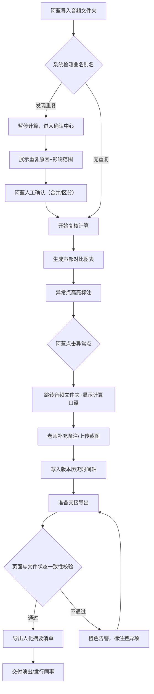

## 1. 产品概述

合唱声部版本复核系统是一款面向合唱团演出统筹、声乐老师及发行团队的音频版本复核工具。系统解决人工兜底复核效率低、历史版本追溯困难、异常原因难交接等痛点，通过图表化复核、历史留痕、异常可追溯等能力，让复核工作从"人盯"转向"系统辅助"。

- 核心目标：让演出统筹阿蓝从人工兜底中解放，老师能快速定位学生进步点，演出/发行同事交接时零信息丢失
- 目标用户：演出统筹（阿蓝）、声乐指导老师、演出协调人员、发行对接人员
- 价值主张：每一次复核都有迹可循，每一个异常都说得清来龙去脉

## 2. 核心功能

### 2.1 用户角色

| 角色 | 核心场景 | 核心权限 |
|------|---------|---------|
| 演出统筹（阿蓝） | 日常复核、交接给演出/发行同事 | 全功能权限：导入音频、复核、标记异常、导出摘要 |
| 声乐老师 | 查看学生进步点、补充备注 | 查看复核结果、添加备注、上传截图 |
| 演出/发行同事 | 接收交接清单、理解异常原因 | 只读权限：查看复核结果、异常说明、历史版本 |

### 2.2 功能模块

1. **复核总览页**：材料入口卡片、复核进度仪表盘、异常待处理清单
2. **声部复核详情页**：声部对比图表、时间轴波形异常标记、点击异常跳转源文件
3. **音频文件夹管理页**：文件列表、版本历史时间轴、备注与截图留痕
4. **异常确认中心**：曲名别名重复待确认、影响范围预览、人工确认后才继续计算
5. **交接导出页**：人化异常原因清单、页面状态与文件一致性校验、一键导出摘要

### 2.3 页面详情

| 页面名称 | 模块名称 | 功能描述 |
|---------|---------|---------|
| 复核总览页 | 材料入口卡片 | 拖拽上传/选择文件夹，显示最近3次复核记录，卡片状态颜色区分（正常绿/待确认黄/异常红） |
| 复核总览页 | 复核进度仪表盘 | 环形图展示各声部复核完成率，柱状图展示各曲目异常数量分布 |
| 复核总览页 | 异常待处理清单 | 按优先级排序的异常列表，每项显示"人话原因"+ 影响曲目数 + 快捷处理按钮 |
| 声部复核详情页 | 声部对比图表 | 多声部频率/能量曲线图，异常点高亮，点击弹出：关联音频文件位置 + 本次计算口径说明 |
| 声部复核详情页 | 波形时间轴 | 可缩放波形图，异常区段红色标注，右键可直接跳转音频文件夹对应位置 |
| 声部复核详情页 | 计算口径面板 | 显示本次复核的算法参数、阈值设置、与上一版本口径差异对比 |
| 音频文件夹管理页 | 文件版本时间轴 | 纵向时间轴展示每次修改：谁在什么时间改了什么，附带备注与截图缩略图 |
| 音频文件夹管理页 | 备注与截图区 | 可追加备注（不可删除仅可追加）、上传旧版本截图，点击截图可放大对比 |
| 异常确认中心 | 别名重复检测列表 | 检测到曲名别名重复时暂停计算，展示：重复项、可能原因（同曲异名/录入错误/重名曲目）、影响的声部数量 |
| 异常确认中心 | 影响范围预览图 | 高亮展示哪些文件会受影响，确认前不可跳过，提供"标记为不同曲目"/"合并为同一曲目"选项 |
| 交接导出页 | 人化异常清单 | 每条异常用自然语言描述：如"女高音声部第2分17秒处音量比基准低30%，可能是站位偏后导致，参考5月12日排练版本" |
| 交接导出页 | 一致性校验条 | 实时校验：页面显示状态 vs 文件中实际状态，不一致时橙色告警并显示差异项 |
| 交接导出页 | 摘要导出面板 | 支持导出PDF/Excel，可选包含：异常清单、版本历史摘要、计算口径说明、截图附件 |

## 3. 核心流程

主流程：演出统筹阿蓝导入音频文件夹 → 系统检测曲名别名（发现重复则暂停，进入确认中心）→ 确认后开始计算 → 生成图表与异常标记 → 阿蓝点击异常回溯源文件和计算口径 → 老师补充备注与截图 → 所有信息写入历史时间轴 → 阿蓝导出人化交接清单 → 一致性校验通过后交付

## 4. 用户界面设计

### 4.1 设计风格

**设计理念：乐谱纸的温暖质感 + 数据可视化的专业精准**

- **主色调**：深墨绿 `#1F4D3A`（象征合唱团的沉稳与和谐），暖铜橙 `#C87941`（异常高亮色，像铅笔圈注的痕迹），米白背景 `#F7F3EB`（仿乐谱纸质感）
- **辅助色**：声部区分色——女高音粉紫 `#9B5DE5`、女低音湖蓝 `#00BBF9`、男高音苔绿 `#4CAF50`、男低音赭石 `#8D6E63`
- **按钮风格**：微立体圆角按钮（圆角10px），悬停时轻微上浮+阴影加深，主按钮用深墨绿填充配白字
- **字体**：标题用「思源宋体」（呼应乐谱的文艺气质），正文用「思源黑体」（确保数据可读性）；大标题28px/粗体，正文14px/常规
- **布局风格**：卡片式布局，卡片边角带仿纸张的微纹理，模块间用细虚线分隔（仿乐谱小节线）
- **图标风格**：线性+微填充的音乐主题图标（🎵音符、📄乐谱、🎙️麦克风、📌图钉用于标记备注）
- **动效**：异常点出现时有"铅笔圈画"的描边动画，切换版本有"翻页"过渡效果

### 4.2 页面设计概述

| 页面名称 | 模块名称 | UI元素细节 |
|---------|---------|-----------|
| 复核总览页 | 材料入口卡片 | 米白卡面带细点状纹理，上传框内有虚线+音符图标，拖拽时卡片微弹起+边框变暖铜橙 |
| 复核总览页 | 复核进度仪表盘 | 环形图用声部4色渐变，异常部分闪烁暖铜橙，悬停时弹出tooltip显示具体曲目数 |
| 声部复核详情页 | 声部对比图表 | 背景是浅灰色乐谱线网格，异常点是暖铜橙圆点带脉冲动画，点击后圆点放大+右侧滑出关联面板 |
| 声部复核详情页 | 波形时间轴 | 波形填充对应声部色，异常区段有半透明暖铜橙覆盖，拖动缩放时光标变为双向箭头 |
| 音频文件夹管理页 | 版本时间轴 | 左侧深墨绿竖线作时间轴，每个节点是圆形图标（🎙️录音/✏️备注/📷截图/🔍复核），悬停节点弹出气泡详情 |
| 异常确认中心 | 别名重复列表 | 每行重复项左侧有黄色⚠️图标，"可能原因"用标签样式，点击影响范围时相关行高亮变暖铜橙边框 |
| 交接导出页 | 人化异常清单 | 每条异常用大号引号图标开头，原因文字用思源宋体斜体，下方灰色小字标注关联文件路径+时间 |
| 交接导出页 | 一致性校验条 | 顶部固定横幅：绿色✓通过 / 橙色✗不通过，不通过时点击展开差异对比（左旧右新） |

### 4.3 响应式

桌面优先设计（1440px基准），适配1280px~1920px。

- **≥1280px**：标准三栏布局（左侧导航+中间主内容+右侧详情面板）
- **<1280px**：右侧详情面板改为底部滑出抽屉，异常清单改为单列
- **触控优化**：异常点最小点击区域40x40px，波形缩放手势支持双指捏合

### 4.4 装饰细节
- 页面边角添加淡入的乐谱线装饰元素（固定定位，极低透明度）
- 卡片hover时边缘出现1px暖铜光晕
- 加载状态用跳动的八分音符🎵动画替代转圈
