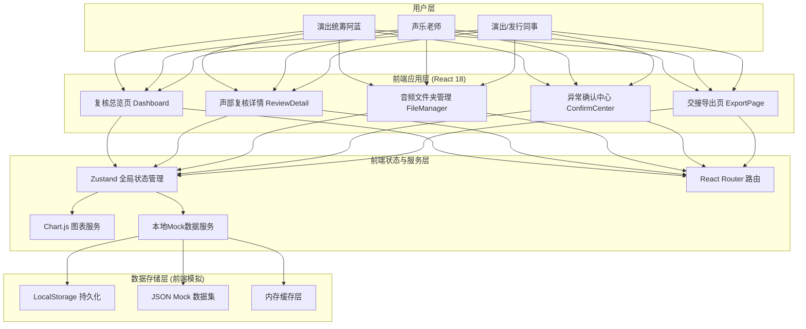
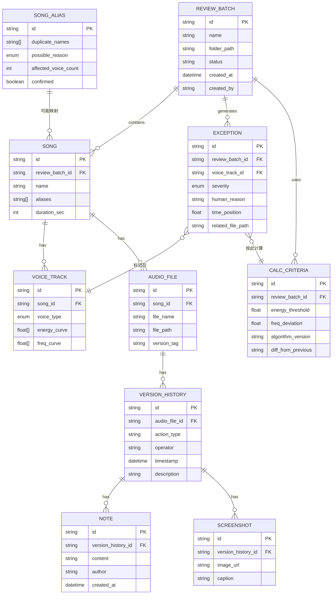

## 1. 架构设计



## 2. 技术描述

- **前端框架**：React@18 + TypeScript@5 + Vite@6（快速冷启动，TS类型安全）
- **样式方案**：TailwindCSS@3 + CSS Variables（设计令牌系统，便于主题切换）
- **路由管理**：React Router Dom@6（声明式路由，嵌套路由适配三栏布局）
- **状态管理**：Zustand@4（轻量、无模板代码，适合中型应用）
- **图表可视化**：Chart.js@4 + react-chartjs-2（波形图、环形图、柱状图统一方案）
- **UI组件基础**：自建组件库（不引入额外UI库，保持美学独特性）
- **数据方案**：LocalStorage + Mock JSON（无后端依赖，前端全功能演示）
- **导出方案**：jsPDF + xlsx（PDF/Excel双格式导出）
- **拖拽上传**：react-dropzone（文件夹拖拽）
- **图标方案**：Lucide React + Emoji 组合使用

## 3. 路由定义

| 路由路径 | 页面名称 | 核心子组件 |
|---------|---------|-----------|
| `/` | 复核总览页（Dashboard） | MaterialUploadCard、ProgressGauges、ExceptionList |
| `/review/:songId` | 声部复核详情页 | VoiceCompareChart、WaveformTimeline、CalcCriteriaPanel |
| `/files/:folderId` | 音频文件夹管理页 | FileListTable、VersionTimeline、NoteAndScreenshotArea |
| `/confirm` | 异常确认中心 | AliasDuplicateList、ImpactScopePreview、ConfirmActions |
| `/export/:reviewId` | 交接导出页 | HumanExceptionList、ConsistencyBar、ExportPanel |

## 4. 数据模型

### 4.1 数据模型定义（ER图）



### 4.2 核心TypeScript类型定义

```typescript
// 复核批次状态
export type ReviewStatus = 'pending' | 'calculating' | 'awaiting_confirm' | 'completed' | 'has_exceptions';

// 声部类型
export type VoiceType = 'soprano' | 'alto' | 'tenor' | 'bass';

// 异常严重度
export type ExceptionSeverity = 'low' | 'medium' | 'high' | 'critical';

// 异常原因（人话模板）
export interface HumanReadableException {
  id: string;
  template: string; // 如："{voiceType}声部第{time}处{metric}比基准{diff}，可能是{cause}，参考{ref}"
  variables: Record<string, string | number>;
}

// 曲名别名冲突
export interface AliasConflict {
  id: string;
  duplicateNames: string[];
  possibleReasons: Array<'same_song_alias' | 'typo' | 'different_songs_same_name'>;
  affectedVoiceCount: number;
  affectedFileIds: string[];
  confirmed: boolean;
  resolution?: 'merge' | 'separate';
}

// 版本历史条目（不可变，只追加）
export interface HistoryEntry {
  id: string;
  type: 'upload' | 'note_added' | 'screenshot_added' | 'review_marker' | 'name_change';
  operator: string;
  timestamp: string;
  description: string;
  noteContent?: string;
  screenshotUrl?: string;
}

// 计算口径
export interface CalcCriteria {
  id: string;
  energyThreshold: number;
  frequencyDeviation: number;
  algorithmVersion: string;
  baselineDate: string;
  diffFromPrevious: string;
}

// 一致性校验结果
export interface ConsistencyCheck {
  passed: boolean;
  mismatches: Array<{
    field: string;
    displayValue: string;
    fileValue: string;
  }>;
}
```

### 4.3 Mock数据初始化策略

- 使用JSON文件预置3个完整复核批次数据（覆盖：正常/有异常/待确认别名三种场景）
- 包含12首曲目、48条声部音轨、96条历史记录、36条异常、4组别名冲突案例
- 波形/曲线数据：用三角函数+随机噪声模拟真实音频特征，异常区段人工插入显著偏离值
