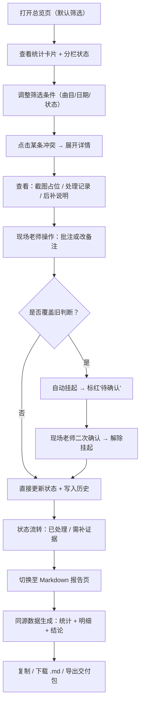

## 1. 产品概述

面向音乐排练场景的版权授权排期冲突追踪工具，服务音乐老师林姐与现场彩排老师。解决截图材料散、批注覆盖无历史、判断结论不稳定三大痛点，以"单一数据源 + 全链路留痕 + 保守确认机制"为核心，让老师一眼看清"哪些已处理、哪些还要补证据"，并能一键将截图、记录、报告对给第三方。

---

## 2. 核心功能

### 2.1 用户角色

| 角色 | 登录方式 | 核心权限 |
|------|----------|----------|
| 音乐老师（林姐） | 本地直入 | 查看全局、筛选统计、生成 Markdown 报告、导出交付包 |
| 现场老师 | 本地直入 | 批注单条记录、修改备注、标记证据状态、触发"挂起待确认" |

### 2.2 功能模块

1. **冲突总览页（首页）**：顶部筛选栏 + 统计卡片 + 状态分栏（已处理 / 需补证据 / 挂起待确认）
2. **冲突明细表**：同页下方的可展开列表，每条含截图占位、处理记录、后补说明、操作按钮
3. **冲突详情抽屉**：完整变更历史、批注时间线、当前状态流转
4. **Markdown 报告页**：实时预览、一键复制、一键下载，内容与筛选结果严格同源
5. **交付包导出**：将截图占位清单、处理记录摘要、Markdown 报告打包为可读文件夹结构

### 2.3 页面详情

| 页面名称 | 模块名称 | 功能描述 |
|-----------|-------------|---------------------|
| 冲突总览页 | 筛选栏 | 按曲目、日期、状态、处理人多条件筛选；所有统计、明细、报告共用该筛选结果 |
| 冲突总览页 | 统计卡片 | 总数、已处理、需补证据、挂起待确认 4 个数字卡；点击数字跳转对应分栏 |
| 冲突总览页 | 状态分栏 | 三栏 Tab 切换：已处理（绿）/ 需补证据（橙）/ 挂起待确认（红）；每栏含数量徽章 |
| 冲突明细表 | 列表行 | 曲目、日期、冲突简述、当前状态、证据数、最后修改人/时间；展开后显示三段内容 |
| 冲突明细表 | 截图占位区 | 排练群截图缩略图网格（2~3 张示例占位，带时间戳 + 来源群名），点击放大 |
| 冲突明细表 | 处理记录区 | 一条"正常记录"模板 + 可追加后补说明；每条记录带来源（系统/人工）与时间戳 |
| 冲突明细表 | 操作区 | 批注、改备注、补证据、标记已处理、挂起待确认；批注覆盖旧判断时自动走挂起流程 |
| 冲突详情抽屉 | 变更历史时间线 | 所有状态变更、备注修改、批注覆盖的完整历史，不可删除，逐条可追溯 |
| Markdown 报告页 | 报告预览 | 严格基于当前筛选结果生成：概览统计、明细表格、每条的证据清单与处理结论 |
| Markdown 报告页 | 操作区 | 一键复制 Markdown 原文、下载 .md 文件、附带截图占位说明的使用提示 |
| 交付包导出 | 结构预览 | 确认文件夹结构：screenshots/ + records/ + report.md，点击导出 ZIP |

---

## 3. 核心流程

林姐打开工具 → 看到排期冲突整体状态 → 按曲目/日期筛选 → 点击需补证据分栏 → 点开某条查看截图与处理记录 → 交给现场老师批注 → 系统检测到人工覆盖旧判断 → 自动挂起并标红 → 现场老师二次确认 → 状态流转为已处理 → 回到总览，筛选条件不变 → 生成 Markdown 报告 → 一键交付。

---

## 4. 用户界面设计

### 4.1 设计风格

- **主色**：深靛蓝 `#1e3a8a`（专业、信任），辅色：翡翠绿 `#059669`（已处理）、琥珀橙 `#d97706`（需补证据）、赤红 `#dc2626`（挂起）
- **按钮风格**：圆角 6px，2px 实心描边悬停变内阴影；危险操作（挂起/覆盖）带红色左边框警示
- **字体**：标题用思源黑体 Heavy，正文用思源宋体 / Noto Serif SC 呈现文档感，数字等宽
- **布局风格**：顶部固定筛选 + 统计行，下方左侧 2/3 明细表、右侧 1/3 变更历史抽屉常驻
- **图标风格**：Lucide 线性图标，状态图标旁配文字标签，避免纯图标识别

### 4.2 页面设计概述

| 页面名称 | 模块名称 | UI 元素 |
|-----------|-------------|-------------|
| 冲突总览页 | 筛选栏 | 深靛蓝渐变底 + 半透明毛玻璃；下拉框与日期选择器一行排列 |
| 冲突总览页 | 统计卡片 | 4 张卡片横向，数字用超大等宽字体（48px），底部细进度条表示占比 |
| 冲突总览页 | 状态分栏 Tab | 大号文字 + 色块徽章，选中时下划线加粗 + 轻微上浮动画 |
| 冲突明细表 | 行展开 | 手风琴展开，三段内容（截图/记录/操作）用竖线分隔 + 米色卡片底 |
| 冲突明细表 | 截图缩略图 | 3:2 比例，圆角 4px，hover 放大 + 阴影；底部半透明条显示时间戳 |
| 冲突详情抽屉 | 变更时间线 | 左侧彩色竖线（绿/橙/红对应状态），右侧卡片式时间节点，操作人头像圆形 |
| Markdown 报告页 | 预览区 | 白色文档卡 + 投影，等宽字体渲染代码块，表格斑马纹 |
| Markdown 报告页 | 固定操作栏 | 页面顶部浮动，复制/下载按钮 + 字数统计 |

### 4.3 响应性

- Desktop-first（1440px 基准），窄屏（<1024px）时右侧历史抽屉改为底部弹出
- 明细表在移动端改为卡片列表，每行完整展示三段内容
- 所有操作按钮 ≥44px 触控热区

### 4.4 动画与交互细节

- 挂起时：行背景闪红 2 次（0.4s × 2）后稳定为浅红底
- 状态变更：新状态标签以 300ms 滑入替换旧标签
- 筛选变更：统计数字做 500ms 数字滚动过渡动画
- Markdown 报告复制成功：绿色对勾从按钮中心扩散涟漪
