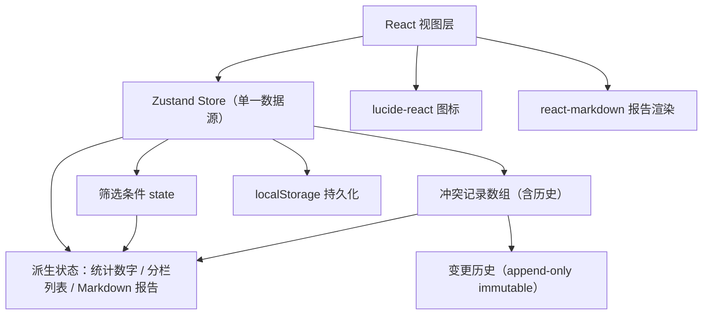
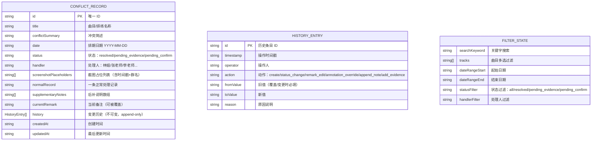

## 1. 架构设计

纯前端单页应用，全部数据与状态驻留浏览器内存 + localStorage 持久化，无需后端服务。采用 Zustand 做单一数据源（确保筛选→统计→明细→报告完全同源），变更历史以不可变 append-only 结构写入 store。



---

## 2. 技术描述

- **前端**：React@18 + TypeScript + Vite
- **样式**：Tailwind CSS@3（自定义设计令牌：靛蓝主色 + 三色状态体系）
- **状态管理**：Zustand — 单一 store，含筛选条件、冲突记录、派生选择器
- **路由**：react-router-dom（2 个路由：`/` 总览 + 明细；`/report` Markdown 报告页）
- **Markdown 渲染**：react-markdown + remark-gfm
- **图标**：lucide-react
- **后端**：无
- **数据库**：无，使用 localStorage 存储，内置 7 条符合场景的 mock 数据

---

## 3. 路由定义

| 路由 | 目的 |
|-------|---------|
| `/` | 冲突总览：顶部筛选栏 + 4 张统计卡片 + 状态分栏 Tab + 可展开明细表 + 右侧常驻变更历史抽屉 |
| `/report` | Markdown 报告：实时预览 + 复制 + 下载 + 导出交付包入口 |

---

## 4. 数据模型

### 4.1 数据模型定义



### 4.2 TypeScript 类型定义

```typescript
export type ConflictStatus = 'resolved' | 'pending_evidence' | 'pending_confirm';

export type HistoryAction =
  | 'create'
  | 'status_change'
  | 'remark_edit'
  | 'annotation_override'
  | 'append_note'
  | 'add_evidence';

export interface HistoryEntry {
  id: string;
  timestamp: string;
  operator: string;
  action: HistoryAction;
  fromValue?: string;
  toValue?: string;
  reason?: string;
}

export interface ScreenshotPlaceholder {
  id: string;
  name: string;
  sourceGroup: string;
  timestamp: string;
  description: string;
}

export interface ConflictRecord {
  id: string;
  title: string;
  conflictSummary: string;
  date: string;
  status: ConflictStatus;
  handler: string;
  screenshots: ScreenshotPlaceholder[];
  normalRecord: string;
  supplementaryNotes: { id: string; content: string; operator: string; timestamp: string }[];
  currentRemark: string;
  history: HistoryEntry[];
  createdAt: string;
  updatedAt: string;
}

export interface FilterState {
  searchKeyword: string;
  trackFilter: string;
  dateRangeStart: string;
  dateRangeEnd: string;
  statusFilter: 'all' | ConflictStatus;
  handlerFilter: string;
}
```

---

## 5. Store 设计（Zustand）

```typescript
// 单一 store：筛选 + 数据 + 派生选择器（同源保证）
interface ConflictStore {
  // 状态
  records: ConflictRecord[];
  filters: FilterState;
  expandedRowId: string | null;

  // 筛选动作
  setFilters: (f: Partial<FilterState>) => void;
  resetFilters: () => void;

  // 派生 selector（均基于 filters + records 实时计算）
  getFilteredRecords: () => ConflictRecord[];
  getStatistics: () => { total: number; resolved: number; pendingEvidence: number; pendingConfirm: number };
  getRecordsByStatus: (s: ConflictStatus) => ConflictRecord[];

  // 记录动作（全部写入 history 变更历史）
  updateRemark: (id: string, newRemark: string, operator: string, reason?: string) => void;
  overrideAnnotation: (id: string, newRemark: string, operator: string, reason: string) => void; // 覆盖→自动挂起
  appendSupplementaryNote: (id: string, content: string, operator: string) => void;
  changeStatus: (id: string, status: ConflictStatus, operator: string, reason?: string) => void;
  confirmPending: (id: string, operator: string) => void; // 二次确认→解除挂起
  toggleExpand: (id: string | null) => void;

  // Markdown 报告生成（同源）
  generateMarkdownReport: () => string;
}
```

### 5.1 关键业务规则（保守判断机制）

1. **`overrideAnnotation` 规则**：当检测到 `currentRemark` 非空且 newRemark 与旧值不同 → 自动将 status 置为 `pending_confirm`，并在 history 写入一条 `annotation_override` 动作，附带 `reason` 必填。
2. **`updateRemark` 规则**：仅在 `currentRemark` 为空时允许直接写入；否则提示使用 `overrideAnnotation` 并强制挂起。
3. **Markdown 报告规则**：`generateMarkdownReport` 必须先调用 `getFilteredRecords()` 与 `getStatistics()`，确保报告内容与当前筛选、统计、明细完全同源。
4. **历史不可变**：所有变更操作均为 `history.push(新条目)`，绝不修改或删除已有 HistoryEntry。

---

## 6. Mock 初始数据（7 条，含三状态）

内置以下场景的真实感数据：

| 曲目 | 冲突简述 | 状态 | 处理人 |
|------|---------|------|--------|
| 《黄河大合唱》保卫黄河 | 版权方授权排期 6/18 与彩排 6/18 下午冲突 | 需补证据 | 林姐 |
| 《乘着歌声的翅膀》 | 授权书未到，排期 6/20 待定 | 挂起待确认 | 张老师 |
| 《我和我的祖国》合唱版 | 授权排期 6/15 已确认 ✓ | 已处理 | 林姐 |
| 《蜗牛与黄鹂鸟》童声 | 版权方临时改排期 6/22→6/21，与二排冲突 | 需补证据 | 李老师 |
| 《让我们荡起双桨》 | 授权书与群聊截图日期不一致，待林姐复核 | 挂起待确认 | 林姐 |
| 《歌声与微笑》 | 排期 6/19 已签回 ✓ | 已处理 | 张老师 |
| 《听我说谢谢你》 | 后补授权说明未到，排期 6/21 待补 | 需补证据 | 李老师 |

每条均附：
- 2~3 张排练群截图占位（含具体群名如「小天鹅合唱团·排练群」、精确到分钟的时间戳）
- 一条正常处理记录（例：「6/10 14:30 林姐致电版权方王经理，确认授权可延后至 6/25」）
- 0~2 条后补说明（例：「后补：6/12 群里 @所有人 提醒带授权复印件」）
- 1~3 条历史变更（例：状态从 pending_evidence → pending_confirm 的流转记录）
