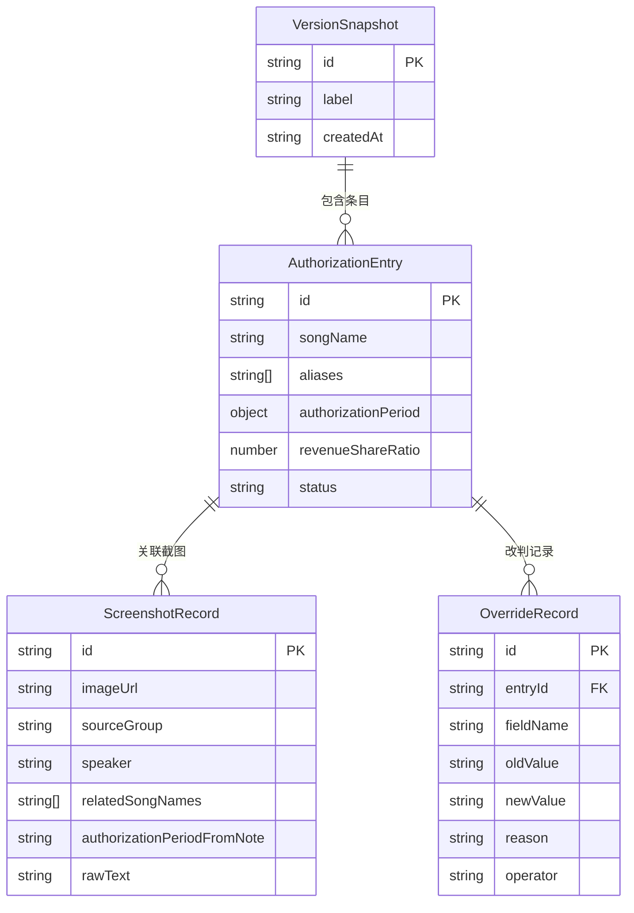

## 1. 架构设计

```mermaid
flowchart TD
    "前端层 (React + Vite)" --> "状态管理 (Zustand)"
    "状态管理 (Zustand)" --> "本地存储 (localStorage)"
    "前端层 (React + Vite)" --> "Mock 数据层"
    "Mock 数据层" --> "排练群截图数据"
    "Mock 数据层" --> "授权条目数据"
    "Mock 数据层" --> "改判历史数据"
```

纯前端架构，数据存储在 localStorage，Mock 数据内置测试用例。

## 2. 技术说明

- 前端：React@18 + Tailwind CSS@3 + Vite
- 初始化工具：Vite (react-ts template)
- 状态管理：Zustand（轻量级，支持持久化到 localStorage）
- 后端：无（纯前端，数据存 localStorage）
- 数据库：无（localStorage 持久化 + Mock 数据初始化）

## 3. 路由定义

| 路由 | 用途 |
|------|------|
| / | 分账对齐总览页：展示所有授权条目卡片、别名冲突溯源、人工改判说明、交付摘要面板、版本时间线 |
| /screenshot/new | 排练群截图录入页：上传截图、填写关联信息、溯源链预览 |

## 4. API 定义

无后端 API，所有数据操作通过 Zustand store 完成。

### 核心数据类型

```typescript
interface AuthorizationEntry {
  id: string
  songName: string
  aliases: string[]
  authorizationPeriod: {
    start: string
    end: string
  } | null
  revenueShareRatio: number
  status: 'aligned' | 'conflict' | 'missing_period' | 'overridden'
  screenshotIds: string[]
}

interface ScreenshotRecord {
  id: string
  imageUrl: string
  sourceGroup: string
  speaker: string
  relatedSongNames: string[]
  authorizationPeriodFromNote: string | null
  revenueShareFromNote: string | null
  rawText: string
  createdAt: string
}

interface OverrideRecord {
  id: string
  entryId: string
  fieldName: string
  oldValue: string
  newValue: string
  reason: string
  operator: string
  timestamp: string
}

interface VersionSnapshot {
  id: string
  entries: AuthorizationEntry[]
  overrides: OverrideRecord[]
  createdAt: string
  label: string
}

interface AliasConflict {
  alias: string
  entryIds: string[]
  sources: {
    screenshotId: string
    speaker: string
    originalPhrase: string
  }[]
}
```

### Store 操作

| 操作 | 说明 |
|------|------|
| addEntry | 新增授权条目 |
| updateEntry | 更新条目字段 |
| overrideEntry | 人工改判（创建 OverrideRecord，不可删除） |
| addScreenshot | 录入排练群截图 |
| rescan | 重扫对齐，生成新版本快照 |
| getAliasConflicts | 获取所有别名冲突及其溯源 |
| generateDeliverySummary | 生成交付摘要文本 |
| getVersionDiff | 对比两个版本快照差异 |

## 5. 服务端架构图

不适用（纯前端项目）

## 6. 数据模型

### 6.1 数据模型定义



### 6.2 Mock 测试数据

内置 5 条排练群截图 + 4 条授权条目，其中包含：
- 1 条人工改判记录（小温将「夜上海」分账比例从 40% 改为 35%，原因：排练群截图 B 中制作人确认原协议已修订）
- 1 条曲名别名冲突（「夜上海」与「夜上海 (复古版)」在排练群截图 C 中被同一发言者称为同一首歌，但截图 A 中被当作两首）
- 1 条授权期限藏在备注中的记录（「雨中旋律」授权期限 2025-03-01 至 2026-02-28，只在截图 D 的备注字段里提到）
- 数据故意不够"干净"：部分截图原始文本有口语化表述、错别字、非标准格式
