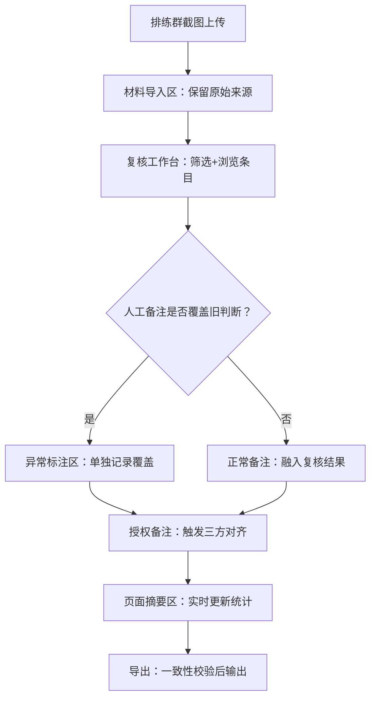

## 1. 产品概述

剧场返场曲版本复核系统——面向剧场排练管理流程的专业工具，解决排练群截图来源杂乱、人工批注覆盖旧判断难以追溯、筛选/备注/摘要不同步三大核心痛点。目标用户为剧场项目经理与琴房前台协调人员，核心价值是让临时改动通知链不再遗漏、数据溯源清晰可查、交接无需额外解释。

## 2. 核心功能

### 2.1 用户角色

| 角色 | 进入方式 | 核心权限 |
|------|----------|----------|
| 项目经理 | 直接访问 | 全部功能：导入材料、复核批注、查看异常、导出清单 |
| 琴房前台 | 直接访问 | 导入材料、查看复核结果、导出清单（只读批注） |

### 2.2 功能模块

1. **复核工作台**：筛选条件面板、复核条目列表、人工备注编辑、页面摘要区、授权备注触发对齐
2. **材料导入区**：排练群截图上传、原始来源标记与溯源、脏数据保留机制
3. **异常标注区**：人工批注覆盖旧判断的记录单独展示、异常状态标记与分类
4. **导出与一致性**：页面摘要导出、页面状态与导出文件内容一致性校验

### 2.3 页面详情

| 页面名称 | 模块名称 | 功能描述 |
|----------|----------|----------|
| 复核工作台 | 筛选条件面板 | 按演出日期、曲号、版本号、来源渠道筛选；筛选变更自动同步摘要区与备注区 |
| 复核工作台 | 复核条目列表 | 展示当前筛选下的所有返场曲版本条目，每条含曲号、版本号、来源截图缩略图、当前状态标签、人工备注入口 |
| 复核工作台 | 人工备注编辑 | 行内编辑备注文本，保存后自动检测是否覆盖旧判断；若覆盖则生成异常记录推至异常标注区 |
| 复核工作台 | 页面摘要区 | 实时汇总当前筛选条件下的统计信息：总条目数、已确认/待复核/异常数；摘要与筛选条件联动刷新 |
| 复核工作台 | 授权备注与对齐 | 输入一条授权备注后，系统自动将文件、曲目表、最后清单三者重新对齐，对齐结果即时反映在摘要区 |
| 复核工作台 | 材料导入区 | 拖拽上传排练群截图，系统自动提取元数据（时间、来源群、发送人）并标记原始来源；脏数据（模糊、截断、重复）保留原始痕迹，仅标注不修改 |
| 复核工作台 | 异常标注区 | 独立面板展示所有人工批注覆盖旧判断的记录，含原判断值、覆盖值、操作人、时间戳；异常记录不混入正常复核结果 |
| 复核工作台 | 导出与一致性 | 一键导出当前页面摘要为文件（JSON/CSV），导出前自动校验页面展示状态与导出内容一致性，不一致时高亮差异项 |

## 3. 核心流程

项目经理拿到排练群截图后，上传至材料导入区，系统保留原始来源痕迹并标注脏数据。在复核工作台通过筛选条件定位目标条目，添加人工备注；若备注覆盖已有判断，系统自动将覆盖记录推送至异常标注区。当需要确认临时改动时，输入授权备注触发文件-曲目表-清单三方对齐。导出时系统保证页面状态与文件内容一致，项目经理交接时三个区域（材料区、异常区、导出区）一目了然。

## 4. 用户界面设计

### 4.1 设计风格

- **主色调**：深炭灰（#1a1a2e）为底，暖琥珀色（#e8a838）为强调色，搭配象牙白（#f5f0e8）文字
- **辅助色**：异常用珊瑚红（#e85d50），确认用鼠尾草绿（#6b9e6b），待复核用雾蓝（#7ba7bc）
- **字体**：标题用 Noto Serif SC（衬线体，庄重剧场感），正文用 Noto Sans SC
- **布局**：单页面三栏分区——左侧材料区、中间复核区、右侧异常与导出区；顶部筛选条+摘要条
- **卡片风格**：微圆角（6px），细线边框，悬停时琥珀色左侧边条
- **图标风格**：线性图标，2px 描边

### 4.2 页面设计概览

| 页面名称 | 模块名称 | UI 要素 |
|----------|----------|---------|
| 复核工作台 | 顶部筛选+摘要条 | 横贯全宽，筛选条件左侧、页面摘要右侧，底部1px琥珀色分隔线 |
| 复核工作台 | 左侧材料区 | 240px 固定宽，截图缩略图列表，每条标注来源群名+时间，脏数据标签用虚线框+警告色角标 |
| 复核工作台 | 中间复核区 | 弹性宽度，条目卡片列表，每卡片含曲号、版本号、状态标签、备注编辑入口，当前对齐状态指示灯 |
| 复核工作台 | 右侧异常与导出区 | 280px 固定宽，上半部分异常记录列表（红点计数），下半部分导出按钮+一致性校验状态 |
| 复核工作台 | 授权备注弹窗 | 居中模态框，文本输入区+对齐结果预览，确认后自动关闭并刷新摘要 |

### 4.3 响应式

- 桌面优先（1440px+）：三栏完整展示
- 平板（768px-1439px）：左侧材料区收为可展开抽屉，右侧异常区收为底部面板
- 移动端（<768px）：单栏切换，底部 Tab 导航三个区域

### 4.4 3D 场景指引

不适用
