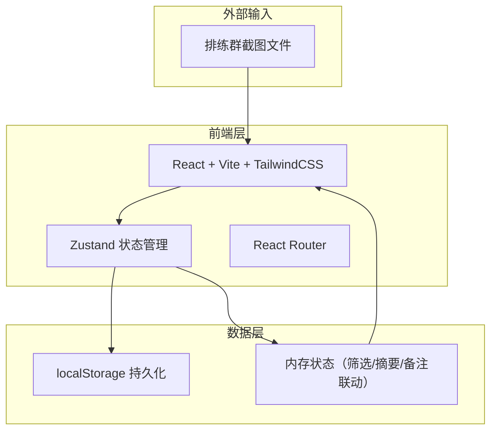
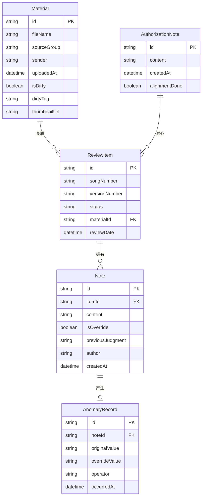

## 1. 架构设计



## 2. 技术说明

- **前端**：React@18 + TailwindCSS@3 + Vite
- **初始化工具**：Vite（react-ts 模板）
- **状态管理**：Zustand（轻量、同步筛选/备注/摘要三区状态）
- **路由**：React Router v6（单页内区域切换用 state 而非路由）
- **后端**：无（纯前端，数据持久化至 localStorage）
- **数据库**：无（localStorage + 内存，mock 数据驱动）
- **文件处理**：浏览器原生 FileReader API 处理截图上传
- **导出**：Blob + URL.createObjectURL 实现客户端导出

## 3. 路由定义

| 路由 | 用途 |
|------|------|
| / | 复核工作台主页面，包含材料导入区、复核条目列表、异常标注区、导出区 |

## 4. API 定义

无后端 API，所有数据操作在前端完成。核心数据操作通过 Zustand store 方法暴露：

- `addMaterial(file, meta)` — 上传截图并标记原始来源
- `updateFilter(filters)` — 更新筛选条件并同步摘要
- `addNote(itemId, note, isOverride)` — 添加人工备注，检测覆盖
- `addAuthorizationNote(note)` — 添加授权备注，触发三方对齐
- `exportSummary()` — 导出摘要并校验一致性

## 5. 服务端架构图

不适用（纯前端应用）

## 6. 数据模型

### 6.1 数据模型定义



### 6.2 数据定义

核心 TypeScript 类型定义：

```typescript
interface Material {
  id: string;
  fileName: string;
  sourceGroup: string;
  sender: string;
  uploadedAt: string;
  isDirty: boolean;
  dirtyTag: string;
  thumbnailUrl: string;
}

interface ReviewItem {
  id: string;
  songNumber: string;
  versionNumber: string;
  status: 'confirmed' | 'pending' | 'anomaly';
  materialId: string;
  reviewDate: string;
  alignedWith: { files: boolean; trackList: boolean; finalChecklist: boolean };
}

interface Note {
  id: string;
  itemId: string;
  content: string;
  isOverride: boolean;
  previousJudgment: string | null;
  author: string;
  createdAt: string;
}

interface AuthorizationNote {
  id: string;
  content: string;
  createdAt: string;
  alignmentDone: boolean;
}

interface AnomalyRecord {
  id: string;
  noteId: string;
  originalValue: string;
  overrideValue: string;
  operator: string;
  occurredAt: string;
}

interface FilterState {
  dateRange: [string, string] | null;
  songNumber: string;
  versionNumber: string;
  sourceChannel: string;
}

interface PageSummary {
  totalItems: number;
  confirmed: number;
  pending: number;
  anomaly: number;
  lastAlignmentAt: string | null;
  filtersApplied: FilterState;
}
```

Mock 初始数据包含 8-10 条预置复核条目、3-4 条材料记录、2 条异常记录，确保页面加载即可展示完整交互流程。
