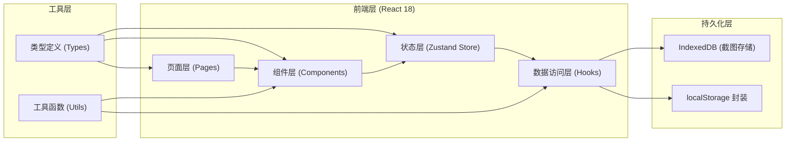
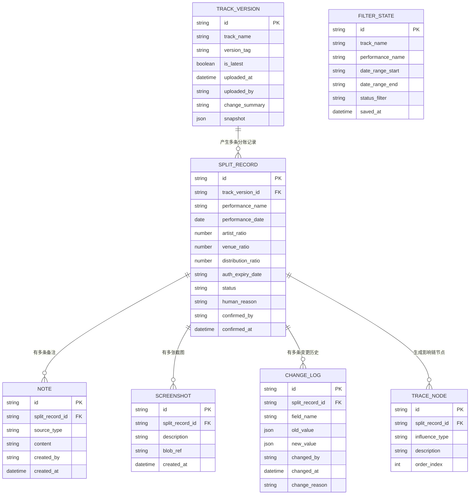

## 1. 架构设计



## 2. 技术说明
- 前端框架：React@18 + TypeScript@5
- 构建工具：Vite@5
- 路由：react-router-dom@6
- 状态管理：zustand@4
- 样式方案：tailwindcss@3
- 图标库：lucide-react
- 持久化：localStorage（结构化数据） + IndexedDB（截图 Blob）
- 导出能力：原生 Blob + CSV 生成 / window.print()
- 后端：无（纯前端单用户场景）

## 3. 路由定义
| 路由路径 | 页面组件 | 用途 |
|---------|---------|------|
| `/` | `AlignHome.tsx` | 分账对齐主页（默认入口） |
| `/versions` | `TrackVersions.tsx` | 曲目表版本管理 |
| `/traceability` | `Traceability.tsx` | 影响溯源面板 |
| `/history` | `HistoryReview.tsx` | 历史变更与复盘 |
| `/quickstart` | `QuickStart.tsx` | 新人快速入口 |

## 4. 数据模型

### 4.1 实体关系图



### 4.2 核心枚举值

**SPLIT_RECORD.status**
- `pending` - 待确认
- `aligned` - 已对齐
- `suspended` - 已挂起（授权到期）
- `conflicted` - 版本冲突
- `missing_note` - 备注待补

**NOTE.source_type**
- `old_version` - 旧版曲目表带入
- `manual_add` - 后补人工备注
- `verbal` - 口头备注转录

**TRACE_NODE.influence_type**
- `old_version` - 旧版曲目表影响
- `manual_add` - 后补备注影响
- `verbal` - 口头备注影响
- `system_check` - 系统校验

## 5. 核心目录结构
```
src/
├── types/
│   └── index.ts           # 全局类型定义
├── utils/
│   ├── storage.ts         # localStorage 封装
│   ├── idb.ts             # IndexedDB 封装
│   ├── export.ts          # 导出 CSV/打印工具
│   ├── diff.ts            # 对象 diff 工具
│   └── reason.ts          # 异常原因翻译（人话转换）
├── hooks/
│   ├── useSplitRecords.ts # 分账记录 CRUD
│   ├── useTrackVersions.ts# 曲目版本 CRUD
│   ├── useFilter.ts       # 筛选条件持久化
│   ├── useChangeLog.ts    # 变更历史记录
│   └── useAuthCheck.ts    # 授权到期检测
├── store/
│   └── appStore.ts        # Zustand 全局状态
├── components/
│   ├── layout/            # 顶栏/侧边栏/布局
│   ├── common/            # 按钮/标签/卡片通用组件
│   ├── AlignTable.tsx     # 分账记录表格
│   ├── FilterBar.tsx      # 筛选栏
│   ├── DetailDrawer.tsx   # 详情抽屉
│   ├── VersionTimeline.tsx# 版本时间线
│   ├── TraceChain.tsx     # 影响链图谱
│   ├── ChangeTimeline.tsx # 变更时间线
│   ├── ExceptionPanel.tsx # 异常看板
│   └── ExportCenter.tsx   # 导出中心
├── pages/
│   ├── AlignHome.tsx      # 分账对齐主页
│   ├── TrackVersions.tsx  # 曲目表版本页
│   ├── Traceability.tsx   # 影响溯源页
│   ├── HistoryReview.tsx  # 历史复盘页
│   └── QuickStart.tsx     # 新人快速页
├── data/
│   └── sampleData.ts      # 样例数据
├── App.tsx
├── main.tsx
└── index.css
```

## 6. 关键实现约定

### 6.1 版本不乱机制
- 新曲目表上传时自动加 `version_tag`（v1.0、v1.1...），旧版 `is_latest=false`，新版 `is_latest=true`
- 列表中旧版记录用 `opacity-60 italic`，最新版加 `ring-2 ring-green-400/40`
- 切换最新版必须二次确认，确认后生成 `CHANGE_LOG` 记录

### 6.2 刷新不丢状态
- 筛选条件每次变化写入 `FILTER_STATE`（localStorage key: `split_filter_v1`）
- 页面 `useEffect` 初始化时从 storage 读回
- 人工备注、截图与 `SPLIT_RECORD` 强关联，页面刷新自动带回来

### 6.3 影响溯源链
- 每次对分账记录操作时，自动判断动作来源并插入 `TRACE_NODE`
- `old_version` 节点：操作时指定了旧版 `track_version_id`
- `manual_add` 节点：用户在备注区主动新增（非初始加载时就有）
- `verbal` 节点：用户新增备注时勾选「这是口头备注转录」
- 溯源面板从右到左渲染节点，最右为最终结论

### 6.4 授权到期挂起
- 列表渲染时，`auth_expiry_date < today` 自动把 `status` 改为 `suspended`
- 挂起状态下所有比例编辑字段 `disabled`，只能执行「通知接手确认」
- 接手同事在 QuickStart 页挂起专区点「已确认可继续」才解锁为 `pending`

### 6.5 异常原因说人话
`utils/reason.ts` 中维护映射表，`SPLIT_RECORD.human_reason` 自动填充：
- `auth_expired` →「本曲目授权已于 X 月 X 日到期，已挂起待接手同事确认是否续约」
- `version_conflict` →「当前引用的 v1.0 曲目表已非最新版，最新为 v1.2，请核对后补备注」
- `missing_verbal` →「存在一条口头备注尚未转录成文字，请补录后再交接」
