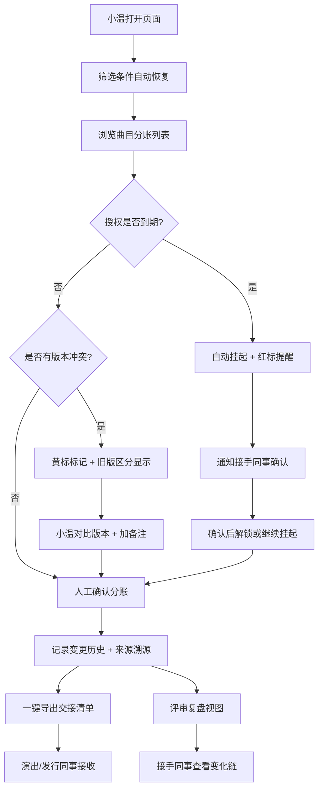

## 1. 产品概述
剧场返场曲分账对齐系统，面向琴房前台小温及演出/发行同事的业务协作工具。解决曲目表版本混乱、备注来源不清、授权到期误判三大痛点，确保分账结论可追溯、交接无障碍。
- 目标用户：琴房前台（日常操作）、演出同事（接收交接）、发行同事（接收交接）、接手同事（评审复盘）
- 核心价值：版本不乱、结论可溯、交接不说人话不行、授权到期不瞎给结论

## 2. 核心功能

### 2.1 用户角色
| 角色 | 注册方式 | 核心权限 |
|------|---------|---------|
| 琴房前台 | 默认登录 | 全量操作：曲目管理、分账对齐、备注、挂起、导出 |
| 演出/发行同事 | 只读查看 | 查看交接清单、异常原因、结论 |
| 接手同事 | 只读查看 | 查看历史变更、评审复盘、异常看板 |

### 2.2 功能模块
1. **分账对齐主页**：曲目表筛选、分账记录列表、筛选条件持久化、人工备注面板、截图说明关联
2. **曲目表版本管理**：多版本列表、最新版锁定标记、旧版高亮区分、版本快照对比
3. **影响溯源面板**：结论影响链可视化，区分「旧版曲目表」「后补备注」「口头备注」三类影响源
4. **授权到期挂起**：授权到期检测、状态自动流转挂起、接手同事二次确认机制
5. **历史变更与复盘**：变更时间线、操作人记录、人工确认前后 diff、评审会导出
6. **新人快速入口**：一键加载样例数据、异常看板聚合、结果一键导出 CSV/打印交接单

### 2.3 页面详情
| 页面名称 | 模块名称 | 功能描述 |
|---------|---------|---------|
| 分账对齐主页 | 顶部筛选栏 | 按曲目名/演出场次/日期/状态筛选，刷新后条件自动保留 |
| 分账对齐主页 | 曲目记录列表 | 每行显示曲目、版本标记、分账比例、授权状态、异常标签 |
| 分账对齐主页 | 右侧详情抽屉 | 选中记录展开：版本快照、人工备注区、截图上传、溯源链、操作按钮 |
| 曲目表版本页 | 版本时间线 | 各版本上传时间、操作人、变更摘要、是否为最新版的徽章 |
| 曲目表版本页 | 版本对比 | 左右双栏对比选中的两个版本，差异字段高亮 |
| 影响溯源页 | 影响链图谱 | 以结论为终点，反推三类影响源（旧版/后补/口头）的作用路径 |
| 历史复盘页 | 变更时间线 | 按时间倒序展示所有操作，含前后状态对比 |
| 新人快速页 | 样例加载卡 | 一键加载演示数据，含典型异常场景样例 |
| 新人快速页 | 异常看板 | 红黄绿三色聚合：授权到期(红)、版本冲突(黄)、备注缺失(浅黄) |
| 新人快速页 | 导出中心 | 一键导出交接清单(CSV)、评审复盘文档、分账对齐结果表 |

## 3. 核心流程
琴房前台小温每日打开页面 → 筛选条件自动恢复上次状态 → 逐条查看曲目分账记录 → 遇到授权到期自动标红挂起 → 人工确认时可加备注/截图，系统自动记录来源 → 确认后结论写入历史 → 交接时一键导出清单，异常原因自动翻译为自然语言 → 评审会上打开历史复盘页，逐条解释变化来源。

## 4. 用户界面设计

### 4.1 设计风格
- 主色：深墨蓝 `#1E3A5F`（专业稳重），辅色：琥珀金 `#D4A574`（剧场质感点缀）
- 警示色：胭脂红 `#C94A4A`（授权到期）、藤黄 `#E8B931`（版本冲突）、松绿 `#4A8C6E`（正常对齐）
- 字体：标题用「思源宋体 CN」(剧场文艺气质)，正文用「思源黑体 CN」(清晰可读)
- 按钮风格：微圆角(6px)、按下微凹、悬停微浮的拟物化扁平风
- 布局：左右双栏主布局 + 顶栏导航 + 卡片式信息块
- 图标风格：lucide-react 线性图标，重要操作配 1px 细线描边
- 整体调性：剧院后台办公感——不是花哨的消费级产品，而是专业、可靠、有温度的业务工具

### 4.2 页面设计概述
| 页面名称 | 模块名称 | UI 元素 |
|---------|---------|---------|
| 分账对齐主页 | 顶栏导航 | 深墨蓝底 + 琥珀金高亮当前页、面包屑显示当前筛选场次 |
| 分账对齐主页 | 筛选栏 | 浅灰卡片 + 下拉筛选 + 标签化已选条件，可单独清除 |
| 分账对齐主页 | 记录列表 | 斑马纹表格，最新版曲目松绿标「当前」，旧版灰斜体标「历史」，授权到期胭脂红横条 |
| 分账对齐主页 | 详情抽屉 | 右侧滑出，分区：版本快照 / 人工备注(带来源标签) / 截图预览 / 溯源链 / 操作区 |
| 曲目表版本页 | 版本时间线 | 左侧竖轴时间线 + 右侧卡片，最新版卡片外框松绿发光 |
| 影响溯源页 | 影响链图谱 | 横向从左到右流动：影响源(分三列色块) → 中间操作节点 → 右侧结论块，箭头带影响说明 |
| 历史复盘页 | 变更时间线 | 交替左右布局卡片，diff 用删除线+下划线样式展示前后变化 |
| 新人快速页 | 三卡片行 | 样例加载(琥珀金边框) / 异常看板(三色数字块) / 导出中心(图标按钮组) |

### 4.3 响应性
- Desktop 优先（1280px 起步），主操作区固定宽度
- 平板（768-1280px）：详情抽屉改为底部弹出
- 移动端（<768px）：列表单列堆叠，筛选折叠收起
- 所有交互支持键盘 Tab 导航，重要操作有 Enter 快捷键

### 4.4 动效细节
- 页面加载：顶栏先淡入，然后筛选栏滑下，最后列表逐行淡入（stagger 50ms）
- 详情抽屉：右侧滑入 + 背景遮罩淡入（200ms ease-out）
- 状态变更：颜色变化用 300ms 渐变过渡，异常标签出现时有轻微弹跳
- 版本标记切换：最新版徽章有呼吸光晕
