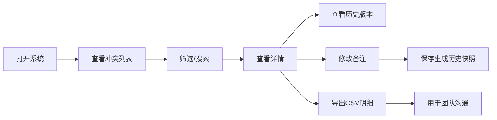

## 1. 产品概述

采样包素材排期冲突管理系统，专为演出统筹团队打造，解决演出前素材管理中合同扫描件、曲目表、时码标记的全链路追踪。
- 目标用户：演出统筹阿蓝、排班同事
- 核心价值：将"靠人记"转为"系统留痕"，服务重启不丢数据，历史可追溯

## 2. 核心功能

### 2.1 用户角色

| 角色 | 注册方式 | 核心权限 |
|------|-----------|-----------|
| 演出统筹 | 无需注册，本地系统 | 查看、编辑、导出全部数据 |
| 排班同事 | 无需注册，本地系统 | 查看、修改备注、导出CSV |

### 2.2 功能模块

1. **冲突列表页**：冲突记录列表、筛选器、状态展示、CSV导入导出
2. **冲突详情页**：合同扫描件关联、历史版本时间线、时码标记、备注历史
3. **历史对比页**：版本对比、变更记录

### 2.3 页面详情

| 页面名称 | 模块名称 | 功能描述 |
|-----------|-----------|----------|
| 冲突列表页 | 筛选区域 | 按状态、时码偏移标记、日期范围筛选 |
| 冲突列表页 | 数据列表 | 展示冲突记录，含处理状态、时码标记、最新备注 |
| 冲突列表页 | 操作栏 | 新增冲突记录、导出CSV明细 |
| 冲突详情页 | 基本信息 | 曲目名称、文件名、合同扫描件关联 |
| 冲突详情页 | 历史时间线 | 所有修改历史、版本快照 |
| 冲突详情页 | 备注编辑 | 支持修改备注，自动记录历史 |
| 冲突详情页 | 时码标记 | 标记"时码偏半拍"，支持筛选和导出 |

## 3. 核心流程

排班同事打开系统查看排期冲突列表
→ 筛选"时码偏半拍"记录
→ 点击查看详情
→ 查看合同扫描件历史版本
→ 修改备注
→ 保存（自动生成历史快照）
→ 导出CSV明细用于沟通

## 4. 用户界面设计

### 4.1 设计风格
- 主色调：深灰蓝 (#1e3a5f)，专业沉稳
- 辅助色：琥珀橙 (#f59e0b) 标记时码偏半拍
- 成功色：翡翠绿 (#10b981) 已处理状态
- 字体：标题用 Playfair Display，正文用 Source Serif Pro
- 布局：左右分栏，左侧筛选，右侧数据
- 风格：专业简约，适合后台管理，强调数据可读性

### 4.2 页面设计概述

| 页面名称 | 模块名称 | UI元素 |
|-----------|-----------|--------|
| 冲突列表页 | 筛选区域 | 下拉筛选、日期选择、搜索框 |
| 冲突列表页 | 数据表格 | 斑马纹、状态标签、时码标记徽章 |
| 冲突列表页 | 操作按钮 | 实线边框按钮，悬停有微动画 |
| 冲突详情页 | 历史时间线 | 垂直时间线，节点带版本号 |
| 冲突详情页 | 合同扫描件 | 卡片式展示，缩略图可放大 |
| 冲突详情页 | 备注编辑 | 文本域，保存按钮在右下角 |

### 4.3 响应性
- 桌面端优先，1280px 及以上
- 平板端适配，筛选区可折叠
- 移动端单列布局

### 4.4 交互动效
- 页面加载：内容渐入，表格行错峰出现
- 悬停：行背景微亮，按钮轻微上浮
- 历史版本切换：内容平滑过渡
- 时码标记闪烁动画提示
