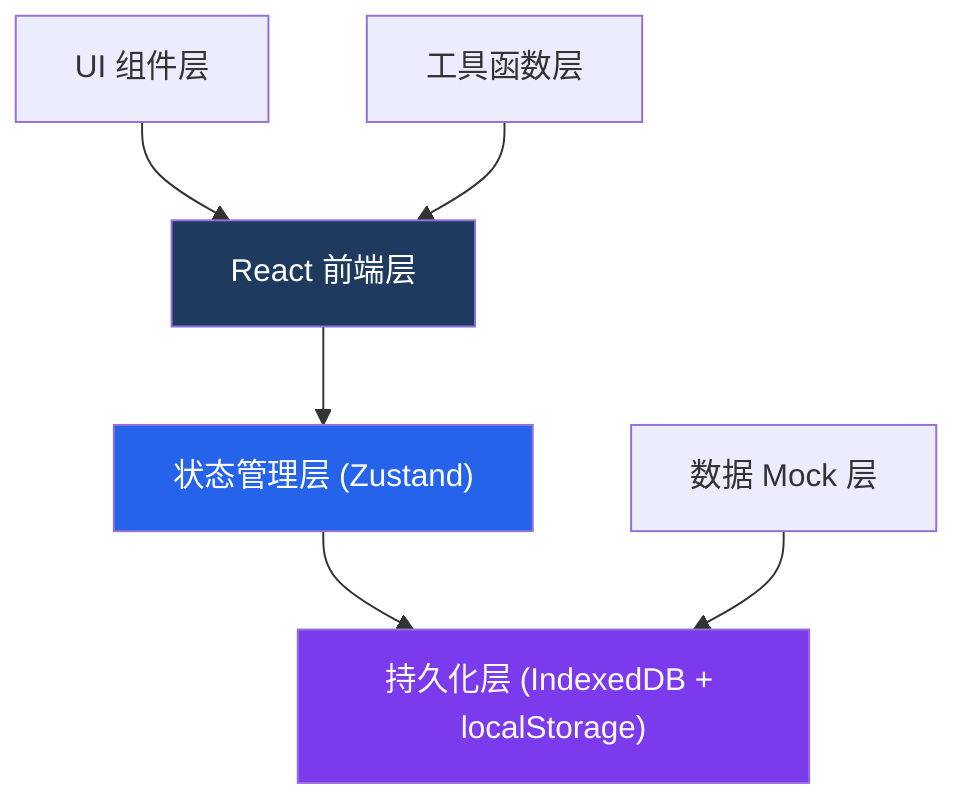
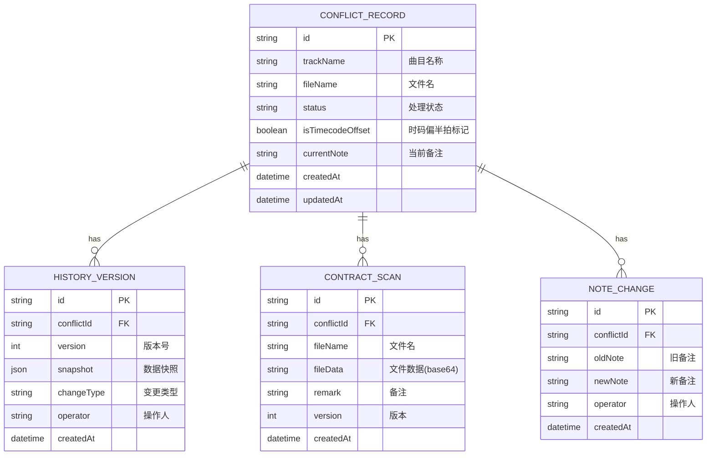

## 1. 架构设计



## 2. 技术描述

- **前端框架**：React@18 + TypeScript
- **构建工具**：Vite@5
- **样式方案**：TailwindCSS@3
- **状态管理**：Zustand（轻量、支持持久化）
- **本地存储**：IndexedDB（存合同扫描件、历史版本大数据）+ localStorage（存配置、状态）
- **路由**：React Router DOM@6
- **图标**：Lucide React
- **CSV 处理**：Papa Parse
- **日期处理**：date-fns

## 3. 路由定义

| 路由 | 页面 | 说明 |
|-------|------|------|
| / | 冲突列表页 | 展示所有冲突记录，支持筛选、搜索、导出 |
| /conflict/:id | 冲突详情页 | 查看详情、编辑备注、查看历史版本 |
| /conflict/:id/history | 历史对比页 | 对比不同版本差异 |
| /import | CSV导入页 | 批量导入冲突记录 |

## 4. 数据模型

### 4.1 实体关系图



### 4.2 核心数据结构

```typescript
type ConflictStatus = 'pending' | 'processing' | 'resolved' | 'closed';

interface ConflictRecord {
  id: string;
  trackName: string;
  fileName: string;
  status: ConflictStatus;
  isTimecodeOffset: boolean;
  currentNote: string;
  contractScans: ContractScan[];
  historyVersions: HistoryVersion[];
  noteChanges: NoteChange[];
  createdAt: string;
  updatedAt: string;
}

interface HistoryVersion {
  id: string;
  conflictId: string;
  version: number;
  snapshot: Partial<ConflictRecord>;
  changeType: 'create' | 'update' | 'status_change' | 'note_change' | 'scan_add';
  operator: string;
  changeDescription: string;
  createdAt: string;
}

interface ContractScan {
  id: string;
  conflictId: string;
  fileName: string;
  fileData: string;
  remark: string;
  version: number;
  createdAt: string;
}

interface NoteChange {
  id: string;
  conflictId: string;
  oldNote: string;
  newNote: string;
  operator: string;
  createdAt: string;
}
```

## 5. 核心模块设计

### 5.1 状态管理 Store

```typescript
// stores/conflictStore.ts
interface ConflictState {
  records: ConflictRecord[];
  filters: {
    status?: ConflictStatus;
    isTimecodeOffset?: boolean;
    dateRange?: [string, string];
    keyword?: string;
  };
  currentRecord: ConflictRecord | null;
  
  // actions
  loadRecords: () => Promise<void>;
  saveRecord: (record: ConflictRecord) => Promise<void>;
  updateNote: (id: string, newNote: string, operator: string) => Promise<void>;
  addContractScan: (id: string, scan: Omit<ContractScan, 'id' | 'version'>) => Promise<void>;
  updateStatus: (id: string, status: ConflictStatus, operator: string) => Promise<void>;
  toggleTimecodeOffset: (id: string, operator: string) => Promise<void>;
  exportCSV: (filters?: typeof filters) => string;
  importCSV: (csvData: string) => Promise<void>;
  setFilters: (filters: Partial<typeof filters>) => void;
}
```

### 5.2 持久化层

- **IndexedDB**：存储合同扫描件（文件数据）、历史版本快照
- **localStorage**：存储冲突记录元数据、筛选条件、用户配置
- **自动同步**：状态变更时自动写入持久化存储，页面加载时自动恢复

### 5.3 历史版本机制

每次数据变更自动创建历史快照：
1. 创建记录 → 版本1
2. 修改备注 → 新版本（记录新旧备注差异）
3. 添加合同扫描件 → 新版本（记录扫描件信息）
4. 状态变更 → 新版本（记录状态流转）
5. 时码标记变更 → 新版本

## 6. CSV 导出规范

导出字段与页面展示完全一致：

| 列名 | 说明 | 对应字段 |
|------|------|---------|
| 曲目名称 | 曲目表中的名称 | trackName |
| 文件名 | 素材文件名 | fileName |
| 处理状态 | 待处理/处理中/已解决/已关闭 | status |
| 时码偏半拍 | 是/否 | isTimecodeOffset |
| 当前备注 | 最新备注内容 | currentNote |
| 合同扫描件数量 | 关联的扫描件数 | contractScans.length |
| 历史版本数 | 变更次数 | historyVersions.length |
| 最后更新时间 | ISO格式时间 | updatedAt |
| 创建时间 | ISO格式时间 | createdAt |

状态映射：
- pending → "待处理"
- processing → "处理中"
- resolved → "已解决"
- closed → "已关闭"
