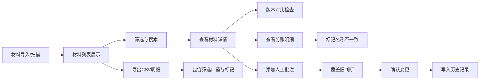

## 1. 产品概述

琴房课时分账对齐系统，用于管理钢琴教室的课时费用分账核对。系统处理合同扫描件、课时记录、人工批注等多种来源材料，帮助演出统筹人员完成分账对齐工作，确保老师和学生的课时费用准确无误。

- 核心目标：解决多来源材料的分账对齐难题，提供筛选、详情、导出、版本管理、历史追溯的完整处理链
- 目标用户：演出统筹人员（如阿蓝）、财务对接人员
- 产品价值：将散落的合同扫描件、补充说明、人工批注统一管理，减少人工核对错误，提高分账效率

## 2. 核心功能

### 2.1 用户角色

| 角色 | 核心权限 |
|------|----------|
| 演出统筹 | 材料上传、筛选查看、详情核对、导出CSV、人工批注、版本对比、历史追溯 |

### 2.2 功能模块

1. **分账列表页**：材料列表、筛选条件、状态标记、批量操作
2. **材料详情页**：材料信息、分账明细、版本对比、人工批注、操作记录
3. **导出功能**：CSV导出，包含筛选口径和完整明细
4. **历史记录页**：操作日志、变更对比、社区公示复盘数据

### 2.3 页面详情

| 页面名称 | 模块名称 | 功能描述 |
|-----------|-------------|---------------------|
| 分账列表页 | 顶部筛选栏 | 按老师、学生、时间段、材料类型、状态筛选，筛选条件保留在导出中 |
| 分账列表页 | 材料列表 | 卡片式列表，显示材料名称、类型、状态、金额、版本标记、人工批注标记 |
| 分账列表页 | 批量操作 | 批量导出、批量标记 |
| 材料详情页 | 基本信息区 | 材料名称、来源、上传时间、版本号、版本来源 |
| 材料详情页 | 分账明细 | 课时记录、学生进度、费用明细、名称不一致标记 |
| 材料详情页 | 版本对比 | 旧版与新版对比，显示处理建议，不自动覆盖 |
| 材料详情页 | 人工批注 | 添加批注、覆盖旧判断、批注历史 |
| 历史记录页 | 操作日志 | 所有人工确认、批注、导出的历史记录 |
| 历史记录页 | 变更对比 | 人工确认前后的变化对比 |

## 3. 核心流程

### 3.1 分账对齐处理流程

演出统筹人员上传或导入合同扫描件后，系统识别材料信息并展示在列表中。用户可以通过筛选条件快速定位材料，查看详情时系统自动比对版本差异、标记名称不一致的记录。用户可添加人工批注覆盖系统判断，确认后变更记录进入历史。最终导出CSV时，筛选口径和所有标记都保留在明细中。

### 3.2 版本管理流程

当扫描到旧版文件时，系统不会自动覆盖新版，而是将旧版与新版并列展示，标注版本来源（合同扫描件/后补说明/人工修正），并给出处理建议（保留新版/合并信息/需人工确认），由人工决定如何处理。

## 4. 用户界面设计

### 4.1 设计风格

- **主色调**：深海蓝 (#0F2B4D) - 专业、稳重、信任感
- **辅助色**：琥珀金 (#D4A853) - 用于高亮、标记、重要提醒
- **状态色**：
  - 正常：墨绿 (#2D6A4F)
  - 待处理：橙红 (#E07A5F)
  - 名称不一致：紫色 (#7B2CBF)
  - 人工批注：琥珀金 (#D4A853)
- **背景色**：米灰 (#F5F2EB) - 温暖的中性底色，避免冷硬感
- **卡片背景**：纯白 (#FFFFFF)
- **字体**：
  - 标题："Noto Serif SC" 宋体 - 正式、专业感
  - 正文："Noto Sans SC" 黑体 - 清晰易读
- **按钮风格**：微立体、圆角 6px、悬停有微妙阴影变化
- **布局风格**：左侧导航 + 右侧内容区，卡片式布局，信息分组清晰
- **图标风格**：lucide 线性图标，与专业风格匹配

### 4.2 页面设计概览

| 页面名称 | 模块名称 | UI 元素 |
|-----------|-------------|----------|
| 分账列表页 | 顶部筛选栏 | 深色背景、下拉筛选器、搜索框、筛选标签悬浮效果 |
| 分账列表页 | 材料卡片 | 白色卡片、状态标签、版本标记角标、悬停上浮动效 |
| 材料详情页 | 信息分区 | 分区标题带下划线、左右两列布局、版本对比左右分栏 |
| 材料详情页 | 分账明细表格 | 斑马纹行、名称不一致行紫色背景标记、悬停高亮 |
| 历史记录页 | 时间线 | 左侧时间轴、右侧操作卡片、变更点高亮标记 |

### 4.3 响应式设计

- 桌面端优先设计（1280px 以上）
- 平板端：左侧导航收起为图标模式
- 移动端：底部导航，列表改为单列卡片布局

### 4.4 微交互动效

- 页面加载：内容区淡入 + 轻微上移
- 卡片悬停：上浮 2px + 阴影加深
- 筛选标签：添加/移除时有缩放过渡
- 状态变更：颜色渐变过渡
- 详情展开：高度平滑过渡
