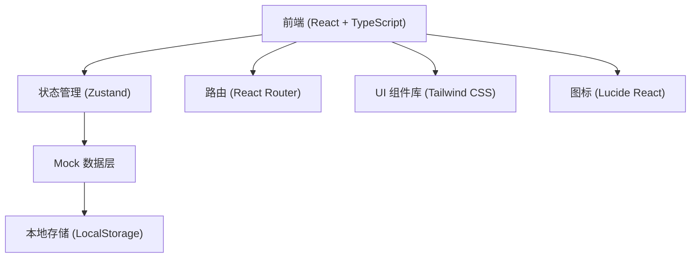
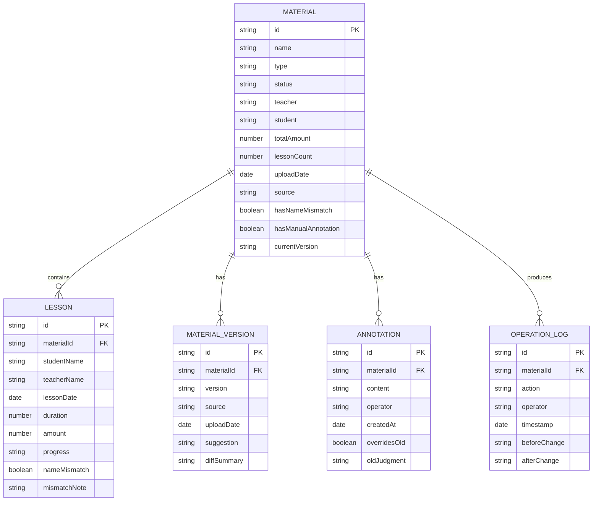

## 1. 架构设计



采用纯前端架构，使用 Mock 数据模拟后端，数据持久化通过 LocalStorage 实现。适合演示和内部工具使用。

## 2. 技术选型说明

- **前端框架**：React@18 + TypeScript
- **构建工具**：Vite
- **样式方案**：Tailwind CSS@3
- **状态管理**：Zustand
- **路由管理**：react-router-dom
- **图标库**：lucide-react
- **数据来源**：Mock 数据 + LocalStorage 持久化

选择纯前端架构的原因：
1. 该系统作为内部工具使用，数据量可控
2. 便于快速迭代和演示
3. 无需后端部署成本

## 3. 路由定义

| 路由路径 | 页面名称 | 说明 |
|----------|----------|------|
| `/` | 分账列表页 | 材料列表、筛选、搜索、批量操作 |
| `/detail/:id` | 材料详情页 | 材料信息、分账明细、版本对比、人工批注 |
| `/history` | 历史记录页 | 操作日志、变更对比、复盘数据 |

## 4. 数据模型

### 4.1 数据实体关系



### 4.2 数据状态定义

- **材料状态 (status)**：
  - `pending`: 待处理
  - `processing`: 处理中
  - `confirmed`: 已确认
  - `mismatch`: 名称不一致
  - `annotated`: 有人工批注

- **材料来源 (source)**：
  - `contract_scan`: 合同扫描件
  - `supplement`: 后补说明
  - `manual`: 人工录入
  - `system`: 系统生成

- **版本来源 (version source)**：
  - `contract_scan`: 合同扫描件
  - `supplement_note`: 后补说明
  - `manual_correction`: 人工修正

### 4.3 演示数据设计

包含一组"不太干净"的演示数据，覆盖以下场景：
1. **正常材料**：2-3 条，状态正常，无异常
2. **名称不一致材料**：1 条，学生姓名在不同记录中有差异（如"王小明" vs "王晓明"）
3. **人工批注覆盖旧判断**：1 条，系统原判断为"正常"，人工批注改为"需调整"，并记录覆盖原因
4. **多版本材料**：1 条，同时存在旧版和新版，显示版本对比和处理建议
5. **后补说明材料**：1 条，来源为后补说明

## 5. 核心模块设计

### 5.1 筛选模块

- 支持多条件组合筛选
- 筛选条件实时生效
- 筛选条件作为导出 CSV 的表头备注
- 已选筛选条件以标签形式展示，可单独移除

### 5.2 导出模块

- 导出格式：CSV
- 导出内容：当前筛选结果的所有明细
- 导出包含：
  - 筛选口径说明（CSV 首行备注）
  - 材料基本信息
  - 分账明细
  - 状态标记列（名称不一致、人工批注等）
  - 版本信息

### 5.3 版本对比模块

- 左右分栏展示旧版与新版
- 高亮显示差异项
- 显示版本来源和上传时间
- 提供处理建议（保留新版 / 合并信息 / 需人工确认）
- 不自动覆盖，需人工操作确认

### 5.4 历史记录模块

- 时间线形式展示操作记录
- 记录人工确认前后的变化
- 支持按操作类型筛选
- 可查看变更详情对比

## 6. 项目结构

```
src/
├── components/          # 可复用组件
│   ├── Layout/         # 布局组件
│   ├── MaterialCard/   # 材料卡片
│   ├── FilterBar/      # 筛选栏
│   ├── StatusTag/      # 状态标签
│   └── VersionCompare/ # 版本对比
├── pages/              # 页面组件
│   ├── MaterialList/   # 分账列表页
│   ├── MaterialDetail/ # 材料详情页
│   └── History/        # 历史记录页
├── store/              # Zustand 状态管理
│   └── useMaterialStore.ts
├── data/               # Mock 数据
│   └── mockData.ts
├── types/              # TypeScript 类型定义
│   └── index.ts
├── utils/              # 工具函数
│   ├── csvExport.ts    # CSV 导出
│   └── dateFormat.ts   # 日期格式化
├── App.tsx
├── main.tsx
└── index.css
```
