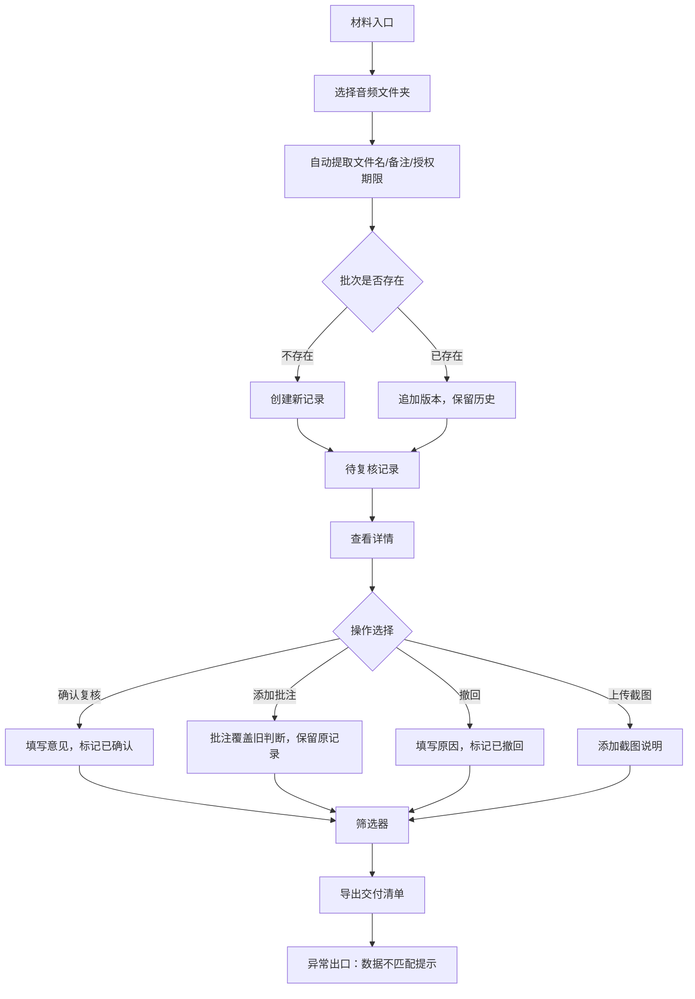

## 1. 产品概述

音乐节摊位版本复核工具，专为音乐老师林姐设计，解决音频文件分批导入、授权期限查找困难、人工批注与历史版本混乱等问题。核心价值是让复核过程可追溯、不覆盖、标记清晰。

- 主要用途：音乐节摊位音频材料的版本复核与授权管理
- 解决痛点：音频分批导入覆盖问题、授权期限藏在备注里难找、人工批注与历史版本混淆
- 目标用户：音乐老师（复核者）、行政人员（补材料）、交付人员（导出清单）

## 2. 核心功能

### 2.1 用户角色

| 角色 | 使用场景 | 核心操作 |
|------|----------|----------|
| 复核者（林姐） | 主复核流程 | 导入音频、确认复核、撤回判断、查看截图 |
| 补材料者 | 分批补充音频 | 追加导入、添加备注、重扫复核 |
| 导出者 | 最终交付 | 筛选记录、导出清单、核对版本 |

### 2.2 功能模块

1. **复核主页**：材料导入区、记录列表、筛选器、操作说明
2. **详情面板**：版本时间线、授权信息、人工批注、截图说明
3. **操作浮层**：导入确认、复核确认、撤回确认、截图上传

### 2.3 页面详情

| 页面名称 | 模块名称 | 功能描述 |
|-----------|-------------|---------------------|
| 复核主页 | 导入区 | 拖拽/选择音频文件夹，自动读取文件名和备注，提取授权期限 |
| 复核主页 | 记录列表 | 按摊位编号展示，每条带状态标记（待复核/已确认/已撤回/有批注） |
| 复核主页 | 筛选器 | 按状态、日期、摊位号筛选，支持搜索备注关键词 |
| 复核主页 | 操作说明 | 放样例、重跑、查看截图说明三件事，简明扼要 |
| 详情面板 | 版本时间线 | 展示历次导入时间、导入人、变更内容，新旧版本可对比 |
| 详情面板 | 授权信息 | 醒目展示授权期限，到期前高亮提醒 |
| 详情面板 | 人工批注 | 区分正常材料和批注覆盖，批注带人名和时间戳 |
| 详情面板 | 交付清单 | 关联导出记录，版本、批注、交付三者可互查 |
| 操作浮层 | 导入确认 | 显示新增/覆盖/追加选项，明确提示数据变化 |
| 操作浮层 | 复核确认 | 需填写复核意见，确认后不可随意修改 |
| 操作浮层 | 撤回确认 | 需填写撤回原因，原判断保留不删除 |
| 操作浮层 | 截图上传 | 支持多图上传，每张图可加文字说明 |

## 3. 核心流程

用户从材料入口进入，选择音频文件夹导入，系统自动提取信息并生成记录。复核者查看详情，可确认通过或添加批注。如需撤回，原记录保留并标记。补材料时采用追加模式，不覆盖历史判断。所有操作留痕，最终可筛选导出交付清单。

## 4. 用户界面设计

### 4.1 设计风格

- **主色调**：深靛蓝 #1E3A5F，代表专业与可靠
- **辅助色**：琥珀橙 #F59E0B（待复核提醒）、翡翠绿 #10B981（已确认）、玫瑰红 #EF4444（已撤回/到期）、紫罗兰 #8B5CF6（有人工批注）
- **按钮风格**：圆角矩形，轻微阴影，hover 时上浮 2px，状态色区分明显
- **字体**：标题用 "Noto Serif SC"（人文感，适合音乐场景），正文用 "Noto Sans SC"（清晰易读）
- **布局**：左侧导航+主内容区，卡片式记录列表，右侧滑出详情面板
- **图标**：用简洁线性图标，音频用音符🎵、授权用日历📅、批注用气泡💬、截图用相框🖼️

### 4.2 页面设计概述

| 页面名称 | 模块名称 | UI 元素 |
|-----------|-------------|-------------|
| 复核主页 | 导入区 | 虚线框拖拽区域，大字体提示，样例按钮显眼 |
| 复核主页 | 记录列表 | 卡片网格布局，状态色条在左侧，角标显示版本数 |
| 复核主页 | 筛选器 | 标签式筛选，搜索框带放大镜图标 |
| 复核主页 | 操作说明 | 右上角折叠面板，三步简明说明 |
| 详情面板 | 版本时间线 | 垂直时间轴，节点用状态色，连线区分正常/批注 |
| 详情面板 | 授权信息 | 卡片突出显示，到期前 7 天橙红渐变边框 |
| 详情面板 | 人工批注 | 浅紫背景，斜体文字，右下角署名和时间 |
| 操作浮层 | 导入确认 | 表格对比新旧数据，红色标记将覆盖项 |
| 操作浮层 | 复核确认 | 文本域必填，确认按钮需二次点击 |

### 4.3 响应性

- 桌面端优先（1280px+），主内容区三栏布局
- 平板端（768-1279px）：详情面板改为底部弹出
- 移动端（<768px）：列表改为单列，导入区简化
- 触摸优化：按钮最小 44px，列表项可滑动显示快捷操作

### 4.4 异常处理

- 导入无备注文件：黄色警示，提示手动补充授权期限
- 授权已过期：红色闪烁边框，导出前强制确认
- 版本不匹配：弹窗提示历史记录与当前文件差异
- 撤回已导出记录：警告将影响交付清单，需二次确认
