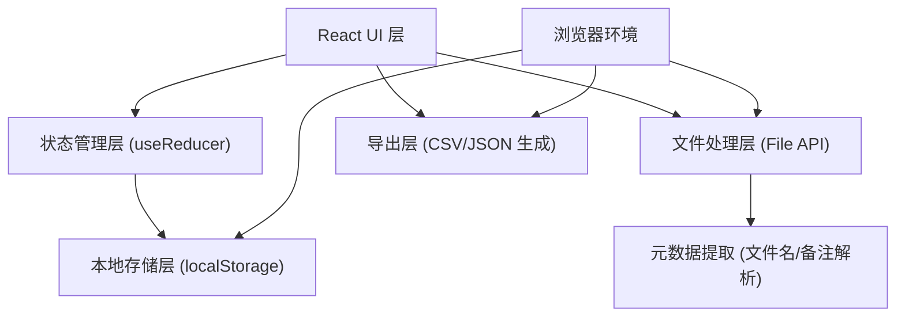
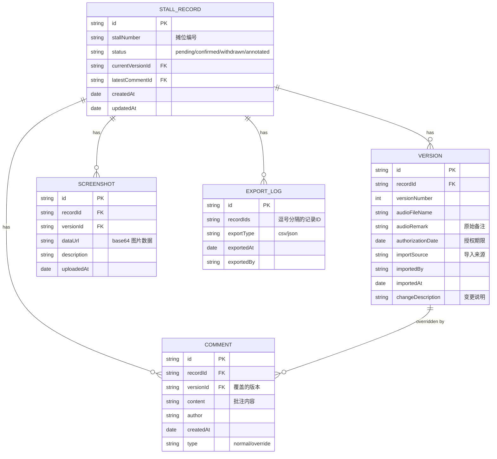

## 1. 架构设计

本应用为纯前端本地应用，所有数据存储在浏览器 localStorage 中，无需后端服务。采用 React 组件化架构，状态集中管理，确保数据一致性。



## 2. 技术描述

- **前端框架**：React@18 + TypeScript
- **构建工具**：Vite@5
- **样式方案**：TailwindCSS@3 + CSS 变量
- **图标库**：Lucide React（轻量线性图标）
- **状态管理**：React useReducer + Context（轻量全局状态）
- **本地存储**：localStorage（结构化 JSON 存储）
- **文件处理**：浏览器原生 File System Access API
- **数据导出**：客户端 CSV/JSON 生成（Blob + URL.createObjectURL）

## 3. 路由定义

| 路由 | 用途 |
|-------|---------|
| / | 复核主页 - 导入、列表、筛选 |
| /detail/:id | 详情面板 - 版本时间线、授权、批注 |
| /export | 导出页 - 筛选和导出交付清单 |

## 4. 数据模型

### 4.1 数据模型定义



### 4.2 数据结构定义（TypeScript）

```typescript
type RecordStatus = 'pending' | 'confirmed' | 'withdrawn' | 'annotated';
type CommentType = 'normal' | 'override';

interface StallRecord {
  id: string;
  stallNumber: string;
  status: RecordStatus;
  currentVersionId: string;
  latestCommentId?: string;
  createdAt: string;
  updatedAt: string;
}

interface Version {
  id: string;
  recordId: string;
  versionNumber: number;
  audioFileName: string;
  audioRemark: string;
  authorizationDate: string;
  importSource: string;
  importedBy: string;
  importedAt: string;
  changeDescription: string;
}

interface Comment {
  id: string;
  recordId: string;
  versionId: string;
  content: string;
  author: string;
  createdAt: string;
  type: CommentType;
}

interface Screenshot {
  id: string;
  recordId: string;
  versionId: string;
  dataUrl: string;
  description: string;
  uploadedAt: string;
}

interface ExportLog {
  id: string;
  recordIds: string[];
  exportType: 'csv' | 'json';
  exportedAt: string;
  exportedBy: string;
}

interface AppState {
  records: StallRecord[];
  versions: Version[];
  comments: Comment[];
  screenshots: Screenshot[];
  exportLogs: ExportLog[];
  filters: {
    status?: RecordStatus;
    dateFrom?: string;
    dateTo?: string;
    stallNumber?: string;
    keyword?: string;
  };
}
```

## 5. 核心模块设计

### 5.1 文件解析模块

```typescript
// 从文件名和备注中提取授权期限
function parseAuthorization(remark: string): Date | null {
  // 匹配多种日期格式：2024-12-31、2024/12/31、授权至2024.12.31等
  const patterns = [
    /(\d{4})[-\/\.](\d{1,2})[-\/\.](\d{1,2})/,
    /授权至[：: ]*(\d{4})[-\/\.](\d{1,2})[-\/\.](\d{1,2})/,
    /有效期[至到][：: ]*(\d{4})[-\/\.](\d{1,2})[-\/\.](\d{1,2})/,
  ];
  // ... 解析逻辑
}

// 从文件名提取摊位编号
function parseStallNumber(filename: string): string | null {
  const pattern = /摊位[#号]?(\d+[-A-Za-z0-9]*)/;
  const match = filename.match(pattern);
  return match ? match[1] : null;
}
```

### 5.2 版本控制模块

```typescript
// 追加新版本，永不删除历史
function appendVersion(
  existingRecord: StallRecord,
  newVersionData: Omit<Version, 'id' | 'versionNumber' | 'importedAt'>
): { record: StallRecord; version: Version } {
  // 版本号递增
  // 保留原记录状态
  // 标记为有新版本待复核
}
```

### 5.3 状态流转模块

```typescript
// 确认复核
function confirmRecord(recordId: string, comment: string, author: string): void;

// 撤回确认（保留历史）
function withdrawRecord(recordId: string, reason: string, author: string): void;

// 添加批注（可覆盖旧判断）
function addComment(
  recordId: string,
  versionId: string,
  content: string,
  author: string,
  type: CommentType
): void;
```

## 6. 数据持久化

### 6.1 存储键名

```typescript
const STORAGE_KEY = 'music_festival_review_data_v1';
```

### 6.2 自动保存机制

- 每次状态变更后 300ms 防抖写入 localStorage
- 页面加载时从 localStorage 恢复状态
- 提供"导出备份"和"导入备份"功能

## 7. Mock 数据

初始化时内置 3 条示例数据，涵盖不同状态，便于用户理解和试用：

1. **摊位 A01** - 待复核状态，2 个版本，授权期限 2024-12-31
2. **摊位 B03** - 已确认状态，有批注覆盖记录
3. **摊位 C02** - 已撤回状态，带截图说明
