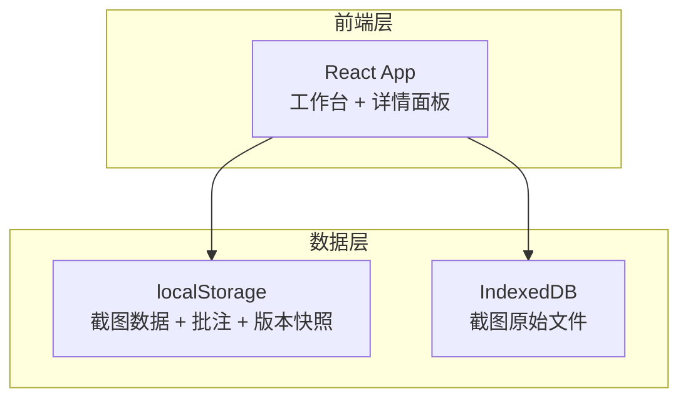
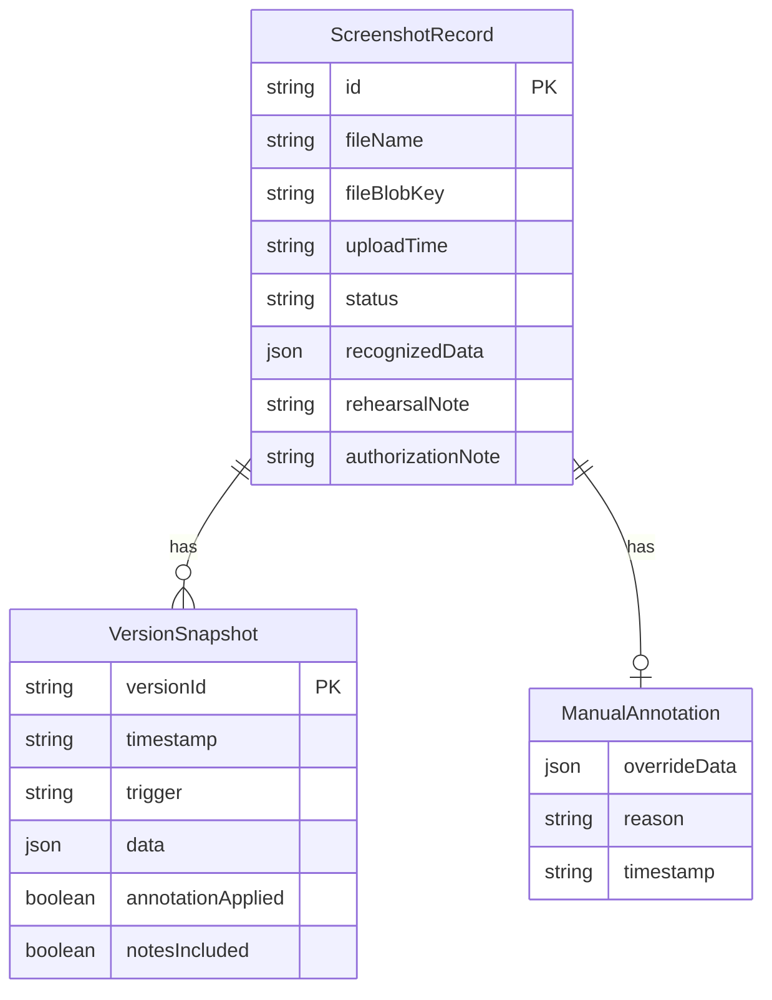

## 1. 架构设计



纯前端架构，无需后端服务。所有数据持久化在浏览器本地（localStorage 存结构化数据，IndexedDB 存截图文件），满足"好交接的小工具"定位。

## 2. 技术说明

- **前端**：React@18 + Tailwind CSS@3 + Vite
- **初始化工具**：Vite (create-vite)
- **后端**：无
- **数据库**：localStorage + IndexedDB（浏览器本地存储）
- **导出格式**：JSON 文件（包含筛选口径、截图状态、批注、版本对齐信息）

## 3. 路由定义

| 路由 | 用途 |
|------|------|
| / | 工作台主页面，包含截图列表、筛选器、摘要条、详情面板和导出功能 |

单页应用，所有功能在工作台一个页面内完成，通过面板展开/收起切换视图。

## 4. API 定义

无后端 API。所有数据操作通过前端本地存储接口：

```typescript
interface ScreenshotRecord {
  id: string
  fileName: string
  fileBlobKey: string
  uploadTime: string
  status: "pending" | "recognized" | "anomaly" | "annotated"
  recognizedData: {
    participants: string[]
    shares: { name: string; ratio: number }[]
    introType: string
  } | null
  manualAnnotation: {
    overrideData: {
      participants: string[]
      shares: { name: string; ratio: number }[]
      introType: string
    }
    reason: string
    timestamp: string
  } | null
  rehearsalNote: string
  authorizationNote: string
  versions: VersionSnapshot[]
}

interface VersionSnapshot {
  versionId: string
  timestamp: string
  trigger: "initial_recognition" | "manual_annotation" | "rescan"
  data: {
    participants: string[]
    shares: { name: string; ratio: number }[]
    introType: string
  }
  annotationApplied: boolean
  notesIncluded: boolean
}

interface ExportPayload {
  exportTime: string
  filterCriteria: {
    statuses: string[]
    dateRange: { start: string; end: string } | null
    hasAnomaly: boolean | null
    hasManualAnnotation: boolean | null
  }
  filterCriteriaText: string
  summary: {
    total: number
    anomaly: number
    annotated: number
    pending: number
  }
  records: ScreenshotRecord[]
}

interface PageSummary {
  filterCriteriaText: string
  total: number
  anomaly: number
  annotated: number
  pending: number
}
```

## 5. 服务器架构图

不适用（纯前端）。

## 6. 数据模型

### 6.1 数据模型定义



### 6.2 数据定义语言

使用 localStorage 键值对：

- `podcast_align_records`：ScreenshotRecord[] 的 JSON 序列化
- `podcast_align_export_counter`：导出计数器，用于生成导出文件名编号

IndexedDB：
- 数据库名：`PodcastAlignDB`
- Object Store：`screenshots`，键为 `fileBlobKey`，值为 Blob 对象

试跑数据：内置 5 条模拟截图记录（含 1 条边界样本），数据硬编码在应用初始化逻辑中，不依赖外部接口。
