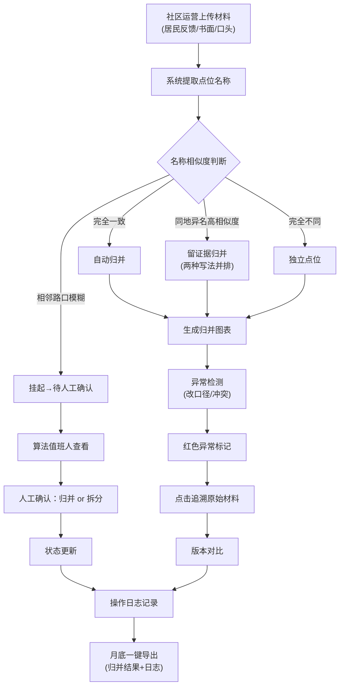

## 1. 产品概述
面向社区运营与算法值班的双人协作型数据归并工具，解决夜市外摆点位因名称不一致、相邻路口误合、材料口径变更等导致归并结果不可信的问题，提供从图表到原始材料的全链路追溯、冲突挂起机制与可审计的操作日志，确保月底汇报有据可依。

## 2. 核心功能

### 2.1 用户角色
| 角色 | 核心场景 | 核心权限 |
|------|----------|----------|
| 社区运营（阿宁） | 上传居民反馈/书面材料/口头说明、补充备注、查看归并状态 | 材料管理、备注编辑、导出报表 |
| 算法值班人 | 查看归并图表、追溯异常点明细、确认挂起项、重跑归并、重新导出 | 归并操作、挂起确认、状态变更、全量数据查看 |

### 2.2 功能模块
1. **页面摘要区**：四大卡片（点位总数/异常数/挂起数/待处理）+ 关键时间戳，接手即懂当前状态
2. **材料管理区**：材料上传、多来源标签、版本历史（口径变更高亮标记）、材料与点位关联
3. **归并图表区**：点位归并关系图，异常点红色高亮，点击节点一路追溯至原始材料
4. **异常与挂起区**：异常清单、挂起待确认项、相邻路口冲突提示、人工确认操作
5. **归并证据区**：同地异名归并证据链、两种原始写法并排展示、历史备注时间轴
6. **操作日志区**：全量操作审计（谁/何时/做了什么/原因），月底可直接导出给领导
7. **导出与重跑区**：一键导出归并结果+操作日志、触发重跑归并（保留历史版本）

### 2.3 页面详情
| 页面名称 | 模块名称 | 功能描述 |
|----------|----------|----------|
| 归并工作台（单页） | 页面摘要卡片 | 展示点位总数、异常数、挂起数、待处理数、最后重跑时间、最后导出时间 |
| 归并工作台（单页） | 左侧材料管理面板 | 材料列表（来源标签：居民反馈/书面材料/口头说明）、版本号、"已改口径"徽章、点击关联点位 |
| 归并工作台（单页） | 中间归并图表面板 | 力导向图展示归并关系，异常节点红色/挂起节点黄色/正常节点绿色，支持缩放拖拽 |
| 归并工作台（单页） | 右上异常挂起面板 | 异常清单（含"追溯材料"按钮）、挂起待确认项（含"确认归并"/"拆分"按钮） |
| 归并工作台（单页） | 右下证据与备注面板 | 同地异名两种写法并排、归并依据、历史备注时间轴、新增备注输入框 |
| 归并工作台（单页） | 底部操作日志面板 | 可折叠全量操作日志，按时间倒序，支持按操作人/类型筛选 |
| 归并工作台（单页） | 顶部工具栏 | 重跑归并按钮、导出按钮、当前版本标签 |

## 3. 核心流程
社区运营阿宁上传多份材料→系统自动提取点位并尝试归并→相邻路口相似度高的自动挂起→算法值班人查看图表，点击异常点追溯原始材料→发现材料改口径则在版本历史中查看前后差异→对挂起项人工确认归并或拆分→所有操作记入日志→月底一键导出归并结果+操作日志给领导。

## 4. 用户界面设计
### 4.1 设计风格
- **主色调**：深夜蓝 `#0F172A`（专业沉稳）+ 警示红 `#EF4444`（异常）+ 待确认黄 `#F59E0B`（挂起）+ 正常绿 `#10B981`
- **辅助色**：材料版本紫 `#8B5CF6`、导出蓝 `#3B82F6`
- **按钮风格**：圆角 8px，主按钮实心高对比，次按钮描边，危险按钮红色渐变
- **字体**：标题使用思源黑体 Bold，正文使用思源黑体 Regular，数字使用等宽字体 JetBrains Mono
- **布局风格**：仪表盘式分区布局，四周卡片环绕中间主图表，卡片有明显区域标签和功能锚点
- **视觉锚点**：每个区域左上角有中文大字标签（如「材料区」「图表区」「异常区」「导出区」），接手不用问

### 4.2 页面设计概览
| 页面名称 | 模块名称 | UI 元素 |
|----------|----------|---------|
| 归并工作台 | 页面摘要区 | 4 张带渐变背景的统计卡片（总数白/异常红/挂起黄/待处理蓝），卡片下方小字显示时间戳 |
| 归并工作台 | 材料区（左侧 280px） | 材料卡片列表，每张含来源 emoji 标签（💬居民反馈/📄书面/🗣️口头）、版本号、改口径紫色小圆点、悬停显示关联点位 |
| 归并工作台 | 图表区（中央） | 力导向图，节点按状态着色，连线粗细代表置信度，异常节点有脉冲动画，右键菜单含「追溯材料」 |
| 归并工作台 | 异常挂起区（右上） | 两栏 Tab 切换（异常/挂起），每条记录含点位名、原因、操作按钮，异常项红底闪 |
| 归并工作台 | 证据备注区（右下） | 双栏对比（写法 A / 写法 B）、归并依据文字、时间轴备注（头像+时间+内容）、底部输入框 |
| 归并工作台 | 操作日志区（底部可折叠） | 表格：时间/操作人/操作/对象/原因，支持筛选 |
| 归并工作台 | 顶部工具栏 | 左：大字标题+版本标签；右：「🔄 重跑归并」「📤 导出结果」两个突出按钮 |

### 4.3 响应式
桌面端优先（最低 1440px 宽度），分区布局固定比例；窄于 1200px 时左右面板变为可折叠抽屉。

### 4.4 动效与交互细节
- 页面加载：各区域按 0.1s 错位渐入（摘要→材料→图表→异常→证据→日志）
- 异常节点：红色脉冲光晕动画，每秒一次
- 挂起节点：黄色呼吸灯效果
- 点击追溯：从图表节点飞线动画定位到左侧材料卡片并高亮闪烁 3 次
- 改口径材料：版本历史左右滑动对比，差异文字黄色下划线
- 操作确认：模态框从下方滑入，遮罩毛玻璃效果
