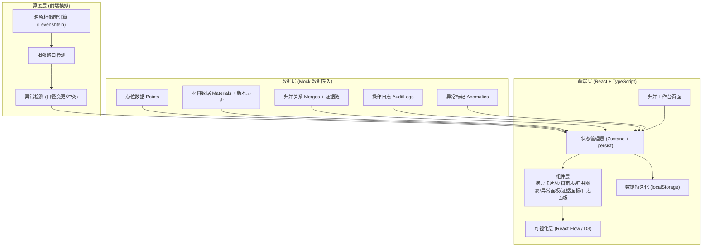
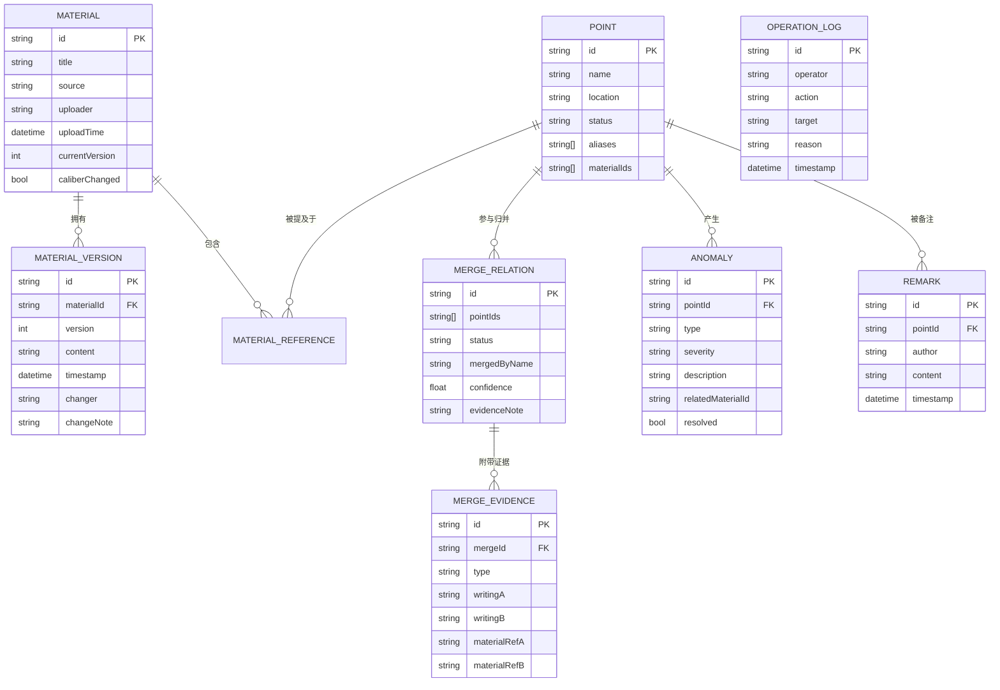

## 1. 架构设计



## 2. 技术说明
- 前端框架：React@18 + TypeScript@5 + Vite@5
- 状态管理：Zustand@4 + persist 中间件（localStorage 持久化，重启不丢状态）
- 样式方案：TailwindCSS@3 + CSS 变量主题系统
- 图表可视化：React Flow@11（归并关系图，支持节点交互、缩放、拖拽）
- 图标：Lucide React
- 数据模拟：内置 Mock 数据（符合真实场景：居民反馈、书面材料、改口径、相邻路口冲突）
- 构建工具：Vite@5

## 3. 路由定义
| 路由 | 用途 |
|------|------|
| / | 归并工作台主页面（单页应用，所有功能集中在此） |

## 4. 数据模型

### 4.1 数据模型 ER 图



### 4.2 TypeScript 类型定义

```typescript
export type PointStatus = 'normal' | 'abnormal' | 'pending' | 'merged';
export type MaterialSource = 'resident_feedback' | 'written' | 'verbal';
export type MergeStatus = 'auto_merged' | 'evidence_merged' | 'pending_review' | 'split';
export type AnomalyType = 'caliber_changed' | 'adjacent_conflict' | 'name_inconsistency' | 'orphan_point';
export type AnomalySeverity = 'high' | 'medium' | 'low';

export interface Point {
  id: string;
  name: string;
  location: string;
  status: PointStatus;
  aliases: string[];
  materialIds: string[];
  mergeId?: string;
  createdAt: string;
}

export interface MaterialVersion {
  id: string;
  version: number;
  content: string;
  timestamp: string;
  changer: string;
  changeNote: string;
  pointMentions: string[];
}

export interface Material {
  id: string;
  title: string;
  source: MaterialSource;
  uploader: string;
  uploadTime: string;
  currentVersion: number;
  versions: MaterialVersion[];
  caliberChanged: boolean;
  relatedPointIds: string[];
}

export interface MergeEvidence {
  id: string;
  type: 'name_similarity' | 'location_proximity' | 'manual_note';
  writingA: string;
  writingB: string;
  materialRefA: string;
  materialRefB: string;
}

export interface MergeRelation {
  id: string;
  pointIds: string[];
  canonicalName: string;
  status: MergeStatus;
  confidence: number;
  evidence: MergeEvidence[];
  operator?: string;
  operateTime?: string;
  evidenceNote: string;
}

export interface Anomaly {
  id: string;
  pointId: string;
  type: AnomalyType;
  severity: AnomalySeverity;
  description: string;
  relatedMaterialId?: string;
  relatedMergeId?: string;
  resolved: boolean;
  detectedAt: string;
}

export interface Remark {
  id: string;
  pointId?: string;
  mergeId?: string;
  author: string;
  content: string;
  timestamp: string;
}

export interface OperationLog {
  id: string;
  operator: string;
  action: string;
  target: string;
  targetType: 'point' | 'material' | 'merge' | 'anomaly' | 'system';
  reason: string;
  timestamp: string;
}

export interface PageSummary {
  totalPoints: number;
  abnormalCount: number;
  pendingCount: number;
  mergedCount: number;
  lastRerunTime: string;
  lastExportTime: string;
  currentVersion: string;
}
```

## 5. 状态管理设计

Zustand Store 切片：
- `pointsSlice`: 点位 CRUD、状态变更
- `materialsSlice`: 材料管理、版本对比
- `mergesSlice`: 归并关系、挂起确认、拆分操作
- `anomaliesSlice`: 异常检测与解决
- `remarksSlice`: 备注时间轴
- `logsSlice`: 操作日志（自动记录所有状态变更）
- `summarySlice`: 页面摘要统计

persist 配置：全部切片持久化至 localStorage，key = `night-market-merge-v1`。

## 6. 模块目录结构

```
src/
├── types/
│   └── index.ts               # 所有类型定义
├── store/
│   ├── index.ts               # Zustand store 聚合
│   ├── pointsSlice.ts
│   ├── materialsSlice.ts
│   ├── mergesSlice.ts
│   ├── anomaliesSlice.ts
│   ├── remarksSlice.ts
│   ├── logsSlice.ts
│   └── summarySlice.ts
├── data/
│   └── mockData.ts            # 模拟数据（真实场景注入）
├── components/
│   ├── layout/
│   │   └── WorkspaceLayout.tsx  # 分区布局容器
│   ├── summary/
│   │   └── SummaryCards.tsx     # 页面摘要四卡片
│   ├── materials/
│   │   ├── MaterialsPanel.tsx   # 材料管理面板
│   │   ├── MaterialCard.tsx     # 材料卡片
│   │   └── VersionCompare.tsx   # 版本对比模态框
│   ├── graph/
│   │   ├── MergeGraph.tsx       # React Flow 归并图
│   │   └── GraphNode.tsx        # 自定义节点组件
│   ├── anomalies/
│   │   └── AnomalyPanel.tsx     # 异常与挂起面板
│   ├── evidence/
│   │   ├── EvidencePanel.tsx    # 归并证据与备注面板
│   │   └── RemarkTimeline.tsx   # 备注时间轴
│   ├── logs/
│   │   └── OperationLogs.tsx    # 操作日志面板
│   └── common/
│       └── StatusBadge.tsx      # 状态徽章等公共组件
├── utils/
│   ├── similarity.ts            # 名称相似度算法
│   ├── detector.ts              # 异常与相邻路口检测
│   └── exporter.ts              # 导出工具（CSV/JSON）
├── App.tsx
├── main.tsx
└── index.css
```

## 7. 关键算法与约束

1. **同地异名归并**：Levenshtein 距离 ≤ 阈值 OR 包含关系 → 归并，但必须保留两种原始写法作为证据，不可丢弃。
2. **相邻路口检测**：若两个点位名称包含「东/西/南/北」「路口/转角」等相邻词且仅有方位词差异 → **强制挂起**，不自动归并，等人工确认。
3. **口径变更检测**：同一材料的两个版本中，对同一点位的描述文字差异 > 30% → 标记 `caliberChanged = true`，紫色徽章高亮，产生异常。
4. **操作日志强制性**：所有变更状态的操作（归并/拆分/确认挂起/解决异常/重跑）必须调用 `addLog()`，不可绕过。
5. **重跑策略**：重跑归并时保留旧版归并关系的历史快照，新归并结果产生新版本号，备注与状态在两版本间可对照。
