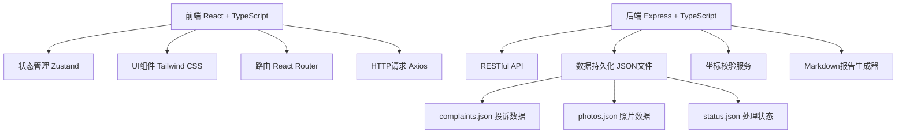
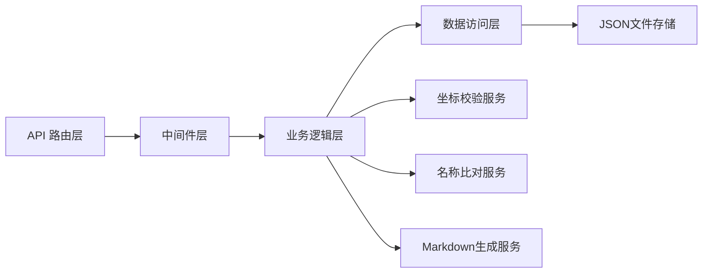
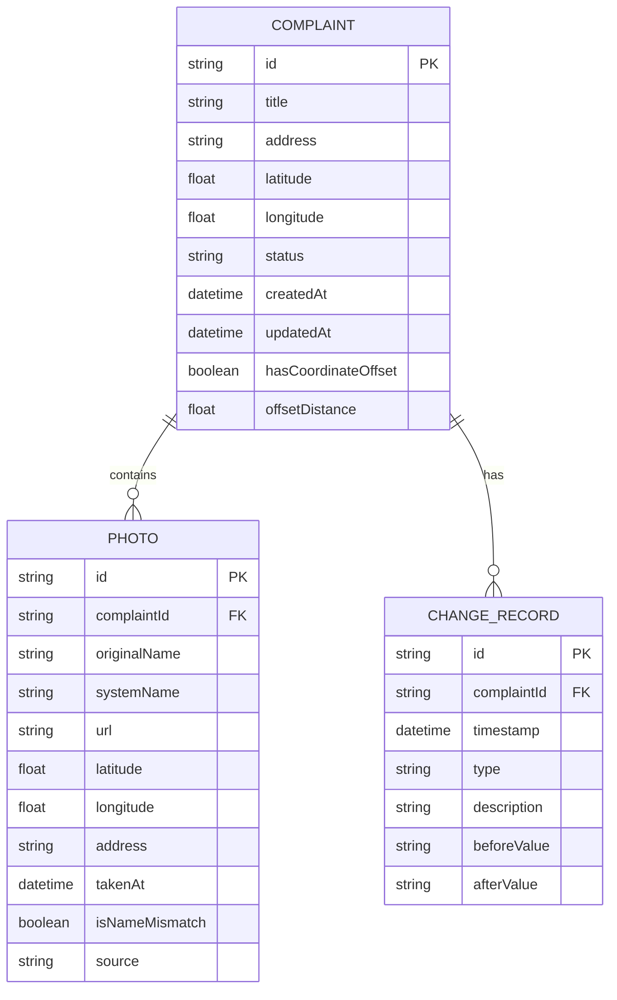

## 1. 架构设计



## 2. 技术描述

- **前端**：React@18 + TypeScript + Vite + Tailwind CSS@3 + Zustand + React Router + Axios + Lucide React
- **后端**：Express@4 + TypeScript
- **数据存储**：本地JSON文件持久化，服务重启后数据不丢失
- **第三方服务**：无需外部服务，地图使用SVG绘制简化版示意图
- **初始化工具**：vite-init

## 3. 路由定义

| 路由 | 用途 |
|-----|------|
| / | 首页，投诉列表 + 详情双栏布局 |
| /report | Markdown报告预览页 |

## 4. API 定义

### 4.1 类型定义

```typescript
interface Photo {
  id: string;
  originalName: string;
  systemName: string;
  url: string;
  latitude: number;
  longitude: number;
  address: string;
  takenAt: string;
  isNameMismatch: boolean;
  source: string;
}

interface Complaint {
  id: string;
  title: string;
  address: string;
  latitude: number;
  longitude: number;
  status: 'pending' | 'processing' | 'resolved';
  photos: Photo[];
  createdAt: string;
  updatedAt: string;
  hasCoordinateOffset: boolean;
  offsetDistance: number;
  changeHistory: ChangeRecord[];
}

interface ChangeRecord {
  id: string;
  timestamp: string;
  type: 'photo_add' | 'coordinate_fix' | 'status_update';
  description: string;
  beforeValue: string;
  afterValue: string;
}

interface SystemStatus {
  lastProcessedAt: string;
  currentComplaintId: string | null;
  reportVersion: number;
}
```

### 4.2 接口列表

| 方法 | 路径 | 描述 |
|-----|------|------|
| GET | /api/complaints | 获取所有投诉列表 |
| GET | /api/complaints/:id | 获取单条投诉详情 |
| POST | /api/complaints/:id/photos | 补录照片 |
| POST | /api/complaints/:id/rerun | 重跑坐标和名称校验 |
| GET | /api/complaints/:id/report | 生成Markdown报告 |
| GET | /api/status | 获取系统处理状态 |
| POST | /api/seed | 生成示例数据（包含名称不一致的照片） |

## 5. 服务器架构图



## 6. 数据模型

### 6.1 数据模型定义



### 6.2 Mock 数据设计

- 准备3条投诉记录作为示例
- 其中1条投诉包含5张巡检照片
- 故意设置1张照片的originalName与systemName不一致（如：originalName="夜市外摆_红旗路_20260615.jpg"，systemName="夜市外摆_红星路_20260615.jpg"）
- 设置坐标偏移场景：投诉点在"红旗路123号"，但某张照片坐标偏移到隔壁"红星路456号"，偏移距离约200米
- 坐标偏移不只是警告，要能看到照片原始地址和坐标说明

## 7. 核心功能实现要点

### 7.1 状态持久化
- 所有数据写入 `api/data/*.json` 文件
- 系统启动时从JSON文件加载状态
- 每次操作后立即写入文件，确保服务重启后数据不丢失

### 7.2 坐标偏移追踪
- 计算投诉点坐标与照片坐标的距离
- 超过阈值（如50米）标记为偏移
- 展示原始坐标、偏移后的坐标、偏移距离、照片拍摄时的原始地址说明

### 7.3 名称不一致检测
- 比对照片的originalName和systemName
- 不一致时标红显示，并列展示两个名称
- 显示来源："原始文件名" vs "系统重命名"

### 7.4 变更记录
- 每次补录照片、重跑校验都生成ChangeRecord
- Markdown报告中包含变更历史对比表
- 明确标注"本次补录修改了什么"
