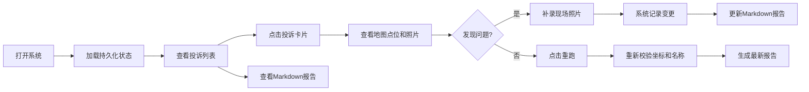

## 1. 产品概述

夜市外摆投诉回放系统，用于街道巡检人员处理夜市外摆投诉的全流程管理。解决早晚高峰巡检口径不一致、坐标偏移溯源难、补录记录追踪难等问题。

- 核心目标：投诉处理状态持久化、巡检照片可溯源、坐标偏移可追踪、补录变更可查看
- 目标用户：街道巡检负责人、城管执法人员

## 2. 核心功能

### 2.1 用户角色

| 角色 | 登录方式 | 核心权限 |
|------|---------|---------|
| 巡检负责人 | 系统默认登录 | 查看投诉列表、处理状态、Markdown报告、补录照片、重跑流程 |

### 2.2 功能模块

1. **投诉列表页**：投诉卡片列表、处理状态标签、坐标偏移预警
2. **投诉详情页**：地图点位展示、巡检照片列表、名称不一致标记、坐标溯源追踪
3. **Markdown报告页**：投诉处理报告、变更记录对比、补录说明
4. **操作工具栏**：重跑流程按钮、补录照片按钮、查看报告按钮

### 2.3 页面详情

| 页面名称 | 模块名称 | 功能描述 |
|---------|---------|---------|
| 投诉列表页 | 投诉卡片 | 展示投诉编号、地址、状态、时间；坐标偏移卡片显示红色预警标记 |
| 投诉列表页 | 顶部操作栏 | 放样例、重跑、查看Markdown报告三个核心操作按钮 |
| 投诉详情页 | 地图点位 | 展示投诉地点、巡检照片拍摄地点、偏移距离、原始坐标说明 |
| 投诉详情页 | 照片列表 | 展示巡检照片缩略图，名称不一致的照片标红并显示原始名称与系统名称对比 |
| 投诉详情页 | 变更记录 | 展示每次补录的变更内容，包括点位调整、新增照片 |
| Markdown报告页 | 报告预览 | 完整Markdown格式报告，包含变更历史对比表格 |

## 3. 核心流程

## 4. 用户界面设计

### 4.1 设计风格

- **主色调**：深灰蓝色 (#1e3a5f) 作为背景和主色，配合橙色 (#f59e0b) 作为警告色，红色 (#ef4444) 作为错误标记
- **按钮风格**：扁平化设计，圆角4px，悬停时有阴影和颜色加深效果
- **字体**：标题使用"Noto Sans SC"粗体，正文使用"Noto Sans SC"常规
- **布局风格**：左侧列表 + 右侧详情的双栏布局，卡片式设计，清晰的视觉层级
- **图标风格**：使用lucide-react线性图标，保持简洁一致

### 4.2 页面设计概述

| 页面名称 | 模块名称 | UI元素 |
|---------|---------|--------|
| 投诉列表页 | 顶部操作栏 | 深灰蓝背景，三个操作按钮水平排列，橙色警告图标标记问题项 |
| 投诉列表页 | 投诉卡片 | 白色卡片，浅灰边框，问题项左侧有红色竖条标记 |
| 投诉详情页 | 地图区域 | 浅蓝底地图占位，红色标记点，虚线连接偏移点位并显示距离 |
| 投诉详情页 | 照片网格 | 3列网格布局，异常照片左上角红色"名称不一致"标签 |
| 投诉详情页 | 变更时间线 | 左侧竖线时间轴，每次补录显示变更前后对比 |
| Markdown报告页 | 报告内容 | 白色背景，等宽字体代码块，变更部分高亮显示 |

### 4.3 响应性

- 桌面端：左右分栏布局，左侧30%宽度，右侧70%宽度
- 平板端：上下布局，列表在上，详情在下
- 移动端：单页切换，底部Tab导航

### 4.4 交互动效

- 页面加载：元素淡入动画，延迟50ms依次出现
- 卡片悬停：上浮2px，阴影加深
- 按钮点击：缩放0.95的按压效果
- 标记闪烁：坐标偏移警告点有呼吸灯动画
