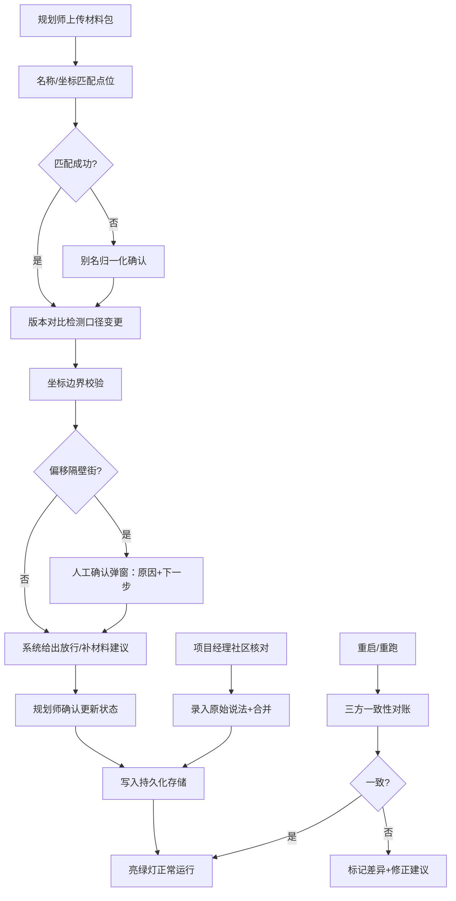

## 1. 产品概述

面向城市规划部门的"夜市外摆公示清单"协同管理系统，解决规划师小赵和项目经理在日常巡检、点位核对、材料追溯中的核心痛点：巡检照片留存、地点别名归一化、材料口径变更追踪、Web3D 可视化联动判断、社区反馈合并、数据持久一致性。系统输出面向业务决策——告诉规划师哪条材料需补充、哪条可以放行，而非纯技术说明。

- 核心目标：把靠人脑记忆的点位关系、材料版本、审核口径全部结构化留存，并用 Web3D 做可视化判断
- 目标用户：规划师（小赵）、项目经理、社区核对人员
- 核心价值：判断有据、变更可溯、反馈可追、重启不丢

## 2. 核心功能

### 2.1 用户角色

| 角色 | 典型场景 | 核心权限 |
|------|----------|----------|
| 规划师 | 上传巡检照片、边界样本、备注说明；判断清单条目放行/补材料 | 上传材料、编辑点位别名、标记状态、写备注、查看所有历史 |
| 项目经理 | 拿清单和社区核对点位；录入社区反馈并合并 | 录入反馈、查看原始说法、触发人工确认、导出清单 |
| 系统自检 | 坐标偏移、接口返回、重启一致性校验 | 触发边界校验、自动一致性检查、输出异常原因 |

### 2.2 功能模块

1. **公示清单主面板**：清单列表、状态标签、放行/补材料建议、筛选器、时间轴
2. **点位归一化管理**：标准地名、别名映射、坐标与边界、名称模糊匹配
3. **材料中心**：巡检照片、边界样本、口头说明的上传/预览/版本对比，口径变更标记
4. **Web3D 场景联动**：三维场景点选、时间轴切换、筛选联动、接口返回可视化
5. **坐标与人工确认**：坐标偏移检测、异常原因说明、下一步建议触发
6. **社区反馈合并**：原始说法与合并后说法双栏展示，溯源可查
7. **一致性仪表盘**：重启后历史备注/当前状态/接口返回三方对账

### 2.3 页面详情

| 页面名称 | 模块名称 | 功能描述 |
|----------|----------|----------|
| 公示清单主面板 | 清单卡片列表 | 每条目显示：点位名、状态色标、材料数、最新备注、系统建议（放行/补材料/待确认） |
| 公示清单主面板 | 顶部筛选栏 | 按状态、点位、时间范围、材料完整度筛选；与 Web3D 场景双向联动 |
| 公示清单主面板 | 底部时间轴 | 按月/周滑动，切换查看不同时期的公示状态；联动 Web3D 和接口返回 |
| 点位归一化 | 别名映射表 | 左侧标准地名，右侧多别名卡片；支持拖拽关联、模糊搜索匹配 |
| 点位归一化 | 坐标边界编辑器 | 地图上画边界、输入坐标、检测是否偏移到隔壁街 |
| 材料中心 | 材料上传区 | 拖拽上传照片/GeoJSON 边界/文本说明；自动关联同名点位 |
| 材料中心 | 版本对比视图 | 同一材料两版并排，高亮变更之处；显示"口径改动"标签 |
| Web3D 场景 | 三维街景 | 夜市点位立体展示，悬停高亮、点击选中、选中联动清单 |
| Web3D 场景 | 联动指示器 | 点选对象后，右侧面板同步展示该点位材料、状态、接口返回 |
| 人工确认弹窗 | 原因与下一步 | 坐标异常/口径冲突时弹出，列出原因、给出下一步选项（补照片/核边界/转社区） |
| 社区反馈面板 | 双栏对比 | 左栏原始说法、右栏合并后说法；时间戳+操作人记录 |
| 一致性仪表盘 | 三方对账卡片 | 历史备注、当前状态、接口返回三色灯，不一致则标红并给修正建议 |

## 3. 核心流程

### 3.1 规划师日常巡检流程

规划师小赵把巡检照片、边界样本、口头说明一起拖入系统 → 系统按文件名/坐标自动匹配点位（匹配不上则弹出别名确认）→ 若该点位已有历史材料，系统标记"口径变更"并保存版本 → 进入清单判断：材料齐则"建议放行"，缺项则"建议补 XX" → 小赵确认后更新状态 → 数据写入持久层。

### 3.2 坐标偏移检测流程

用户故意把坐标偏到隔壁街做压力测试 → 系统比对点位边界与坐标的地理包含关系 → 不匹配则触发"人工确认"弹窗 → 弹窗说明原因（坐标 XX 落在 YY 街而非 ZZ 街边界内）并给出下一步（重新测绘 / 调整边界 / 录入说明备注）。

### 3.3 社区反馈合并流程

项目经理拿清单和社区核对 → 在反馈面板录入社区原始说法（逐字保留）→ 选择合并到某条清单条目 → 系统保存原始说法 + 合并后说法 + 操作人 + 时间 → 清单条目打上"已核社区"标签，溯源链完整。

### 3.4 重启一致性校验流程

系统启动或用户手动触发"重跑" → 逐条比对历史备注（存库）、当前状态（内存/缓存）、接口返回（实时拉取）→ 三方一致则亮绿灯；不一致则亮红并列出差异项（如"接口返回已通过但状态仍为待审核"）→ 给出修正按钮。

## 4. 用户界面设计

### 4.1 设计风格

- **主色与辅色**：主色采用「深夜蓝」#1B3A5C（呼应"夜市"场景的夜调，但专业克制），辅色用「市井橙」#FF6B35（表示需要关注的放行/补材料建议），中性色用石板灰系列，状态色红/黄/绿饱和度降低避免艳俗
- **按钮风格**：圆角 6px，主按钮深夜蓝填充配白字，悬停微抬升（box-shadow 过渡），次按钮描边；危险操作用市井橙描边
- **字体**：标题用「思源宋体 CN SemiBold」（规划报告的正式感），正文用「思源黑体 CN Regular」（清晰可读），数字和代码用 JetBrains Mono
- **布局风格**：三栏式——左栏筛选+点位树，中栏 Web3D 三维场景，右栏清单详情+材料版本；卡片阴影用多层柔光，不做硬边
- **图标/emoji 风格**：Lucide 线性图标统一 18px，状态用点状色标而非 emoji，保持专业感

### 4.2 页面设计概览

| 页面名称 | 模块名称 | UI 元素关键特征 |
|----------|----------|-----------------|
| 公示清单主面板 | 清单卡片 | 深夜蓝卡片头（点位名）、右侧色点状态、中间材料缩略条、底部系统建议（市井橙/墨绿文字标签） |
| 公示清单主面板 | 筛选栏 | 胶囊式筛选标签组，激活项填充深夜蓝，时间轴用渐变橙点标记关键节点 |
| Web3D 场景 | 三维街景 | 夜景氛围（低强度环境光 + 摊位暖光点光源），被选中的点位浮起半透明市井橙轮廓 |
| 材料中心 | 版本对比 | 左右两屏中轴对齐，差异处用橙色蒙版高亮，顶部"口径变更于 YYYY-MM-DD"横幅 |
| 人工确认弹窗 | 原因说明 | 左上警示图标 + 原因分段列出（每段前序号），下方三按钮对应三种下步方案 |
| 一致性仪表盘 | 三方对账卡片 | 三个圆环进度灯（绿/黄/红），下方差异列表用删除线+新值并排展示 |

### 4.3 响应性

- **Desktop-first**，三栏布局最小宽度 1440px 才能完整展示 Web3D + 两侧面板
- 1024-1440px：左右栏可折叠为抽屉，中栏 Web3D 保持为主
- 移动端：不支持 Web3D 交互，仅提供清单查看和材料审核的简化两栏视图

### 4.4 3D 场景设计

- **环境与氛围**：傍晚→入夜的渐变天空盒，街道两侧建筑为低面数几何体，路面有微弱反射
- **灯光设置**：环境光 0.3 强度冷色，每个夜市摊位挂 1 盏暖色点光（半径 5m，强度 0.8）模拟灯笼
- **相机设置**：默认 45° 俯斜视距 80m，鼠标拖拽平移、滚轮缩放、右键旋转；选中点位时相机平滑飞行至目标上方 30m
- **构图与焦点**：摊位点位用高亮立方体+浮标名签，非夜市区域降灰处理视觉降噪
- **交互与动画**：点选后点位上下浮动 0.3m 循环，轮廓边发光；时间轴切换时点位透明度淡入淡出表示不同时期的存在状态
- **后处理**：轻微泛光（Bloom）让暖光点更有夜市氛围，色彩微调提饱和，不做过度滤镜影响识别
- **性能预算**：单场景面数控制在 5 万以内，摊位用 InstancedMesh 批量渲染，贴图总大小不超 4MB
