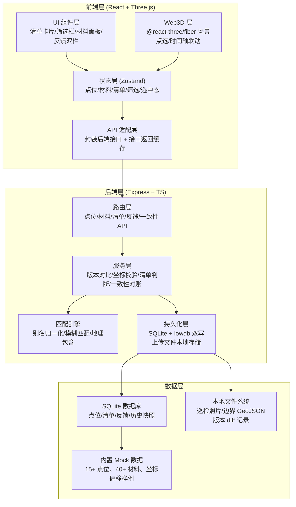
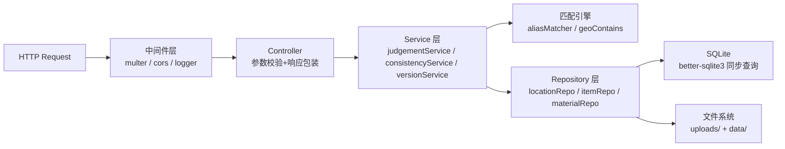
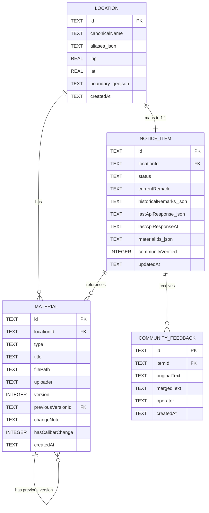

## 1. 总体架构



## 2. 技术栈说明

- **前端**：React 18 + TypeScript 5 + Vite 5
  - 状态管理：Zustand（跨组件共享点位选中态、筛选条件、时间轴位置）
  - 样式：Tailwind CSS 3 + 深夜蓝/市井橙自定义调色板
  - Web3D：three @ 0.160 + @react-three/fiber @ 8.15 + @react-three/drei @ 9.92 + @react-three/postprocessing（Bloom 泛光）
  - 图标：lucide-react
  - 路由：react-router-dom（清单主面板 / 点位管理 / 材料中心 / 一致性仪表盘 4 个主路由）
- **初始化工具**：`pnpm create vite-init@latest . --template react-express-ts --force`
- **后端**：Express 4 + TypeScript（ESM 模块）
  - 中间件：multer（文件上传）、cors、express.json
  - 服务层函数式架构，无重型 ORM，用 `better-sqlite3` 同步驱动 + 参数化查询
- **数据库**：SQLite 单文件（`./data/night-market.db`），启动时自动建表和塞 Mock 数据；上传文件存 `./uploads/` 目录
  - 额外用 lowdb 维护 `./data/snapshot.json` 做重启一致性快照

## 3. 路由定义

| 前端路由 (react-router) | 页面用途 |
|-------------------------|----------|
| `/` | 公示清单主面板（三栏：筛选+点位树 / Web3D / 清单详情） |
| `/locations` | 点位归一化管理（别名映射表 + 边界编辑器） |
| `/materials` | 材料中心（上传 + 版本对比视图） |
| `/consistency` | 一致性仪表盘（三方对账 + 手动重跑） |

| 后端 API 路由 | HTTP | 用途 |
|---------------|------|------|
| `/api/locations` | GET / POST | 点位列表查询 / 新增点位 |
| `/api/locations/:id/aliases` | PUT | 更新点位别名映射 |
| `/api/locations/:id/check-coordinate` | POST | 校验坐标是否偏移隔壁街 |
| `/api/materials` | GET / POST | 材料列表 / 上传新材料（multipart/form-data） |
| `/api/materials/:id/versions` | GET | 获取某材料所有版本及 diff |
| `/api/items` | GET / POST / PUT | 公示清单条目 CRUD + 状态更新 |
| `/api/items/:id/judgement` | GET | 获取该条目"放行/补材料/待确认"判断结果及理由 |
| `/api/feedbacks` | GET / POST | 社区反馈录入 + 查询原始/合并后文本 |
| `/api/consistency/check` | POST | 触发三方一致性对账，返回差异列表 |
| `/api/consistency/fix` | POST | 按建议修正某条不一致 |
| `/api/timeline/items?date=YYYY-MM-DD` | GET | 按时间轴切片返回该日期的清单和接口返回缓存 |

## 4. API 类型定义

```typescript
// ====== 共享类型（放 ./shared/types.ts）======
export type ItemStatus =
  | "pending_review"
  | "approved"
  | "need_supplement"
  | "pending_manual"
  | "community_verified";

export type MaterialType = "photo" | "boundary" | "verbal_note";
export type JudgementSuggestion = "release" | "supplement" | "manual_confirm";

export interface Location {
  id: string;
  canonicalName: string;       // 标准地名
  aliases: string[];           // 别名数组
  lng: number;                 // 中心点经度
  lat: number;                 // 中心点纬度
  boundaryGeoJSON: any;        // 多边形边界
  createdAt: string;
}

export interface Material {
  id: string;
  locationId: string;
  type: MaterialType;
  title: string;
  filePath: string;            // /uploads/xxx
  uploader: "小赵" | "项目经理" | string;
  version: number;             // 同 locationId + type 下递增
  previousVersionId?: string;
  changeNote?: string;         // 小赵填的口径变更说明
  createdAt: string;
  hasCaliberChange: boolean;   // 系统判定：相对上版是否口径变化
}

export interface NoticeItem {
  id: string;
  locationId: string;
  status: ItemStatus;
  currentRemark: string;       // 当前备注（小赵写）
  historicalRemarks: { ts: string; text: string; by: string }[];
  lastApiResponse: any;        // 最近一次接口返回快照（存 JSON）
  lastApiResponseAt: string;
  materialIds: string[];
  communityVerified: boolean;
  updatedAt: string;
}

export interface Judgement {
  suggestion: JudgementSuggestion;
  reason: string[];            // 一条条理由，直接给小赵看
  nextActions: string[];       // 下一步建议文字
  missingMaterials?: MaterialType[];
}

export interface CommunityFeedback {
  id: string;
  itemId: string;
  originalText: string;        // 社区原始说法，逐字保留
  mergedText: string;          // 项目经理合并后的说法
  operator: string;            // "项目经理"等
  createdAt: string;
}

export interface ConsistencyReport {
  itemId: string;
  locationName: string;
  historyVsCurrent: "match" | "mismatch";
  currentVsApi: "match" | "mismatch";
  diff: {
    field: string;
    history?: any;
    current?: any;
    api?: any;
  }[];
  fixSuggestion: string;
}
```

## 5. 后端分层架构



- **Controller**：只做参数提取、zod 校验、统一 `{ code, data, msg }` 格式返回
- **Service**：核心业务。典型如 `judgementService.analyze(itemId)`：拉材料清单 → 检查缺哪类 → 检查坐标是否越界 → 检查是否有版本冲突 → 综合产出 Judgement
- **Repository**：纯 CRUD，屏蔽 SQL 细节。所有写操作附加 `updatedAt` 并写入 lowdb 快照
- **匹配引擎**：`aliasMatcher.fuzzy(query, locations)` 用编辑距离+拼音首字母双向匹配；`geoContains.pointInPolygon(pt, boundary)` 用射线法判断点是否落在边界内

## 6. 数据模型

### 6.1 ER 图



### 6.2 DDL + 初始化数据

```sql
-- 启动时自动执行
CREATE TABLE IF NOT EXISTS location (
  id TEXT PRIMARY KEY,
  canonicalName TEXT NOT NULL,
  aliases_json TEXT NOT NULL DEFAULT '[]',
  lng REAL NOT NULL,
  lat REAL NOT NULL,
  boundary_geojson TEXT NOT NULL,
  createdAt TEXT NOT NULL
);

CREATE TABLE IF NOT EXISTS material (
  id TEXT PRIMARY KEY,
  locationId TEXT NOT NULL REFERENCES location(id),
  type TEXT NOT NULL CHECK(type IN ('photo','boundary','verbal_note')),
  title TEXT NOT NULL,
  filePath TEXT NOT NULL,
  uploader TEXT NOT NULL,
  version INTEGER NOT NULL DEFAULT 1,
  previousVersionId TEXT REFERENCES material(id),
  changeNote TEXT,
  hasCaliberChange INTEGER NOT NULL DEFAULT 0,
  createdAt TEXT NOT NULL
);

CREATE TABLE IF NOT EXISTS notice_item (
  id TEXT PRIMARY KEY,
  locationId TEXT NOT NULL UNIQUE REFERENCES location(id),
  status TEXT NOT NULL,
  currentRemark TEXT NOT NULL DEFAULT '',
  historicalRemarks_json TEXT NOT NULL DEFAULT '[]',
  lastApiResponse_json TEXT NOT NULL DEFAULT '{}',
  lastApiResponseAt TEXT NOT NULL DEFAULT '',
  materialIds_json TEXT NOT NULL DEFAULT '[]',
  communityVerified INTEGER NOT NULL DEFAULT 0,
  updatedAt TEXT NOT NULL
);

CREATE TABLE IF NOT EXISTS community_feedback (
  id TEXT PRIMARY KEY,
  itemId TEXT NOT NULL REFERENCES notice_item(id),
  originalText TEXT NOT NULL,
  mergedText TEXT NOT NULL,
  operator TEXT NOT NULL,
  createdAt TEXT NOT NULL
);

CREATE INDEX IF NOT EXISTS idx_material_location ON material(locationId);
CREATE INDEX IF NOT EXISTS idx_feedback_item ON community_feedback(itemId);
```

初始化时（`api/seed.ts`）自动塞 15 个真实感点位：如「王府井小吃街北段」「簋街东端外摆区」「南锣鼓巷南口」等，每个配 2-4 个别名、1 张巡检照片、1 份边界、偶尔缺 1 类材料以触发"建议补材料"；刻意留 2 个点位的坐标故意偏移隔壁街（如王府井的坐标落在东安门大街上）以触发人工确认弹窗；准备 3 份"口径变更"样例材料（同一类型两版，内容略有出入）。
