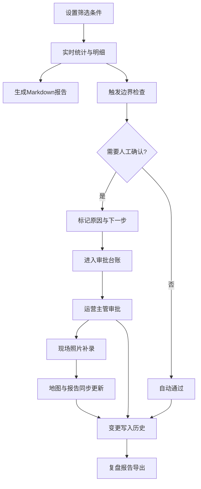

## 1. 产品概述

学校接送方案比选系统——面向社区运营人员的方案筛选、统计与报告生成工具。核心解决"领导问原因只能翻聊天"的痛点，将筛选条件、统计数字、明细表和Markdown报告从同一套结果生成，确保数据口径一致、可追溯。

- 目标用户：社区运营人员（如阿宁）、运营主管
- 核心价值：从"翻聊天记录"升级为"一键出报告"，审批有台账、边界有样本、变更可追溯

## 2. 核心功能

### 2.1 用户角色

| 角色 | 进入方式 | 核心权限 |
|------|----------|----------|
| 社区运营 | 直接访问 | 筛选方案、生成报告、补录现场照片、提交人工确认 |
| 运营主管 | 直接访问 | 审批人工确认、查看历史变更、复盘报告 |

### 2.2 功能模块

1. **方案比选页**：筛选条件面板、方案对比表格、统计摘要卡片、一键生成Markdown报告
2. **审批台账页**：审批记录列表、状态筛选、边界样本展示、后补说明区
3. **现场补录页**：照片上传、地图点位标注、坐标偏移模拟、变更说明自动生成
4. **历史复盘页**：人工确认前后变更对比、时间线、复盘报告导出

### 2.3 页面详情

| 页面名称 | 模块名称 | 功能描述 |
|----------|----------|----------|
| 方案比选页 | 筛选条件面板 | 多条件组合筛选（距离、费用、时间、安全等级），实时联动统计数字 |
| 方案比选页 | 方案对比表格 | 并排展示候选方案，高亮差异项，支持排序和锁定列 |
| 方案比选页 | 统计摘要卡片 | 从筛选结果实时生成：入选方案数、平均费用、覆盖率等统计数字 |
| 方案比选页 | Markdown报告生成 | 一键将当前筛选结果导出为Markdown报告（含筛选条件、统计、明细） |
| 审批台账页 | 审批记录列表 | 展示所有审批条目，状态标签（待审/通过/驳回），支持搜索 |
| 审批台账页 | 边界样本展示 | 展示边界case的一条样本，含坐标偏移说明 |
| 审批台账页 | 后补说明区 | 对审批记录补充文字说明，时间戳自动记录 |
| 现场补录页 | 照片上传 | 上传现场照片，自动提取EXIF坐标或手动标注 |
| 现场补录页 | 地图点位标注 | 在地图上展示/标注点位，支持坐标偏移到隔壁街模拟 |
| 现场补录页 | 变更说明 | 自动生成"本次补录改了什么"的文字说明 |
| 现场补录页 | Markdown报告同步 | 补录后地图点位和Markdown报告自动更新 |
| 历史复盘页 | 变更对比 | 人工确认前后的差异高亮展示 |
| 历史复盘页 | 时间线 | 按时间展示所有变更事件 |
| 历史复盘页 | 复盘报告 | 导出复盘Markdown报告，运营主管可直接使用 |

## 3. 核心流程

1. 运营人员在"方案比选页"设置筛选条件，系统实时展示统计数字和明细表
2. 点击"生成报告"，同一份数据同时产出筛选条件、统计、明细和Markdown报告
3. 需要人工确认时，系统记录原因和下一步建议，进入审批台账
4. 坐标偏移到隔壁街触发边界检查，若需人工确认则标记并说明
5. 现场照片补录后，地图点位和Markdown报告自动同步更新
6. 人工确认前后变化写入历史，运营主管复盘时可查看完整变更链

## 4. 用户界面设计

### 4.1 设计风格

- 主色调：深青色 (#0D7377) + 暖橙色强调 (#FF8C42)
- 按钮：圆角胶囊型，带微阴影，hover时轻微上浮
- 字体：标题用 Noto Serif SC（衬线体，有政务感），正文用 Noto Sans SC
- 布局：顶部导航栏 + 左侧功能侧边栏 + 右侧主内容区（卡片式）
- 图标：线性风格（Lucide Icons），配合数据可视化使用简洁图表

### 4.2 页面设计概览

| 页面名称 | 模块名称 | UI元素 |
|----------|----------|--------|
| 方案比选页 | 筛选条件面板 | 左侧固定侧栏，多选标签+滑块，实时计数徽章 |
| 方案比选页 | 方案对比表格 | 主区域宽表格，差异列用暖橙色背景高亮 |
| 方案比选页 | 统计摘要卡片 | 表格上方4列卡片，数字大号加粗 |
| 方案比选页 | Markdown报告生成 | 表格下方浮动按钮，点击弹出预览弹窗 |
| 审批台账页 | 审批记录列表 | 居中卡片列表，状态徽章（绿/黄/红） |
| 审批台账页 | 边界样本 | 列表内嵌折叠卡片，含地图缩略图 |
| 审批台账页 | 后补说明 | 卡片底部文本框，保存后灰色文字显示 |
| 现场补录页 | 照片上传 | 拖拽区域，缩略图网格 |
| 现场补录页 | 地图点位 | 左侧地图（Leaflet），右侧点位列表 |
| 现场补录页 | 坐标偏移控制 | 地图上方工具栏，偏移量滑块+应用按钮 |
| 现场补录页 | 变更说明 | 地图下方自动生成文字卡 |
| 历史复盘页 | 变更对比 | 左右分栏diff视图，增/删/改三色标注 |
| 历史复盘页 | 时间线 | 左侧竖向时间轴，节点带图标 |
| 历史复盘页 | 复盘报告 | 右上角导出按钮 |

### 4.3 响应式策略

- 桌面优先设计，最小宽度1024px
- 平板（768-1024px）：侧边栏折叠为汉堡菜单
- 移动端暂不作为主要适配目标

### 4.4 3D场景指引

不适用
