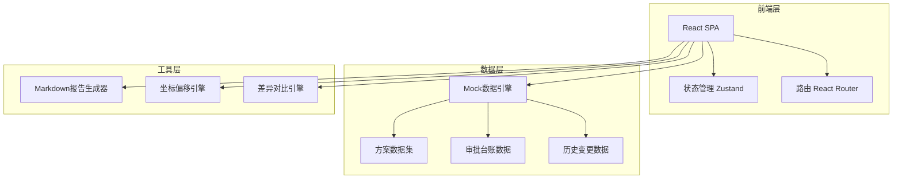
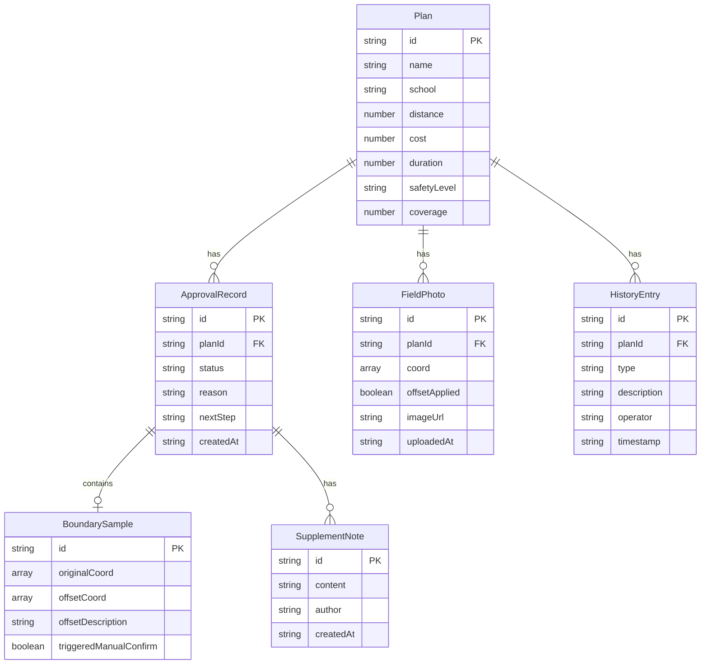

## 1. 架构设计



## 2. 技术说明

- 前端：React@18 + TypeScript + Tailwind CSS@3 + Vite
- 初始化工具：Vite (react-ts template)
- 后端：无（纯前端，数据使用Mock）
- 数据库：无（localStorage + 内存状态管理）
- 地图：Leaflet（开源、轻量）
- 图标：Lucide React
- Markdown渲染：react-markdown
- 状态管理：Zustand
- 路由：React Router v6

## 3. 路由定义

| 路由 | 用途 |
|------|------|
| / | 方案比选页——筛选、统计、明细、报告生成 |
| /ledger | 审批台账页——审批记录、边界样本、后补说明 |
| /field | 现场补录页——照片上传、地图标注、坐标偏移 |
| /history | 历史复盘页——变更对比、时间线、复盘报告 |

## 4. API定义

纯前端项目，无后端API。数据交互通过Zustand store完成，核心数据接口如下：

```typescript
interface Plan {
  id: string
  name: string
  school: string
  distance: number
  cost: number
  duration: number
  safetyLevel: 'A' | 'B' | 'C'
  coverage: number
  route: [number, number][]
  description: string
}

interface ApprovalRecord {
  id: string
  planId: string
  status: 'pending' | 'approved' | 'rejected'
  reason: string
  nextStep: string
  boundarySample?: BoundarySample
  supplementNotes: SupplementNote[]
  createdAt: string
  updatedAt: string
}

interface BoundarySample {
  id: string
  originalCoord: [number, number]
  offsetCoord: [number, number]
  offsetDescription: string
  triggeredManualConfirm: boolean
}

interface FieldPhoto {
  id: string
  planId: string
  coord: [number, number]
  offsetApplied: boolean
  offsetCoord?: [number, number]
  imageUrl: string
  description: string
  uploadedAt: string
}

interface HistoryEntry {
  id: string
  planId: string
  type: 'filter_change' | 'manual_confirm' | 'field_supplement' | 'approval'
  before: Record<string, unknown>
  after: Record<string, unknown>
  description: string
  operator: string
  timestamp: string
}

interface FilterState {
  distanceRange: [number, number]
  costRange: [number, number]
  durationRange: [number, number]
  safetyLevels: string[]
  coverageMin: number
}

interface SupplementNote {
  id: string
  content: string
  author: string
  createdAt: string
}
```

## 5. 服务器架构图

不适用（纯前端项目）

## 6. 数据模型

### 6.1 数据模型定义



### 6.2 数据定义语言

不适用（无SQL数据库，使用TypeScript类型定义和Mock JSON数据）
