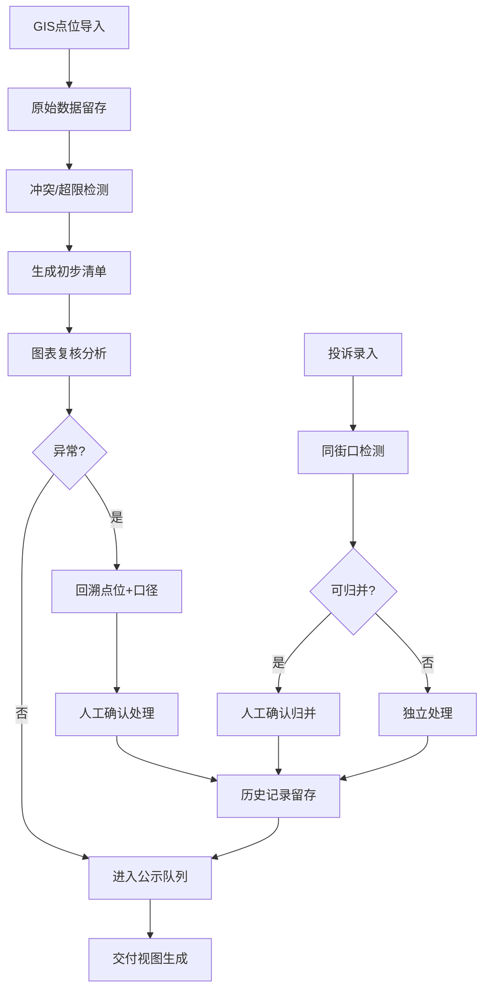

## 1. 产品概述

学校接送公示清单管理系统，专为市政设计老曹团队打造，解决GIS点位人工兜底效率低、冲突难发现、数据追溯难、异常处理不规范等问题。系统支持GIS点位冲突自动检测、原始数据保留、异常复核追溯、投诉归并提示、历史操作追踪，实现从数据接入到交付公示的全流程可管可控。

- 核心解决：GIS点位街口冲突自动识别、原始数据不丢失、异常记录区分展示、投诉智能归并提示、换班复盘有据可依
- 目标用户：市政设计人员（老曹）、现场老师、复核人员
- 核心价值：减少人工兜底80%，数据追溯效率提升3倍，异常处理规范度100%

## 2. 核心功能

### 2.1 用户角色

| 角色 | 注册方式 | 核心权限 |
|------|----------|----------|
| 市政设计员（老曹） | 系统内置 | 全功能操作、数据导入、冲突处理、交付导出 |
| 复核人员 | 系统内置 | 异常复核、历史查看、确认记录 |
| 现场老师 | 系统内置 | 公示清单查看、历史复盘了解 |

### 2.2 功能模块

1. **GIS点位管理页**：点位导入、原始数据保留、冲突可视化、来源追溯
2. **公示清单主页**：清单列表、异常标记、容量超限区分、一键回溯
3. **复核工作台**：图表联动分析、计算口径追溯、异常确认处理
4. **投诉处理页**：投诉列表、同街口归并提示、人工确认归并
5. **历史复盘页**：操作历史记录、人工确认前后对比、换班交接说明
6. **交付视图页**：点位+处理记录+异常队列三合一简洁展示

### 2.3 页面详情

| 页面名称 | 模块名称 | 功能描述 |
|----------|----------|----------|
| GIS点位管理 | 点位列表 | 展示所有GIS点位，保留原始数据字段，冲突点位红框高亮 |
| GIS点位管理 | 原始数据面板 | 点击点位显示完整原始数据JSON，与处理后数据并排对比 |
| GIS点位管理 | 冲突检测 | 自动识别街口冲突点位，弹窗提示冲突详情和涉及清单条目 |
| 公示清单主页 | 清单列表 | 学校接送公示清单，异常条目左侧彩色边条区分 |
| 公示清单主页 | 容量超限标记 | 超限记录使用斜纹背景+感叹号图标，不与正常条目混同 |
| 公示清单主页 | 回溯按钮 | 每条记录可回溯到对应GIS点位和本次计算口径详情 |
| 复核工作台 | 统计图表 | 正常/异常/超限/投诉四类数据堆叠柱状图，支持时间筛选 |
| 复核工作台 | 图表联动 | 点击图表柱子自动筛选对应清单条目，高亮关联GIS点位 |
| 复核工作台 | 计算口径面板 | 展示本次处理的计算规则、参数、算法版本，可追溯 |
| 投诉处理页 | 投诉列表 | 展示所有投诉，同街口条目自动标记"可归并"标签 |
| 投诉处理页 | 归并提示弹窗 | 检测到同街口多条投诉时弹出确认框，由人工选择是否归并 |
| 投诉处理页 | 归并操作 | 人工确认后执行归并，保留原始投诉记录不删除 |
| 历史复盘页 | 时间线 | 按时间顺序展示所有人工确认操作，前后对比清晰 |
| 历史复盘页 | 换班说明 | 针对每次人工确认生成可解释说明，便于现场老师理解 |
| 交付视图页 | 三栏布局 | GIS点位、处理记录、异常队列分栏展示，简洁无冗余 |
| 交付视图页 | 导出功能 | 一键生成交付文档，老曹可直接对外展示 |

## 3. 核心流程

### 3.1 主要业务流程

GIS点位数据导入 → 系统自动检测街口冲突和容量超限 → 生成初步公示清单 → 复核人员通过图表联动分析异常 → 点击异常回溯GIS点位和计算口径 → 投诉同街口自动提示归并（人工确认）→ 人工确认结果记入历史 → 生成最终公示清单 → 交付视图对外展示

### 3.2 异常复核流程

点击公示清单异常条目 → 自动跳转GIS点位并高亮 → 展示计算口径详情面板 → 复核人员确认处理结果 → 选择确认/驳回 → 操作记录进入历史时间线

## 4. 用户界面设计

### 4.1 设计风格

- **主色调**：市政蓝 `#1E40AF`（专业严谨），辅以警示橙 `#EA580C`（异常标记）、通过绿 `#16A34A`（正常）、超限红 `#DC2626`（容量超限）
- **按钮风格**：直角矩形、细边框、点击态深色填充，符合政务工具调性
- **字体**：标题使用"思源宋体"增强正式感，正文使用"思源黑体"保证可读性
- **布局风格**：左右分栏主布局，左侧导航+主内容区，卡片式数据展示
- **图标风格**：线性图标，避免花哨，强调功能辨识度
- **特殊视觉**：异常记录左侧彩色竖边条，超限记录增加斜纹背景纹理

### 4.2 页面设计概述

| 页面名称 | 模块名称 | UI元素 |
|----------|----------|--------|
| GIS点位管理 | 点位卡片 | 蓝灰卡片、冲突红色边框、原始数据折叠面板、坐标高亮 |
| 公示清单主页 | 列表条目 | 左侧彩色边条（蓝=正常、橙=异常、红=超限、紫=投诉）、斜纹背景（超限专用）、回溯按钮 |
| 复核工作台 | 图表区 | 堆叠柱状图、交互式图例、点击联动筛选、时间轴选择器 |
| 投诉处理页 | 归并提示 | 橙色提示条、"人工确认归并"按钮、并排对比视图、原始记录保留标记 |
| 历史复盘页 | 时间线 | 左侧时间轴、右侧操作卡片、前后数据对比表、换班说明文字区 |
| 交付视图页 | 三栏布局 | 极简卡片、无多余操作按钮、数据高亮、导出按钮在右上角 |

### 4.3 响应性

- 桌面端优先设计，主内容区最小宽度1280px
- 平板端自适应收缩，导航改为顶部折叠
- 移动端核心数据列表展示，图表简化为统计数字
- 所有表格支持横向滚动，保证数据完整性

### 4.4 动效设计

- 页面加载：顶部进度条+内容淡入
- 冲突检测：红色边框脉冲动画2次后稳定
- 异常点击：平滑滚动到GIS点位，点位卡片放大1.02倍高亮
- 归并提示：从顶部滑入，带背景模糊效果
- 图表交互：柱子hover时轻微上浮，数据标签淡入
