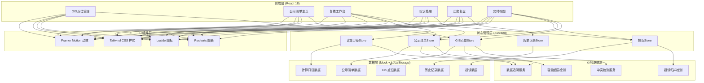
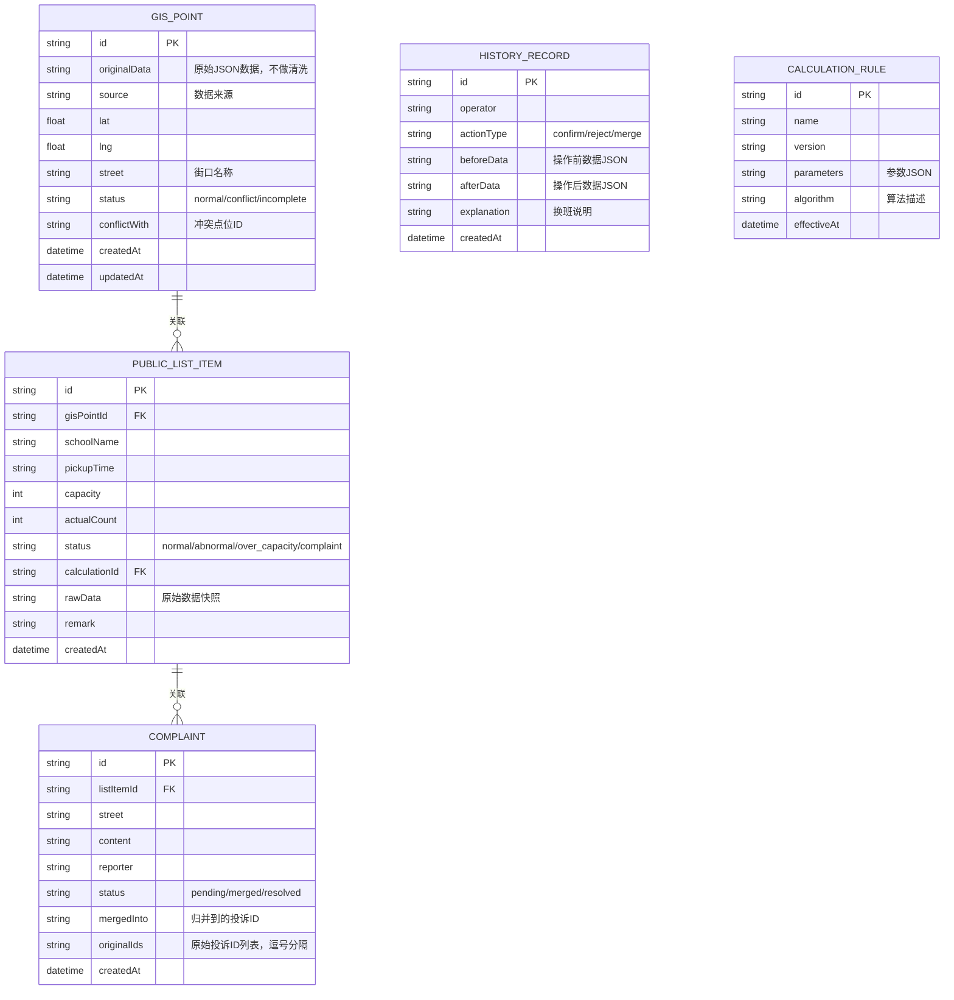

## 1. 架构设计



## 2. 技术描述

- **前端框架**：React 18.2 + TypeScript 5.2
- **构建工具**：Vite 5.0
- **样式方案**：Tailwind CSS 3.4
- **状态管理**：Zustand 4.4
- **图表库**：Recharts 2.10
- **图标库**：Lucide React 0.294
- **动效库**：Framer Motion 10.16
- **数据持久化**：LocalStorage + Mock 数据
- **后端**：无后端，纯前端模拟业务逻辑

## 3. 路由定义

| 路由 | 页面 | 功能说明 |
|------|------|----------|
| / | GIS点位管理 | GIS点位列表、原始数据查看、冲突检测 |
| /public-list | 公示清单主页 | 学校接送公示清单、异常标记、回溯入口 |
| /review | 复核工作台 | 统计图表、计算口径追溯、异常确认 |
| /complaints | 投诉处理 | 投诉列表、归并提示、人工确认归并 |
| /history | 历史复盘 | 操作时间线、前后对比、换班说明 |
| /delivery | 交付视图 | 三栏简洁展示、导出功能 |

## 4. 数据模型

### 4.1 数据模型ER图



### 4.2 TypeScript 类型定义

```typescript
// GIS点位
interface GisPoint {
  id: string;
  originalData: Record<string, any>;
  source: string;
  lat: number;
  lng: number;
  street: string;
  status: 'normal' | 'conflict' | 'incomplete';
  conflictWith?: string;
  createdAt: string;
  updatedAt: string;
}

// 公示清单项
interface PublicListItem {
  id: string;
  gisPointId: string;
  schoolName: string;
  pickupTime: string;
  capacity: number;
  actualCount: number;
  status: 'normal' | 'abnormal' | 'over_capacity' | 'complaint';
  calculationId: string;
  rawData: Record<string, any>;
  remark: string;
  createdAt: string;
}

// 投诉
interface Complaint {
  id: string;
  listItemId: string;
  street: string;
  content: string;
  reporter: string;
  status: 'pending' | 'merged' | 'resolved';
  mergedInto?: string;
  originalIds?: string;
  createdAt: string;
}

// 历史记录
interface HistoryRecord {
  id: string;
  operator: string;
  actionType: 'confirm' | 'reject' | 'merge';
  beforeData: Record<string, any>;
  afterData: Record<string, any>;
  explanation: string;
  createdAt: string;
}

// 计算口径
interface CalculationRule {
  id: string;
  name: string;
  version: string;
  parameters: Record<string, any>;
  algorithm: string;
  effectiveAt: string;
}
```

## 5. 核心业务逻辑设计

### 5.1 冲突检测算法
- 输入：所有GIS点位
- 逻辑：按street字段分组，同街口多个点位标记为conflict
- 输出：标记冲突的点位列表及冲突关系

### 5.2 容量超限检测
- 输入：公示清单项（capacity, actualCount）
- 逻辑：actualCount > capacity * 1.1 标记为 over_capacity
- 输出：超限标记及超限百分比

### 5.3 投诉归并检测
- 输入：投诉列表
- 逻辑：按street+listItemId分组，同组>1条提示可归并
- 输出：可归并投诉组，人工确认后执行归并

### 5.4 数据追溯服务
- 输入：公示清单项ID
- 逻辑：关联查询GIS点位原始数据 + 计算口径详情
- 输出：完整追溯链路数据

## 6. 状态管理设计

每个核心模块独立Store，支持跨模块数据访问：
- useGisStore: GIS点位CRUD、冲突检测
- usePublicListStore: 公示清单CRUD、超限检测
- useComplaintStore: 投诉CRUD、归并逻辑
- useHistoryStore: 历史记录CRUD、时间线查询
- useCalculationStore: 计算口径管理
