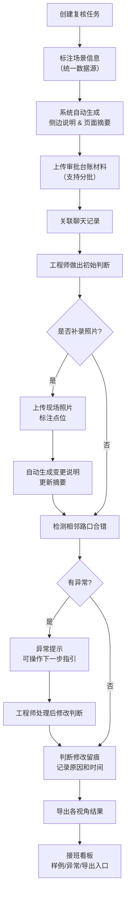

## 1. 产品概述

雨水口积淤容量复核系统是面向交通工程师的专业作业工具，解决审批台账追溯难、判断变更无记录、补料覆盖无痕迹、异常提示不可操作等核心痛点，让复核过程可追溯、判断变更留痕、异常处置有指引、接班交接高效率。

## 2. 核心功能

### 2.1 用户角色

| 角色 | 描述 | 核心权限 |
|------|------|----------|
| 交通工程师（主班） | 负责雨水口积淤容量复核的主要作业人员 | 创建复核、补录材料、修改判断、导出结果 |
| 交通工程师（接班） | 交接班后继续处理的人员 | 查看历史、定位异常、继续作业 |
| 领导 | 查看复核结果和原因的管理人员 | 查看台账、追溯判断依据 |

### 2.2 功能模块

1. **复核工作台**：复核列表、地图点位、侧边说明、页面摘要统一数据源
2. **审批台账管理**：分批补料、材料关联聊天记录、历史版本追溯
3. **判断历史追溯**：判断修改记录、修改人、修改时间、修改原因
4. **异常提示与处置**：相邻路口合错检测、可操作下一步指引
5. **现场照片补录**：照片上传、点位标注、变更说明自动生成
6. **接班信息看板**：样例位置、异常位置、导出入口、简洁交接

### 2.3 页面详情

| 页面名称 | 模块名称 | 功能描述 |
|----------|----------|----------|
| 复核列表页 | 顶部导航 | 系统标题、用户信息、搜索筛选 |
| 复核列表页 | 列表区 | 复核条目卡片、状态标签、异常标记、最新摘要 |
| 复核详情页 | 地图区 | 雨水口点位、相邻路口连线、照片点位标注 |
| 复核详情页 | 场景标注 | 统一数据源的场景描述标签 |
| 复核详情页 | 侧边说明 | 从统一数据源生成的详细说明 |
| 复核详情页 | 页面摘要 | 从统一数据源生成的摘要信息 |
| 复核详情页 | 审批台账 | 材料列表、分批补料时间线、聊天记录关联 |
| 复核详情页 | 判断历史 | 判断版本列表、版本对比、修改原因 |
| 复核详情页 | 异常提示 | 相邻路口合错提示、可操作下一步指引 |
| 复核详情页 | 照片补录 | 上传照片、标注点位、自动生成变更说明 |
| 接班看板页 | 样例入口 | 标准复核样例快速跳转 |
| 接班看板页 | 异常列表 | 待处理异常汇总、一键跳转 |
| 接班看板页 | 导出入口 | 各视角导出功能快捷入口 |

## 3. 核心流程

### 3.1 复核主流程

交通工程师创建复核任务 → 标注场景信息（统一数据源）→ 上传审批台账材料（分批）→ 系统自动生成侧边说明和页面摘要 → 工程师做出初始判断 → 补录现场照片（自动生成变更说明）→ 如需修改判断（留痕记录原因）→ 检测相邻路口是否合错 → 异常提示并给出可操作下一步 → 导出各视角结果 → 交接班时通过接班看板快速上手

### 3.2 流程图

## 4. 用户界面设计

### 4.1 设计风格

- **主色调**：深海蓝 #165DFF（专业、可靠），配合钢灰色 #4E5969
- **辅助色**：警示橙 #FF7D00（异常标记），成功绿 #00B42A（正常）
- **按钮风格**：圆角 6px，轻微阴影，hover 时有微妙的上浮效果
- **字体**：标题用 "PingFang SC Semibold"，正文用 "PingFang SC Regular"，等宽数字用 "JetBrains Mono"
- **布局风格**：左右分栏布局，左侧地图/内容区，右侧信息面板，顶部导航
- **视觉风格**：工业专业风，克制的装饰元素，强调信息清晰度和操作效率
- **图标风格**：线性图标，统一 2px 线宽，颜色与文本一致

### 4.2 页面设计概览

| 页面名称 | 模块名称 | UI 元素 |
|----------|----------|---------|
| 复核列表页 | 列表卡片 | 卡片式布局，状态标签角标，摘要截断展示，hover 上浮 |
| 复核详情页 | 地图区 | 浅蓝色底图，深蓝色点位，橙色异常点位，连线虚线 |
| 复核详情页 | 统一信息源 | 场景标签组，点击可编辑，一处修改三处同步更新 |
| 复核详情页 | 审批台账 | 时间线布局，分批材料分组，聊天记录气泡样式 |
| 复核详情页 | 判断历史 | 版本卡片，diff 对比样式，修改原因标签 |
| 复核详情页 | 异常提示 | 橙色边框卡片，步骤化指引，可点击执行 |
| 接班看板页 | 三栏布局 | 样例区、异常区、导出区，卡片式，大图标，简洁文字 |

### 4.3 响应式

桌面端优先设计，主内容区最小宽度 1200px。平板端自适应缩放下边距和字体大小。不考虑移动端，因是专业作业工具。

### 4.4 动效设计

- 页面切换：淡入 + 轻微上移，200ms 缓动
- 卡片 hover：上移 2px，阴影加深，150ms
- 异常提示出现：从右侧滑入 + 轻微弹性
- 时间线新增条目：从透明到实色，高度展开动画
- 判断版本切换：交叉淡入淡出
