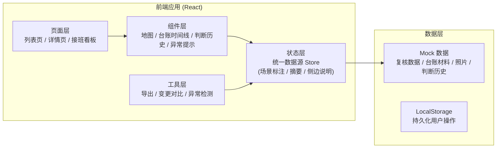
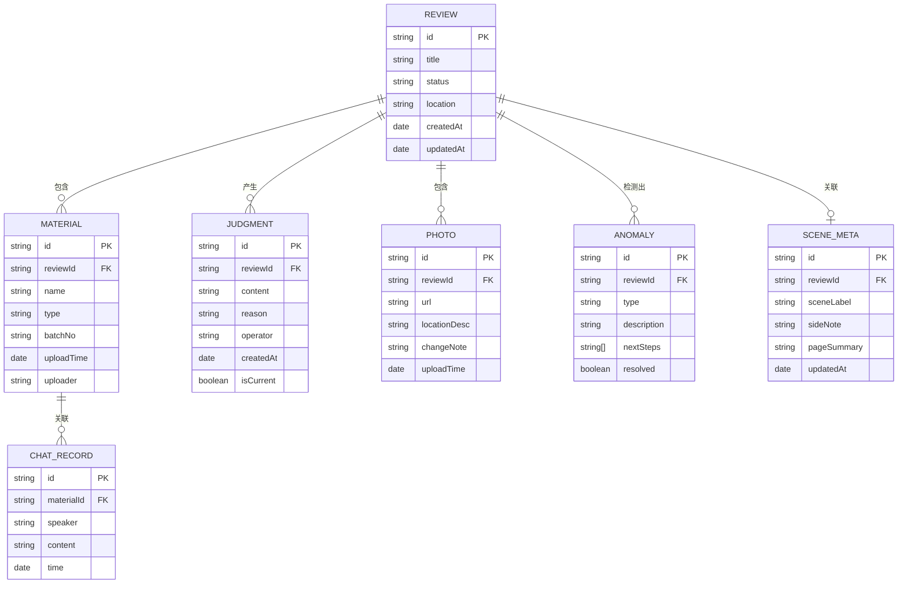

## 1. 架构设计



## 2. 技术描述

- **前端框架**：React@18 + TypeScript
- **构建工具**：Vite@5
- **样式方案**：TailwindCSS@3 + CSS 变量
- **状态管理**：Zustand（轻量，适合统一数据源场景）
- **路由**：React Router v6
- **图标**：Lucide React
- **地图**：使用 SVG 自定义示意图（无需第三方地图服务）
- **数据**：Mock 数据 + LocalStorage 持久化
- **导出**：html2canvas + jspdf（导出 PDF 报告）

## 3. 路由定义

| 路由 | 页面 | 用途 |
|------|------|------|
| `/` | 复核列表页 | 展示所有复核任务，搜索筛选 |
| `/review/:id` | 复核详情页 | 核心作业页面，地图、台账、判断、异常 |
| `/handover` | 接班看板页 | 接班时快速了解样例、异常、导出入口 |

## 4. 数据模型

### 4.1 ER 图



### 4.2 核心数据结构定义

```typescript
// 复核任务
interface Review {
  id: string;
  title: string;
  status: 'pending' | 'processing' | 'completed' | 'anomaly';
  location: string;
  point: { x: number; y: number };
  adjacentPoints: { id: string; x: number; y: number; name: string }[];
  createdAt: string;
  updatedAt: string;
}

// 统一场景元数据（场景标注、侧边说明、页面摘要同一数据源）
interface SceneMeta {
  reviewId: string;
  sceneLabels: string[];      // 场景标注
  sideNote: string;           // 侧边说明
  pageSummary: string;        // 页面摘要
  updatedAt: string;
  updatedBy: string;
}

// 审批台账材料
interface Material {
  id: string;
  reviewId: string;
  name: string;
  type: 'drainage_design' | 'survey_report' | 'approval' | 'other';
  batchNo: number;            // 批次号
  uploadTime: string;
  uploader: string;
  chatRecords: ChatRecord[];  // 关联聊天记录
}

// 聊天记录
interface ChatRecord {
  id: string;
  speaker: string;
  content: string;
  time: string;
  isLeader: boolean;
}

// 判断历史
interface Judgment {
  id: string;
  reviewId: string;
  content: string;
  reason: string;             // 修改原因
  operator: string;
  createdAt: string;
  isCurrent: boolean;
}

// 现场照片
interface Photo {
  id: string;
  reviewId: string;
  url: string;
  locationDesc: string;       // 点位描述
  changeNote: string;         // 补录变更说明
  uploadTime: string;
  uploader: string;
}

// 异常
interface Anomaly {
  id: string;
  reviewId: string;
  type: 'adjacent_mismatch' | 'insufficient_material' | 'data_conflict';
  description: string;
  nextSteps: string[];        // 可操作的下一步
  resolved: boolean;
  resolvedAt?: string;
}
```

## 5. 核心模块设计

### 5.1 统一数据源模块

使用 Zustand Store 管理场景元数据，确保场景标注、侧边说明、页面摘要从同一数据源读取和写入：

- 修改场景标注后，自动重新生成侧边说明和页面摘要
- 侧边说明和页面摘要支持手动覆盖，但会标记"已手动调整"
- 导出时统一从 Store 读取，保证三套话一致

### 5.2 分批补料不覆盖模块

- 每批材料独立存储，带批次号
- 初始判断和每批补料后的判断都单独成版本
- 判断历史按时间线展示，可对比任意两个版本
- 后补材料上传时自动提示"是否更新判断"，不直接覆盖

### 5.3 异常检测与可操作提示模块

- 相邻路口合错检测：根据点位距离和管网走向判断
- 异常提示采用"问题描述 + 影响说明 + 分步操作指引"结构
- 每一步操作指引可点击跳转到对应操作区域

### 5.4 判断历史追溯模块

- 每次判断修改都生成新版本，记录修改人、时间、原因
- 版本对比高亮差异
- 支持回退到历史版本（同样留痕）

### 5.5 照片补录变更说明模块

- 上传照片时标注点位
- 系统自动生成变更说明模板（"补录XX位置照片，显示积淤情况较之前判断更为严重/轻微"）
- 工程师可编辑确认
- 变更说明同步更新到页面摘要

### 5.6 接班信息看板模块

- 三栏布局：样例入口、异常列表、导出入口
- 每项信息控制在 1-2 行文字
- 点击直接跳转到对应页面
- 不需要大段说明文字
