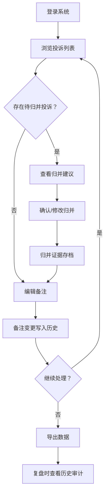

## 1. 产品概述

雨水口积淤投诉回放系统——面向市政巡检团队，用于回溯、归并、确认和导出雨水口积淤投诉数据的工具。解决旧版意见被覆盖无法解释、脏数据被过度清洗、相邻点位被错误合并、人工确认缺乏留痕等痛点，确保第二天复盘前负责人可独立运行并完整交代数据变化过程。

- 目标用户：市政巡检负责人、设计工程师（老曹类角色）
- 核心价值：让"数据从哪来、做了什么处理、谁确认的"全程可追溯，复盘零障碍

## 2. 核心功能

### 2.1 用户角色

| 角色 | 注册方式 | 核心权限 |
|------|----------|----------|
| 负责人 | 管理员分配 | 查看、编辑备注、确认归并、导出、查看历史 |
| 工程师 | 管理员分配 | 查看、编辑备注、查看历史 |

### 2.2 功能模块

1. **投诉回放主页**：投诉列表、筛选与搜索、状态标记
2. **投诉详情与归并页**：原始来源展示、归并操作、备注编辑、确认流程
3. **历史审计页**：确认前后变化对比、操作日志、归并证据链
4. **导出页**：按条件导出、备注同步到导出结果

### 2.3 页面详情

| 页面名称 | 模块名称 | 功能描述 |
|----------|----------|----------|
| 投诉回放主页 | 投诉列表 | 按时间/地点/状态展示所有投诉，支持筛选和搜索 |
| 投诉回放主页 | 状态标记 | 标记投诉为"待归并"/"已归并"/"已确认"，颜色区分 |
| 投诉回放主页 | 快速备注 | 行内编辑备注，保存后即时同步到后端和导出数据 |
| 投诉详情与归并页 | 原始来源 | 展示投诉原始内容、照片（不齐整也保留原样）、来源系统 |
| 投诉详情与归并页 | 归并操作 | 展示同一地点不同写法的投诉，选择归并或拆分，保留归并证据 |
| 投诉详情与归并页 | 备注编辑 | 编辑备注字段，修改自动写入历史 |
| 投诉详情与归并页 | 确认流程 | 人工确认归并结果，确认前后变化写入历史 |
| 历史审计页 | 变化对比 | 展示确认前后数据差异，高亮变化字段 |
| 历史审计页 | 操作日志 | 按时间线展示所有操作（编辑、归并、确认） |
| 历史审计页 | 归并证据 | 展示归并依据、原始写法、归并结果 |
| 导出页 | 条件导出 | 按时间范围/状态/地点导出，备注字段同步到导出 |
| 导出页 | 导出预览 | 导出前预览数据，确认备注和归并结果正确 |

## 3. 核心流程

1. 负责人登录系统，进入投诉回放主页，浏览待处理的投诉
2. 系统自动识别同一地点不同写法的投诉，提示归并建议
3. 负责人查看归并建议，确认或修改归并结果
4. 确认后的归并结果保留归并证据（原始写法、归并依据）
5. 负责人编辑备注，修改自动写入历史
6. 负责人导出数据，备注和归并结果同步到导出文件
7. 第二天复盘时，负责人通过历史审计页回溯所有变更

## 4. 用户界面设计

### 4.1 设计风格

- 主色：深青灰 (#1B3A4B)，辅色：暖琥珀 (#E8A838)
- 按钮：圆角矩形，确认类按钮用琥珀色，危险操作用红色
- 字体：标题用 Noto Serif SC（衬线，权威感），正文用 Noto Sans SC
- 布局：左侧导航 + 右侧内容区，卡片式布局
- 图标：Lucide 图标库，线条风格

### 4.2 页面设计概述

| 页面名称 | 模块名称 | UI 元素 |
|----------|----------|---------|
| 投诉回放主页 | 投诉列表 | 卡片列表、状态标签（彩色圆点）、时间筛选器 |
| 投诉回放主页 | 快速备注 | 行内文本框、保存按钮、自动保存提示 |
| 投诉详情与归并页 | 原始来源 | 折叠面板、照片缩略图网格、来源标签 |
| 投诉详情与归并页 | 归并操作 | 左右对比面板、拖拽归并指示线、归并证据卡片 |
| 投诉详情与归并页 | 确认流程 | 确认对话框、差异高亮、签名确认 |
| 历史审计页 | 变化对比 | 双栏对比、增删标记（绿/红）、时间轴 |
| 历史审计页 | 操作日志 | 垂直时间线、操作类型图标、详情展开 |
| 导出页 | 条件导出 | 日期选择器、状态复选框、预览表格 |

### 4.3 响应式设计

- 桌面优先（1280px+），平板适配（768px-1279px），移动端基础可用（<768px）
- 投诉列表在移动端切换为简化卡片视图
- 归并操作在移动端切换为上下对比

### 4.4 3D 场景指导

不适用
