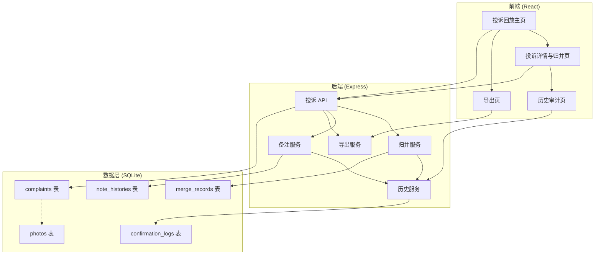
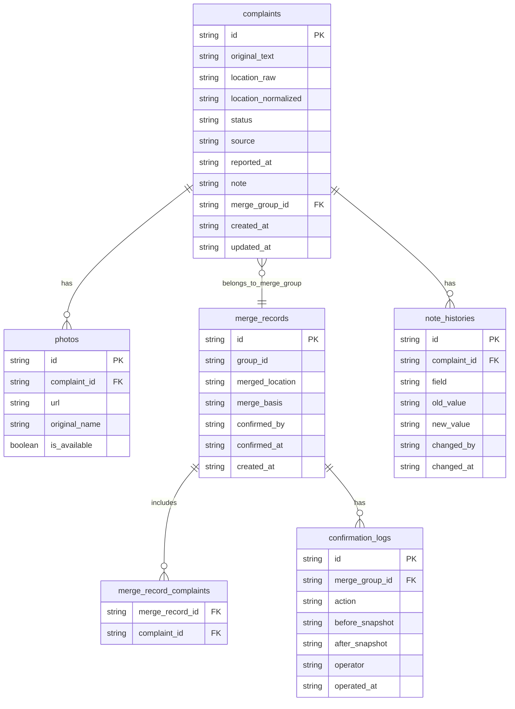

## 1. 架构设计



## 2. 技术说明

- 前端：React@18 + Tailwind CSS@3 + Vite + Zustand
- 初始化工具：vite-init
- 后端：Express@4 + TypeScript (ESM)
- 数据库：SQLite（文件数据库，单机部署，无需额外服务）
- 数据存储：前端使用 mock 初始数据，后端使用 SQLite 持久化

## 3. 路由定义

| 路由 | 用途 |
|------|------|
| `/` | 投诉回放主页，展示投诉列表、筛选、快速备注 |
| `/complaint/:id` | 投诉详情与归并页，展示原始来源、归并操作、备注编辑 |
| `/history` | 历史审计页，展示操作日志、变化对比、归并证据 |
| `/export` | 导出页，条件导出、预览 |

## 4. API 定义

### 4.1 投诉相关

```typescript
interface Complaint {
  id: string;
  original_text: string;
  location_raw: string;
  location_normalized: string;
  status: "pending" | "merged" | "confirmed";
  source: string;
  reported_at: string;
  note: string;
  merge_group_id: string | null;
  created_at: string;
  updated_at: string;
}

interface Photo {
  id: string;
  complaint_id: string;
  url: string;
  original_name: string;
  is_available: boolean;
}

// GET /api/complaints - 获取投诉列表（支持筛选）
interface GetComplaintsQuery {
  status?: Complaint["status"];
  location?: string;
  keyword?: string;
  date_from?: string;
  date_to?: string;
}
interface GetComplaintsResponse {
  complaints: Complaint[];
  total: number;
}

// GET /api/complaints/:id - 获取投诉详情
interface GetComplaintResponse {
  complaint: Complaint;
  photos: Photo[];
  merge_group: Complaint[] | null;
  history: NoteHistory[];
}

// PATCH /api/complaints/:id - 更新投诉（备注等）
interface PatchComplaintBody {
  note?: string;
}
interface PatchComplaintResponse {
  complaint: Complaint;
}
```

### 4.2 归并相关

```typescript
interface MergeRecord {
  id: string;
  group_id: string;
  complaint_ids: string[];
  original_locations: string[];
  merged_location: string;
  merge_basis: string;
  confirmed_by: string | null;
  confirmed_at: string | null;
  created_at: string;
}

// POST /api/merges - 创建归并
interface CreateMergeBody {
  complaint_ids: string[];
  merged_location: string;
  merge_basis: string;
}
interface CreateMergeResponse {
  merge_record: MergeRecord;
  complaints: Complaint[];
}

// POST /api/merges/:id/confirm - 确认归并
interface ConfirmMergeResponse {
  merge_record: MergeRecord;
  confirmation_log: ConfirmationLog;
}
```

### 4.3 历史相关

```typescript
interface NoteHistory {
  id: string;
  complaint_id: string;
  field: string;
  old_value: string;
  new_value: string;
  changed_by: string;
  changed_at: string;
}

interface ConfirmationLog {
  id: string;
  merge_group_id: string;
  action: "confirm" | "unconfirm" | "edit_note" | "merge" | "unmerge";
  before_snapshot: Record<string, unknown>;
  after_snapshot: Record<string, unknown>;
  operator: string;
  operated_at: string;
}

// GET /api/histories - 获取操作历史
interface GetHistoriesQuery {
  complaint_id?: string;
  merge_group_id?: string;
  action?: ConfirmationLog["action"];
  date_from?: string;
  date_to?: string;
}
interface GetHistoriesResponse {
  logs: ConfirmationLog[];
  total: number;
}
```

### 4.4 导出相关

```typescript
// POST /api/export - 导出数据
interface ExportBody {
  status?: Complaint["status"];
  date_from?: string;
  date_to?: string;
  location?: string;
  format: "csv" | "json";
}
// 返回文件流
```

## 5. 服务端架构图


## 6. 数据模型

### 6.1 数据模型定义



### 6.2 数据定义语言

```sql
CREATE TABLE complaints (
  id TEXT PRIMARY KEY,
  original_text TEXT NOT NULL,
  location_raw TEXT NOT NULL,
  location_normalized TEXT NOT NULL,
  status TEXT NOT NULL DEFAULT 'pending' CHECK(status IN ('pending','merged','confirmed')),
  source TEXT NOT NULL,
  reported_at TEXT NOT NULL,
  note TEXT NOT NULL DEFAULT '',
  merge_group_id TEXT,
  created_at TEXT NOT NULL DEFAULT (datetime('now')),
  updated_at TEXT NOT NULL DEFAULT (datetime('now'))
);

CREATE TABLE photos (
  id TEXT PRIMARY KEY,
  complaint_id TEXT NOT NULL REFERENCES complaints(id),
  url TEXT NOT NULL,
  original_name TEXT NOT NULL,
  is_available INTEGER NOT NULL DEFAULT 1
);

CREATE TABLE merge_records (
  id TEXT PRIMARY KEY,
  group_id TEXT NOT NULL UNIQUE,
  merged_location TEXT NOT NULL,
  merge_basis TEXT NOT NULL,
  confirmed_by TEXT,
  confirmed_at TEXT,
  created_at TEXT NOT NULL DEFAULT (datetime('now'))
);

CREATE TABLE merge_record_complaints (
  merge_record_id TEXT NOT NULL REFERENCES merge_records(id),
  complaint_id TEXT NOT NULL REFERENCES complaints(id),
  original_location TEXT NOT NULL,
  PRIMARY KEY (merge_record_id, complaint_id)
);

CREATE TABLE note_histories (
  id TEXT PRIMARY KEY,
  complaint_id TEXT NOT NULL REFERENCES complaints(id),
  field TEXT NOT NULL,
  old_value TEXT NOT NULL,
  new_value TEXT NOT NULL,
  changed_by TEXT NOT NULL,
  changed_at TEXT NOT NULL DEFAULT (datetime('now'))
);

CREATE TABLE confirmation_logs (
  id TEXT PRIMARY KEY,
  merge_group_id TEXT NOT NULL REFERENCES merge_records(group_id),
  action TEXT NOT NULL CHECK(action IN ('confirm','unconfirm','edit_note','merge','unmerge')),
  before_snapshot TEXT NOT NULL,
  after_snapshot TEXT NOT NULL,
  operator TEXT NOT NULL,
  operated_at TEXT NOT NULL DEFAULT (datetime('now'))
);

CREATE INDEX idx_complaints_status ON complaints(status);
CREATE INDEX idx_complaints_location ON complaints(location_normalized);
CREATE INDEX idx_complaints_merge_group ON complaints(merge_group_id);
CREATE INDEX idx_note_histories_complaint ON note_histories(complaint_id);
CREATE INDEX idx_confirmation_logs_group ON confirmation_logs(merge_group_id);
```
