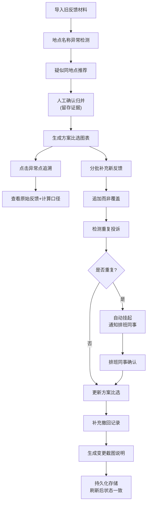

## 1. 产品概述

面向市政设计团队的雨水口积淤方案比选复核工具，解决居民反馈地点名称混乱、后补材料覆盖原始判断、重复投诉误判等问题。
- 服务市政设计人员（老曹）、排班确认同事，用于雨水口积淤治理方案的比选与全链路复核
- 核心价值：地点归并留痕、历史判断不被覆盖、异常状态挂起机制、重启后状态一致

## 2. 核心功能

### 2.1 用户角色
| 角色 | 核心权限 |
|------|----------|
| 市政设计人员（老曹） | 导入反馈、归并地点、生成比选方案、补充材料、查看历史 |
| 排班同事 | 确认挂起的重复投诉、审核归并结果 |

### 2.2 功能模块
1. **居民反馈管理**：导入反馈记录、分批补充、撤回记录、状态时间线
2. **地点名称归并**：同一地点多种写法识别、人工确认归并、归并证据留存、防止相邻点位误合
3. **方案比选面板**：积淤方案图表、异常点高亮、点击追溯原始反馈与计算口径
4. **状态流转与持久化**：重复投诉自动挂起、历史备注保留、刷新/重启后状态恢复
5. **截图说明**：自动生成变更记录快照、补充材料前后对比、撤回原因标注

### 2.3 页面详情
| 页面名称 | 模块名称 | 功能描述 |
|-----------|-------------|---------------------|
| 总览仪表盘 | 方案比选图表 | 多方案积淤指标对比柱状图，异常点位红色高亮，点击穿透到原始反馈 |
| 总览仪表盘 | 状态统计卡片 | 待归并地点、挂起投诉、已确认方案、今日变更数量 |
| 居民反馈页 | 反馈列表 | 按地点分组的反馈记录，显示分批补充时间线，支持撤回单条记录 |
| 居民反馈页 | 导入面板 | 批量导入旧材料 JSON，单条新增反馈，撤回记录输入 |
| 地点归并页 | 疑似重复列表 | 算法推荐的疑似同地点对，显示双方名称/坐标/反馈次数 |
| 地点归并页 | 归并确认面板 | 展示归并证据（名称相似度、坐标距离、历史反馈内容），支持确认/驳回 |
| 方案详情页 | 方案比选表 | 各方案的成本、工期、治理效果对比 |
| 方案详情页 | 变更截图说明 | 自动记录每次状态变更的快照，含前后对比文字说明与时间戳 |
| 方案详情页 | 历史时间线 | 所有操作的完整记录：导入、补充、撤回、归并、挂起、确认 |

## 3. 核心流程

**主要用户流程**：老曹先导入历史居民反馈材料 → 系统识别出地点名称异常和疑似重复 → 老曹逐一确认归并（留存证据）→ 生成积淤方案比选图表 → 发现异常点位时点击回溯到原始反馈与计算口径 → 分批补充新反馈（不覆盖旧判断，仅追加）→ 遇到重复投诉自动挂起 → 排班同事确认后继续 → 补充撤回记录 → 系统自动生成变更截图说明 → 刷新页面后所有状态、备注、时间线一致。

## 4. 用户界面设计

### 4.1 设计风格
- **主色调**：深蓝 `#1e3a5f`（市政专业感），辅色：橙黄 `#f59e0b`（警告/挂起），青绿 `#10b981`（确认/完成），深红 `#dc2626`（异常/撤回）
- **按钮风格**：直角微圆角（2px），实心按钮配细边框，悬停时轻微上浮阴影
- **字体**：标题用思源宋体（专业文档感），正文用思源黑体（可读性），数据表格用等宽字体
- **布局风格**：左侧固定导航栏 + 右侧主内容区，卡片式模块，数据密集型表格优先
- **图标风格**：Lucide 线性图标，市政相关元素（水管、水滴、地图标记）

### 4.2 页面设计概览
| 页面名称 | 模块名称 | UI 元素 |
|-----------|-------------|----------|
| 总览仪表盘 | 方案比选图表 | 深蓝色网格背景，多色柱状图，异常柱红色描边闪烁，hover 显示详情 |
| 总览仪表盘 | 状态统计卡片 | 四色方块卡片，数字大号加粗，底部趋势小箭头 |
| 居民反馈页 | 反馈列表 | 斑马纹表格，状态标签色区分，时间线竖线连接分批记录 |
| 地点归并页 | 疑似重复列表 | 左右对比卡片，中间箭头连接，相似度百分比进度条 |
| 方案详情页 | 变更截图说明 | 灰色虚线边框快照卡片，变更文字用删除线+新增标注对比 |
| 方案详情页 | 历史时间线 | 左侧竖轴时间戳，右侧事件卡片，不同操作类型不同色左边框 |

### 4.3 响应式
桌面端优先（1440px 基准），侧边栏固定 240px；平板端侧边栏可折叠；手机端转为顶部 Tab 导航。所有表格支持横向滚动。
