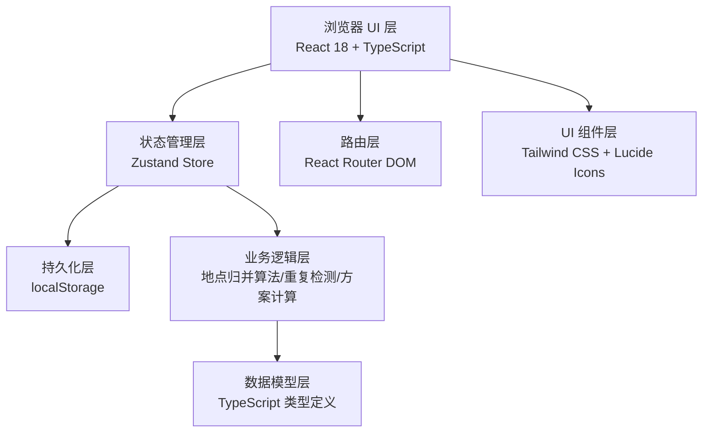
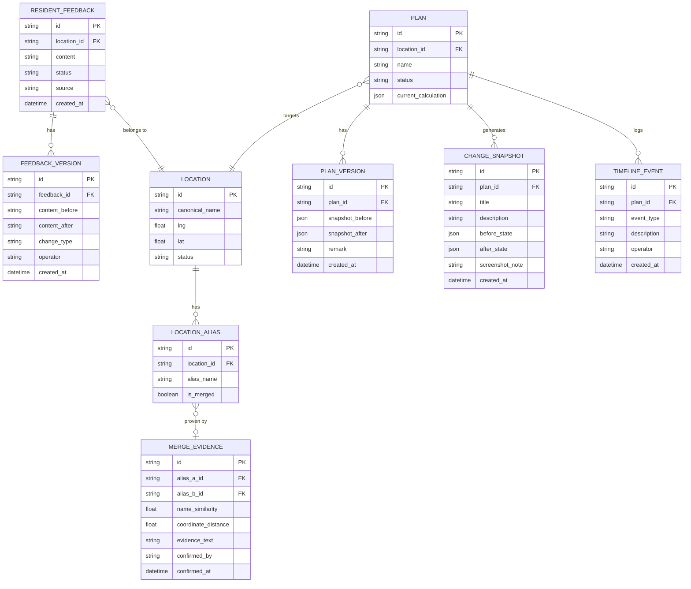

## 1. 架构设计

纯前端单页应用，状态通过 Zustand 管理，持久化到 localStorage，无需后端服务。



## 2. 技术描述
- **前端框架**：React 18 + TypeScript
- **构建工具**：Vite 5
- **样式方案**：Tailwind CSS 3
- **状态管理**：Zustand 4（含 persist 中间件做 localStorage 持久化）
- **路由**：React Router DOM 6
- **图标**：Lucide React
- **数据存储**：浏览器 localStorage（纯前端，无需后端）
- **初始化工具**：vite-init（react-ts 模板）

## 3. 路由定义
| 路由 | 页面组件 | 用途 |
|-------|---------|------|
| `/` | Dashboard | 总览仪表盘：方案比选图表、状态统计卡片 |
| `/feedbacks` | FeedbackList | 居民反馈管理：导入、列表、分批补充、撤回 |
| `/locations` | LocationMerge | 地点名称归并：疑似重复列表、归并确认、证据留存 |
| `/方案/:id` | PlanDetail | 方案详情：比选表、变更截图说明、历史时间线 |

## 4. 数据模型

### 4.1 ER 图



### 4.2 类型定义

```typescript
interface ResidentFeedback {
  id: string;
  locationId: string;
  locationNameRaw: string;
  content: string;
  status: 'pending' | 'active' | 'withdrawn' | 'suspended';
  source: string;
  reporterName?: string;
  createdAt: string;
  versions: FeedbackVersion[];
}

interface FeedbackVersion {
  id: string;
  feedbackId: string;
  contentBefore: string | null;
  contentAfter: string;
  changeType: 'create' | 'supplement' | 'withdraw' | 'edit';
  operator: string;
  remark?: string;
  createdAt: string;
}

interface Location {
  id: string;
  canonicalName: string;
  lng: number;
  lat: number;
  status: 'active' | 'merged' | 'pending_review';
  aliases: LocationAlias[];
}

interface LocationAlias {
  id: string;
  locationId: string;
  aliasName: string;
  isMerged: boolean;
  firstSeenAt: string;
}

interface MergeEvidence {
  id: string;
  aliasAId: string;
  aliasBId: string;
  targetLocationId: string;
  nameSimilarity: number;
  coordinateDistance: number;
  evidenceText: string;
  confirmedBy: string;
  confirmedAt: string;
}

interface DrainagePlan {
  id: string;
  locationId: string;
  name: string;
  status: 'draft' | 'reviewing' | 'suspended' | 'confirmed';
  schemes: PlanScheme[];
  currentCalculation: CalculationBasis;
  versions: PlanVersion[];
  snapshots: ChangeSnapshot[];
  timeline: TimelineEvent[];
}

interface PlanScheme {
  id: string;
  name: string;
  cost: number;
  duration: number;
  effectiveness: number;
  riskLevel: 'low' | 'medium' | 'high';
  isAnomaly: boolean;
  anomalyReason?: string;
}

interface CalculationBasis {
  formula: string;
  parameters: Record<string, number>;
  sourceFeedbackIds: string[];
  updatedAt: string;
}

interface PlanVersion {
  id: string;
  planId: string;
  snapshotBefore: string;
  snapshotAfter: string;
  remark: string;
  createdAt: string;
}

interface ChangeSnapshot {
  id: string;
  planId: string;
  title: string;
  description: string;
  beforeState: string;
  afterState: string;
  screenshotNote: string;
  createdAt: string;
}

interface TimelineEvent {
  id: string;
  planId: string;
  eventType: 'import' | 'supplement' | 'withdraw' | 'merge' | 'suspend' | 'confirm' | 'calculate';
  description: string;
  operator: string;
  createdAt: string;
  relatedFeedbackIds?: string[];
}
```

## 5. 核心业务规则（Store Actions）

| Action | 输入 | 输出 | 关键规则 |
|--------|------|------|----------|
| `importFeedbacks` | Feedback[] | void | 逐条创建，自动生成 `create` 版本记录，检测疑似重复地点 |
| `supplementFeedback` | feedbackId, newContent, operator | void | 追加新版本（`supplement`），旧版本保留不可删除，触发方案重算但保留旧版本 |
| `withdrawFeedback` | feedbackId, reason, operator | void | 状态改为 `withdrawn`，生成 `withdraw` 版本，生成变更快照，不物理删除 |
| `mergeLocations` | aliasAId, aliasBId, evidence, operator | void | 生成 MergeEvidence 记录，合并到 canonical location，相邻点位（距离>阈值）禁止合入 |
| `suspendDuplicate` | feedbackId, reason | void | 状态改为 `suspended`，生成 timeline 事件，禁止自动生成稳定结论 |
| `confirmSuspended` | feedbackId, operator | void | 排班同事确认，恢复 active，生成 timeline |
| `recalculatePlan` | planId | void | 基于当前生效反馈重算，保留前一版本为 PlanVersion，生成变更快照 |
| `persistAll` | - | void | Zustand persist 中间件自动同步 localStorage |
