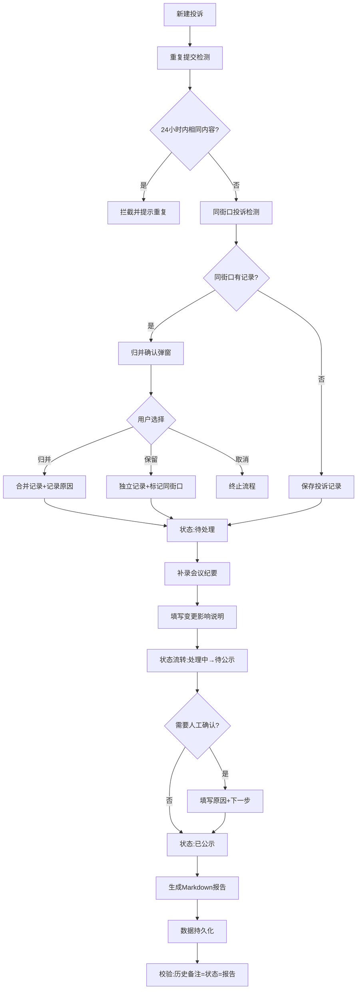

## 1. 产品概述

雨水口积淤公示清单是社区运营团队的内部工作管理工具，用于规范雨水口积淤投诉的记录、审核、公示全流程。解决会议纪要追溯难、重复提交管理混乱、归并判断缺乏依据等痛点，确保每一条记录都可追溯、每一次变更都有原因、每一份报告都准确一致。

- **主要目标**：建立标准化的雨水口积淤投诉处理流程，避免重复统计、遗漏会议决策、状态不一致等问题
- **目标用户**：社区运营人员（阿宁）、项目经理、审核人员
- **核心价值**：可追溯、防重复、可归并、状态一致

## 2. 核心特性

### 2.1 用户角色

| 角色 | 登录方式 | 核心权限 |
|------|----------|----------|
| 社区运营 | 本地应用 | 记录投诉、补录会议纪要、提交公示 |
| 项目经理 | 本地应用 | 审核记录、确认归并、查看报告、流程测试 |
| 系统管理员 | 本地应用 | 数据重置、参数配置 |

### 2.2 功能模块

1. **投诉记录页**：新建投诉、列表展示、状态筛选、搜索
2. **详情编辑页**：编辑投诉信息、添加附件、查看历史备注、补录会议纪要
3. **归并确认弹窗**：同一街口重复投诉提示、人工确认归并、原因说明
4. **重复提交防护层**：相同内容检测、附件去重、重复拦截
5. **报告导出页**：Markdown格式报告生成、预览、下载
6. **操作日志页**：所有变更记录、状态流转历史

### 2.3 页面详情

| 页面名称 | 模块名称 | 功能描述 |
|----------|----------|----------|
| 投诉记录页 | 顶部导航 | 新建按钮、搜索框、状态筛选标签、导出按钮 |
| 投诉记录页 | 列表区域 | 投诉卡片列表，显示街口、状态、投诉时间、操作按钮 |
| 投诉记录页 | 统计卡片 | 待处理、处理中、待公示、已公示数量统计 |
| 详情编辑页 | 基础信息区 | 街口位置、投诉人、投诉时间、积淤情况描述 |
| 详情编辑页 | 附件管理区 | 附件上传、列表展示、去重标识 |
| 详情编辑页 | 会议纪要区 | 补录会议纪要、变更影响说明（改变了哪些判断） |
| 详情编辑页 | 状态流转区 | 状态变更按钮、人工确认弹窗、原因和下一步说明 |
| 详情编辑页 | 历史备注区 | 所有历史操作记录、时间戳、操作人 |
| 归并确认弹窗 | 重复提示区 | 显示两条重复投诉的对比信息 |
| 归并确认弹窗 | 操作区 | 归并/保留两条/取消三个选项、原因输入 |
| 报告预览页 | 报告内容区 | Markdown格式报告实时预览 |
| 报告预览页 | 操作区 | 复制到剪贴板、下载.md文件 |

## 3. 核心流程

### 3.1 新建投诉流程
用户填写投诉信息 → 系统检测重复提交（相同内容+相同街口+24小时内）→ 检测到重复则拦截并提示 → 未检测到重复则检查同一街口是否已有投诉 → 有则弹出归并确认 → 确认后保存记录 → 状态设为"待处理"

### 3.2 补录会议纪要流程
用户在详情页点击"补录会议纪要" → 填写会议内容、时间、参会人 → 填写"变更影响说明"（此纪要改变了哪些判断）→ 保存 → 自动添加到历史备注 → 状态可根据纪要内容变更

### 3.3 重复投诉处理流程
用户提交投诉 → 系统检测到同一街口已有投诉 → 弹出归并确认弹窗 → 显示两条投诉对比 → 用户选择：归并为一条/保留两条分别处理/取消 → 选择归并则合并内容并记录归并原因 → 选择保留则两条独立存在但标记"同街口"

### 3.4 状态流转流程
待处理 → 处理中 → 待公示（需补录会议纪要）→ 已公示
每个状态变更都需要填写原因和下一步说明（如需人工确认时）

### 3.5 数据持久化流程
每次操作自动保存到localStorage → 页面加载时从localStorage恢复 → 历史备注、当前状态、报告内容三方校验一致 → 不一致时提示并以历史备注为准

## 4. 用户界面设计

### 4.1 设计风格
- **主色调**：深蓝 `#1e3a5f`（专业、可信），搭配水蓝 `#3b82f6`（雨水主题）
- **辅助色**：琥珀橙 `#f59e0b`（待处理警告）、翠绿 `#10b981`（已完成）、玫红 `#ef4444`（异常/重复）
- **中性色**：冷灰系列 `#f8fafc #f1f5f9 #e2e8f0 #64748b #334155 #0f172a`
- **按钮风格**：圆角8px，悬停有阴影提升，点击有按压效果
- **字体**：标题使用 Noto Serif SC（宋体，正式感），正文使用 Inter（清晰易读）
- **布局风格**：卡片式布局，左侧列表右侧详情的双栏结构，顶部固定导航栏
- **图标风格**：使用 lucide-react 线性图标，保持统一线条粗细
- **特殊元素**：雨水滴装饰元素、积水纹理背景、状态标签带徽标动画

### 4.2 页面设计概览

| 页面名称 | 模块名称 | UI元素 |
|----------|----------|--------|
| 投诉记录页 | 顶部导航 | 深蓝渐变背景、白色文字、logo带水滴图标、按钮带微动画 |
| 投诉记录页 | 统计卡片 | 四个彩色统计卡，悬停上浮，数字有计数动画 |
| 投诉记录页 | 列表卡片 | 白色卡片、浅灰边框、状态标签彩色、悬停阴影 |
| 详情编辑页 | 分栏布局 | 左侧30%导航/历史，右侧70%详情编辑 |
| 详情编辑页 | 会议纪要区 | 浅黄背景卡片、带"纪要"徽章、变更说明用红色边框高亮 |
| 归并确认弹窗 | 对比布局 | 左右两列对比、中间VS分隔线、底部三个操作按钮 |
| 归并确认弹窗 | 原因输入 | 文本域带字数统计、必填校验 |
| 报告预览页 | 预览区域 | 仿GitHub Markdown样式、代码高亮、可滚动 |

### 4.3 响应式设计
- **桌面端优先**：1280px以上双栏布局，卡片网格展示
- **平板端**：1024px以下切换为单栏，详情页改为上下布局
- **移动端**：768px以下简化列表，编辑表单全屏展示
- **触控优化**：按钮最小高度44px，输入框有足够间距

### 4.4 交互动效
- 页面加载：元素从下往上渐入，staggered延迟效果
- 状态变更：标签颜色渐变过渡 + 轻微缩放动画
- 重复检测：loading旋转动画 + 结果弹出动效
- 归并确认：弹窗从中心缩放出现，背景模糊
- 附件去重：重复附件有红色边框抖动提示
