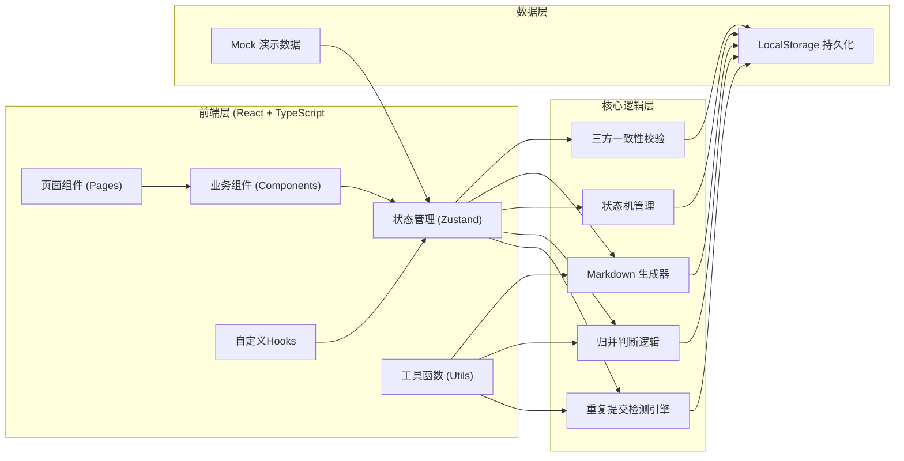
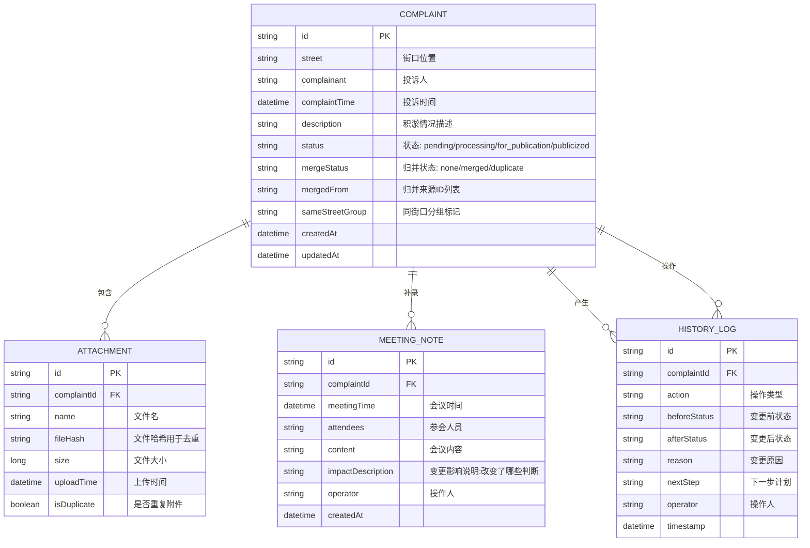

## 1. 架构设计



## 2. 技术选型

- **前端框架**: React 18 + TypeScript
- **构建工具**: Vite 5
- **状态管理**: Zustand 4
- **路由管理**: React Router DOM 6
- **样式方案**: TailwindCSS 3
- **图标库**: Lucide React
- **Markdown渲染**: React Markdown
- **数据持久化**: LocalStorage（浏览器本地存储）
- **包管理器**: pnpm

## 3. 路由定义

| 路由 | 页面 | 功能 |
|------|------|------|
| `/` | 投诉记录列表页 | 展示所有投诉记录、统计、筛选 |
| `/complaint/:id` | 投诉详情页 | 查看/编辑详情、补录纪要、状态变更 |
| `/complaint/new` | 新建投诉页 | 创建新的投诉记录 |
| `/report` | 报告预览页 | 生成和导出Markdown报告 |
| `/logs` | 操作日志页 | 查看所有操作历史记录 |

## 4. 数据模型

### 4.1 ER图



### 4.2 数据结构定义 (TypeScript)

```typescript
type ComplaintStatus = 'pending' | 'processing' | 'for_publication' | 'publicized';
type MergeStatus = 'none' | 'merged' | 'duplicate' | 'same_street';

interface Attachment {
  id: string;
  complaintId: string;
  name: string;
  fileHash: string;
  size: number;
  uploadTime: string;
  isDuplicate: boolean;
}

interface MeetingNote {
  id: string;
  complaintId: string;
  meetingTime: string;
  attendees: string;
  content: string;
  impactDescription: string;
  operator: string;
  createdAt: string;
}

interface HistoryLog {
  id: string;
  complaintId: string;
  action: string;
  beforeStatus?: ComplaintStatus;
  afterStatus?: ComplaintStatus;
  reason?: string;
  nextStep?: string;
  operator: string;
  timestamp: string;
}

interface Complaint {
  id: string;
  street: string;
  complainant: string;
  complaintTime: string;
  description: string;
  status: ComplaintStatus;
  mergeStatus: MergeStatus;
  mergedFrom: string[];
  sameStreetGroup?: string;
  attachments: Attachment[];
  meetingNotes: MeetingNote[];
  historyLogs: HistoryLog[];
  createdAt: string;
  updatedAt: string;
}
```

### 4.3 初始演示数据

```typescript
const mockComplaints: Complaint[] = [
  {
    id: '1',
    street: '幸福路与阳光大道交叉口东南角',
    complainant: '张女士',
    complaintTime: '2026-06-10 09:30:00',
    description: '连续三天暴雨后，雨水口被落叶和淤泥堵塞，积水约30cm，影响行人通行。',
    status: 'processing',
    mergeStatus: 'none',
    mergedFrom: [],
    attachments: [
      {
        id: 'a1',
        complaintId: '1',
        name: '现场照片1.jpg',
        fileHash: 'abc123',
        size: 2048000,
        uploadTime: '2026-06-10 09:35:00',
        isDuplicate: false
      }
    ],
    meetingNotes: [
      {
        id: 'm1',
        complaintId: '1',
        meetingTime: '2026-06-11 14:00:00',
        attendees: '李主任、王工、赵队',
        content: '会议决定优先处理该路口，调配2名工人配合吸污车作业',
        impactDescription: '原计划本周六处理，改为明日上午处理，优先级从普通提升为紧急',
        operator: '阿宁',
        createdAt: '2026-06-11 16:30:00'
      }
    ],
    historyLogs: [
      {
        id: 'h1',
        complaintId: '1',
        action: '创建投诉',
        afterStatus: 'pending',
        operator: '阿宁',
        timestamp: '2026-06-10 09:30:00'
      },
      {
        id: 'h2',
        complaintId: '1',
        action: '状态变更',
        beforeStatus: 'pending',
        afterStatus: 'processing',
        reason: '已安排工人现场勘查',
        nextStep: '明日上午进行清淤作业',
        operator: '阿宁',
        timestamp: '2026-06-11 10:00:00'
      }
    ],
    createdAt: '2026-06-10 09:30:00',
    updatedAt: '2026-06-11 16:30:00'
  },
  {
    id: '2',
    street: '民生小区西门北侧',
    complainant: '刘先生',
    complaintTime: '2026-06-12 15:20:00',
    description: '雨后积水严重，雨水篦子被塑料袋堵住，水深约20cm，有异味。',
    status: 'for_publication',
    mergeStatus: 'same_street',
    sameStreetGroup: 'group-2',
    mergedFrom: [],
    attachments: [],
    meetingNotes: [],
    historyLogs: [
      {
        id: 'h3',
        complaintId: '2',
        action: '创建投诉',
        afterStatus: 'pending',
        operator: '阿宁',
        timestamp: '2026-06-12 15:20:00'
      }
    ],
    createdAt: '2026-06-12 15:20:00',
    updatedAt: '2026-06-12 15:20:00'
  },
  {
    id: '3',
    street: '民生小区西门北侧',
    complainant: '陈阿姨',
    complaintTime: '2026-06-12 16:45:00',
    description: '同一个地方又堵了，早上刚清完晚上又堵，建议增加防护网。',
    status: 'pending',
    mergeStatus: 'same_street',
    sameStreetGroup: 'group-2',
    mergedFrom: [],
    attachments: [],
    meetingNotes: [],
    historyLogs: [
      {
        id: 'h4',
        complaintId: '3',
        action: '创建投诉',
        afterStatus: 'pending',
        operator: '阿宁',
        timestamp: '2026-06-12 16:45:00'
      }
    ],
    createdAt: '2026-06-12 16:45:00',
    updatedAt: '2026-06-12 16:45:00'
  },
  {
    id: '4',
    street: '和平路23号门前',
    complainant: '王大爷',
    complaintTime: '2026-06-13 08:10:00',
    description: '雨水口积淤严重，散发臭味，蚊虫滋生。',
    status: 'publicized',
    mergeStatus: 'none',
    mergedFrom: [],
    attachments: [],
    meetingNotes: [
      {
        id: 'm2',
        complaintId: '4',
        meetingTime: '2026-06-14 09:00:00',
        attendees: '李主任、赵队',
        content: '已完成清淤，验收合格，同意公示',
        impactDescription: '原待公示状态确认通过，正式列入本周公示清单',
        operator: '阿宁',
        createdAt: '2026-06-14 10:00:00'
      }
    ],
    historyLogs: [
      {
        id: 'h5',
        complaintId: '4',
        action: '创建投诉',
        afterStatus: 'pending',
        operator: '阿宁',
        timestamp: '2026-06-13 08:10:00'
      },
      {
        id: 'h6',
        complaintId: '4',
        action: '状态变更',
        beforeStatus: 'pending',
        afterStatus: 'processing',
        reason: '已安排清淤',
        operator: '阿宁',
        timestamp: '2026-06-13 09:00:00'
      },
      {
        id: 'h7',
        complaintId: '4',
        action: '状态变更',
        beforeStatus: 'processing',
        afterStatus: 'for_publication',
        reason: '清淤完成，等待会议确认',
        operator: '阿宁',
        timestamp: '2026-06-13 15:30:00'
      },
      {
        id: 'h8',
        complaintId: '4',
        action: '状态变更',
        beforeStatus: 'for_publication',
        afterStatus: 'publicized',
        reason: '会议确认通过',
        nextStep: '列入本周公示清单',
        operator: '阿宁',
        timestamp: '2026-06-14 10:00:00'
      }
    ],
    createdAt: '2026-06-13 08:10:00',
    updatedAt: '2026-06-14 10:00:00'
  }
];
```

## 5. 核心模块设计

### 5.1 重复提交检测模块
- **检测维度**：相同街口 + 相同描述内容（相似度>85%）+ 24小时时间窗口
- **附件去重**：基于文件内容哈希值比对
- **拦截逻辑**：检测到重复时阻止提交，提示已有记录信息
- **防重复标识**：重复附件标记为isDuplicate，不计入统计

### 5.2 归并判断模块
- **检测条件**：同一街口存在多条投诉记录
- **归并选项**：
  - 归并为一条（合并内容、保留所有附件、记录归并原因
  - 保留两条独立记录（标记sameStreetGroup）
  - 取消操作
- **归并逻辑**：选择归并后，原记录标记为merged，新记录包含mergedFrom字段

### 5.3 状态机模块
- **状态流转**：pending → processing → for_publication → publicized
- **人工确认触发点**：
  - 状态变更时如有会议纪要影响
  - 归并操作
  - 重复投诉处理
- **确认内容**：必须填写原因(reason)和下一步(nextStep)

### 5.4 三方一致性校验模块
- **校验时机**：页面加载、数据恢复、报告生成前
- **校验维度**：
  - 当前status必须与最后一条historyLog的afterStatus一致
  - meetingNotes必须有对应的historyLog记录
  - 生成的report内容必须与当前数据一致
- **修复策略**：不一致时以historyLog为准，自动修复并提示用户

### 5.5 Markdown报告生成模块
- **报告结构**：
  - 标题：雨水口积淤公示清单
  - 统计概览
  - 详细列表（按状态分组）
  - 会议纪要补录说明
  - 异常情况说明（归并、重复等）
- **导出方式**：复制到剪贴板、下载.md文件

## 6. 状态管理设计 (Zustand)

```typescript
interface ComplaintStore {
  complaints: Complaint[];
  selectedComplaintId: string | null;
  searchKeyword: string;
  statusFilter: ComplaintStatus | 'all';
  isLoading: boolean;
  // Actions:
  fetchComplaints: () => void;
  addComplaint: (complaint: Omit<Complaint, 'id' | 'createdAt' | 'updatedAt'>) => { success: boolean; duplicate?: Complaint };
  updateComplaint: (id: string, updates: Partial<Complaint>) => void;
  deleteComplaint: (id: string) => void;
  addMeetingNote: (complaintId: string, note: Omit<MeetingNote, 'id' | 'createdAt'>) => void;
  addHistoryLog: (complaintId: string, log: Omit<HistoryLog, 'id'>) => void;
  changeStatus: (complaintId: string, newStatus: ComplaintStatus, reason: string, nextStep?: string) => void;
  mergeComplaints: (targetId: string, sourceIds: string[], reason: string) => void;
  checkDuplicate: (street: string, description: string) => Complaint | null;
  checkSameStreet: (street: string) => Complaint[];
  generateMarkdownReport: () => string;
  validateConsistency: () => { valid: boolean; issues: string[] };
  resetToDefaults: () => void;
}
```

## 7. 项目目录结构

```
src/
├── components/          # 可复用组件
│   ├── ComplaintCard.tsx       # 投诉卡片
│   ├── StatusBadge.tsx        # 状态标签
│   ├── MeetingNoteForm.tsx       # 会议纪要表单
│   ├── MergeConfirmModal.tsx    # 归并确认弹窗
│   ├── DuplicateWarning.tsx    # 重复提交警告
│   ├── ConfirmModal.tsx            # 通用确认弹窗
│   ├── HistoryLogList.tsx       # 历史记录列表
│   ├── AttachmentList.tsx      # 附件列表
│   ├── StatsCard.tsx           # 统计卡片
│   └── MarkdownPreview.tsx     # Markdown预览
├── pages/               # 页面组件
│   ├── ComplaintList.tsx       # 投诉列表页
│   ├── ComplaintDetail.tsx       # 投诉详情页
│   ├── NewComplaint.tsx       # 新建投诉页
│   ├── ReportPage.tsx         # 报告页
│   └── LogsPage.tsx          # 日志页
├── hooks/               # 自定义Hooks
│   ├── useComplaintStore.ts    # 投诉状态管理
│   ├── useDuplicateCheck.ts # 重复检测
│   └── useLocalStorage.ts  # 本地存储
├── utils/               # 工具函数
│   ├── types.ts              # 类型定义
│   ├── constants.ts        # 常量定义
│   ├── hash.ts               # 哈希计算
│   ├── markdown.ts           # Markdown生成
│   ├── consistency.ts      # 一致性校验
│   └── mockData.ts         # 演示数据
├── App.tsx
├── main.tsx
└── index.css
```
