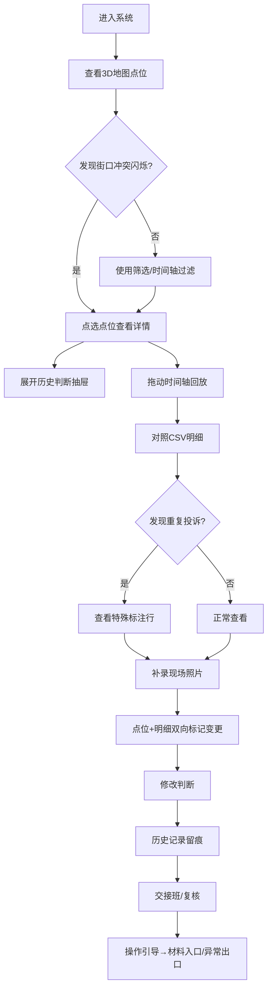

## 1. 产品概述

"社区充电投诉回放"是面向城市规划师的Web3D决策辅助工具，聚焦社区充电桩投诉点位的时空复盘与方案冲突预判。解决规划师小赵在落位方案时遇到的街口冲突、重复投诉、历史判断追溯等痛点，让复核人与接班人员能快速读懂材料、辨明异常。

- 核心价值：通过3D地图+时间轴+CSV明细的多维联动，还原投诉全生命周期，辅助规划决策
- 目标用户：城市规划师（小赵为主）、复核人员、交接班同事

## 2. 核心功能

### 2.1 用户角色

| 角色 | 使用场景 | 核心诉求 |
|------|----------|----------|
| 规划师（小赵） | 日常方案落位、判断记录 | 快速定位冲突、修改判断留痕 |
| 复核人员 | GIS数据核验 | 字段兼容、来源追溯、状态核查 |
| 交接班同事 | 接手未完成工作 | 读懂历史判断、明确异常出口 |

### 2.2 功能模块

1. **3D地图主界面**：GIS点位渲染、点选交互、街口冲突高亮
2. **时间轴回放**：投诉全生命周期时间线、任意时刻切片回放
3. **筛选面板**：多条件过滤、来源/处理状态保底字段
4. **CSV明细区**：与地图点选联动、支持导出、标注重复投诉
5. **现场照片补录**：补录后点位+明细双向标记变更
6. **历史判断追溯**：规划师临时修改全记录、对比视图
7. **材料入口/异常出口**：新手友好的引导式操作提示

### 2.3 页面详情

| 页面名称 | 模块名称 | 功能描述 |
|----------|----------|----------|
| 主工作台 | 3D场景容器 | Cesium/Three.js渲染社区地图，支持缩放平移、建筑与道路分层 |
| 主工作台 | 点位渲染层 | GIS投诉点位按状态着色（待处理/处理中/重复投诉/已结案），街口冲突点位闪烁警示 |
| 主工作台 | 点位详情弹窗 | 点选后显示核心字段：来源、处理状态、投诉时间、最新判断 |
| 主工作台 | 时间轴控件 | 底部横向时间轴，拖拽滑块回放任意时刻状态，播放/暂停/步进按钮 |
| 主工作台 | 筛选面板 | 左侧可折叠面板，保底字段（来源、处理状态）必显，其余GIS字段自适应映射 |
| 主工作台 | CSV明细表格 | 右侧联动表格，选中行对应地图高亮，重复投诉行特殊底色标注，处理结果用"驳回/冲突"替代"通过"类措辞 |
| 主工作台 | 照片补录入口 | 明细行内操作按钮，上传后自动记录"补录人、补录时间、补录内容"，点位与明细同步打标 |
| 主工作台 | 判断历史抽屉 | 点位详情中展开，显示历次修改时间、修改人、修改前后对比，不可删除 |
| 主工作台 | 操作引导层 | 首次进入显示"材料入口"指引，异常操作自动弹出"异常出口"提示（如：字段缺失如何处理） |

## 3. 核心流程

规划师小赵打开系统 → 查看默认时间切片的投诉点位 → 发现街口冲突闪烁点 → 点选点位查看详情与历史判断 → 拖动时间轴回放投诉演化 → 对照CSV明细核对字段（来源、状态保底）→ 发现重复投诉行（特殊标注）→ 补充现场照片 → 系统自动在点位和明细中标记补录变更 → 小赵修改判断 → 历史抽屉记录修改痕迹 → 复核人/接班人登录 → 通过操作引导快速定位材料入口 → 发现异常通过提示出口处理。

## 4. 用户界面设计

### 4.1 设计风格
- **主色调**：深海蓝 #0B1E3F（专业、沉稳），搭配琥珀橙 #FF8C42（警示、冲突高亮）
- **辅助色**：石板灰 #64748B（文字/边框），薄荷绿 #10B981（正常状态），品红 #EC4899（重复投诉）
- **按钮风格**：微立体圆角（8px），悬浮阴影加深，主按钮用琥珀橙渐变
- **字体**：标题用「思源黑体 Heavy」，正文用「思源宋体 Regular」（政府/规划类气质），数据区用「JetBrains Mono」等宽字体
- **布局**：三栏式（左筛选+中3D地图+右CSV明细），底部悬浮时间轴
- **图标**：线性图标，线宽2px，状态点位用实体圆点配光晕

### 4.2 页面设计概览

| 页面名称 | 模块名称 | UI元素 |
|----------|----------|--------|
| 主工作台 | 3D场景容器 | 暗色地图底图，建筑体块描边，道路网发光，冲突点脉冲光晕动画 |
| 主工作台 | 时间轴控件 | 半透明深色背景，刻度带日期标注，滑块琥珀橙，播放按钮圆形微投影 |
| 主工作台 | 筛选面板 | 毛玻璃效果（backdrop-filter），字段分组折叠，保底字段用橙色边框高亮 |
| 主工作台 | CSV明细表格 | 斑马纹行，重复投诉行品红底色+斜纹，状态列用彩色标签，补录行有相机图标角标 |
| 主工作台 | 判断历史抽屉 | 从右侧滑出，时间线布局，每次修改用卡片展示，前后对比用删除线+新增色 |
| 主工作台 | 操作引导层 | 半透明遮罩+聚光灯效果，步骤气泡带序号，"材料入口"绿色标识，"异常出口"红色标识 |

### 4.3 响应式
- 桌面端（≥1280px）：三栏完整布局，3D场景占60%宽度
- 平板端（768-1279px）：上下布局，3D在上，明细在下，筛选面板改为顶部抽屉
- 移动端（<768px）：仅保留核心3D视图+简化筛选，CSV与详情改为全屏弹窗

### 4.4 3D场景指导
- **环境**：城市社区黄昏光环境，HDRI用温和的城市黄昏贴图，整体偏冷色调衬托橙色警示点
- **光照**：主光方向光模拟夕阳，环境光补充阴影区，点位用自发光材质+PointLight点光源
- **相机**：默认45°俯视角，初始聚焦投诉密度最高区域，支持鼠标自由控制，点选后自动平滑聚焦
- **构图**：道路为引导线指向冲突点位，建筑用半透明体块不遮挡视线，地面叠加热力图纹理
- **交互**：点位Hover放大+显示名称，点击弹出详情卡片，时间轴切换时点位有淡入淡出过渡
- **后处理**：Bloom泛光（冲突光晕）、轻微景深、色调映射保持色彩准确
- **资源**：建筑轮廓用GeoJSON挤出，道路从OSM获取，性能预算维持60fps，点位不超过500个时分页加载
