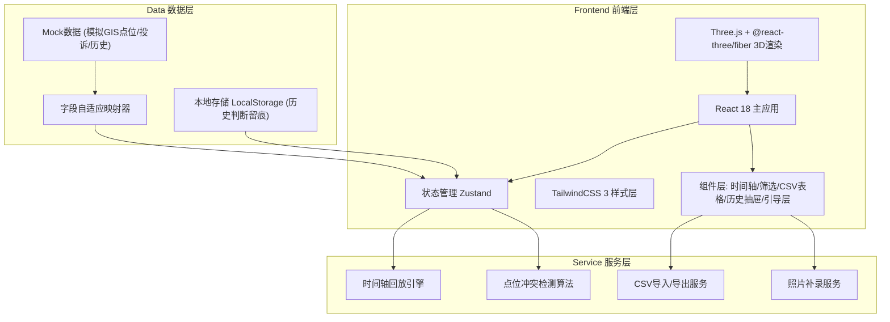
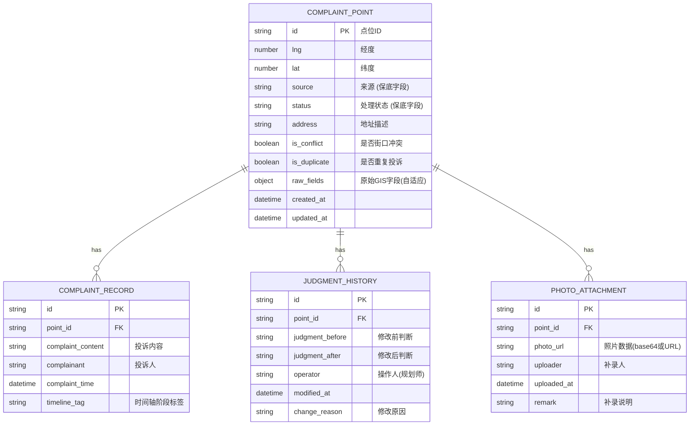

## 1. 架构设计



## 2. 技术描述

- **前端框架**: React 18 + TypeScript
- **构建工具**: Vite 5
- **3D渲染**: three@0.160 + @react-three/fiber@8 + @react-three/drei@9 + @react-three/postprocessing@2
- **状态管理**: zustand@4（轻量，支持时间旅行调试）
- **样式**: tailwindcss@3 + postcss + autoprefixer
- **UI组件**: lucide-react@0.312（线性图标库）+ framer-motion@11（动画）
- **CSV处理**: papaparse@5
- **后端**: 无后端，全部用Mock数据 + LocalStorage持久化
- **数据库**: 无服务端数据库，浏览器端IndexedDB/LocalStorage

## 3. 路由定义

| 路由 | 用途 |
|------|------|
| / | 主工作台（唯一页面，所有功能在此呈现） |

## 4. 数据模型

### 4.1 数据模型定义



### 4.2 字段自适应映射规则

由于复核人提供的GIS字段名前后不一致，系统需实现映射器：

```typescript
// 保底字段映射（必保）
const GUARANTEED_FIELDS = {
  source: ['来源', '投诉来源', 'source', 'from_channel', '渠道来源'],
  status: ['处理状态', 'status', 'state', '处理结果', '当前状态']
} as const;

// 其余字段尝试模糊匹配，匹配不上归入 raw_fields 原样展示
```

### 4.3 处理结果措辞规范

```typescript
// 禁止使用"通过/正常通过"类措辞，替换为:
const RESULT_WORDS = {
  approved: '准予备案',
  rejected: '驳回·存在冲突',
  duplicate: '重复投诉·不予受理',
  pending: '待复核'
} as const;
```

## 5. 核心模块职责

| 模块 | 文件路径 | 职责 |
|------|----------|------|
| 3D场景 | src/components/Scene3D/ | Three.js场景、点位渲染、相机控制、冲突高亮 |
| 时间轴 | src/components/Timeline/ | 回放控制、时间切片、动画帧调度 |
| 筛选面板 | src/components/FilterPanel/ | 保底字段高亮、多条件过滤、字段自适应 |
| CSV明细 | src/components/DetailTable/ | 联动高亮、重复投诉标注、补录标记、CSV导入导出 |
| 判断历史 | src/components/HistoryDrawer/ | 时间线展示、前后对比、不可删除 |
| 操作引导 | src/components/GuideLayer/ | 材料入口提示、异常出口提示、新手引导 |
| 状态存储 | src/store/ | Zustand store、时间轴状态、选中等全局状态 |
| 数据服务 | src/services/ | Mock数据生成、字段映射、本地持久化 |
