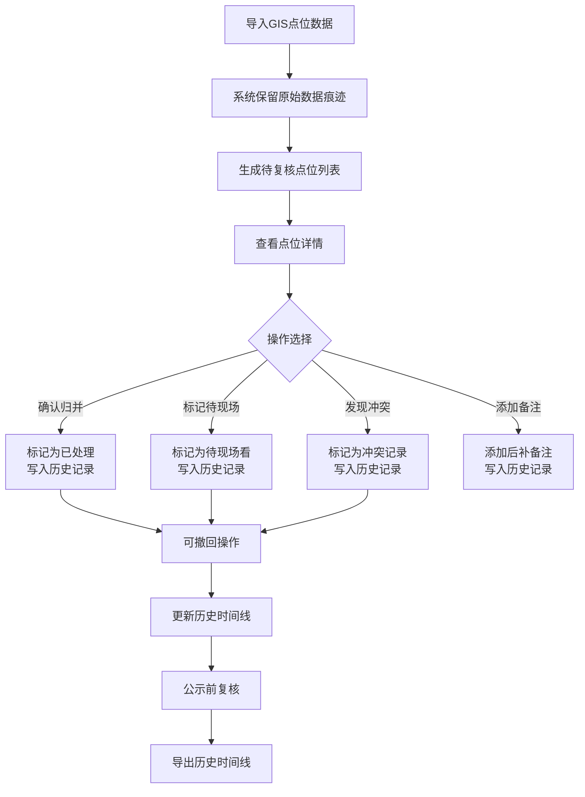

## 1. 产品概述

公交港湾点位归并工具，服务于交通工程师处理GIS点位数据时的脏数据清洗问题。核心解决"同一地点多种名称"、"坐标偏移"、"历史追溯"三大痛点。工具保留原始数据痕迹，提供导入、确认、撤回、历史时间线四大核心接口，所有数据基于本地存储，确保数据安全可追溯。

### 目标用户
- 交通工程师（老何）
- GIS数据处理人员
- 市政规划人员

### 核心价值
- 脏数据保留原始痕迹，可追溯可审计
- 同地点多名自动归并，减少人工识别
- 坐标偏移可视化标记，避免人眼漏判
- 全量操作历史，支持撤回和公示前复核

## 2. 核心功能

### 2.1 功能模块

1. **点位列表页**：点位分类展示（待复核/已处理/待现场看/冲突）、批量操作
2. **点位详情页**：原始数据查看、归并操作、坐标偏移检测、备注管理
3. **历史时间线页**：全量操作记录、状态筛选、导出功能
4. **数据导入页**：GIS数据导入、原始数据预览

### 2.2 页面详情

| 页面名称 | 模块名称 | 功能描述 |
|-----------|-------------|---------------------|
| 点位列表页 | 分类标签栏 | 按状态分类：待复核、已处理、待现场看、冲突记录 |
| 点位列表页 | 点位卡片 | 展示规范名称、原始名称数量、坐标偏移标记、状态标签 |
| 点位列表页 | 操作栏 | 批量确认、批量标记待现场、导入按钮 |
| 点位详情页 | 原始数据区 | 保留完整原始数据：来源、来源行号、原始名称、原始坐标 |
| 点位详情页 | 归并操作区 | 选择多个原始点位归并为一个规范点位、输入规范名称 |
| 点位详情页 | 坐标检测区 | 偏移检测、影响范围展示、与实际位置对比 |
| 点位详情页 | 备注区 | 添加备注、标记后补备注 |
| 历史时间线页 | 时间线列表 | 按时间倒序展示所有操作：导入、确认、撤回、归并、备注 |
| 历史时间线页 | 筛选区 | 按操作类型、点位、时间范围筛选 |
| 历史时间线页 | 导出功能 | 导出CSV/JSON，确保页面状态与文件内容一致 |
| 数据导入页 | 文件上传 | 支持CSV/JSON格式GIS点位数据 |
| 数据导入页 | 数据预览 | 导入前预览原始数据，标记潜在问题 |

## 3. 核心流程

## 4. 用户界面设计

### 4.1 设计风格
- **主色调**：市政蓝 (#1e3a5f)，体现专业严谨
- **辅助色**：警示橙 (#f97316) 标记坐标偏移和冲突；成功绿 (#10b981) 标记已处理；待定黄 (#eab308) 标记待现场
- **字体**：标题使用"Noto Serif SC"（宋体类，正式公文感），正文使用"Noto Sans SC"
- **按钮风格**：直角矩形、细边框、按压式交互反馈
- **布局风格**：左右分栏（列表+详情），顶部导航，卡片式信息展示
- **图标风格**：使用lucide-react线性图标，统一20px尺寸

### 4.2 页面设计概述

| 页面名称 | 模块名称 | UI Elements |
|-----------|-------------|-------------|
| 点位列表页 | 分类标签栏 | 市政蓝背景、白色文字、选中带下划线、hover轻微上浮 |
| 点位列表页 | 点位卡片 | 卡片式设计、左边框颜色表示状态、hover阴影加深 |
| 点位详情页 | 原始数据区 | 等宽字体展示、灰色背景、删除线标记旧名称 |
| 点位详情页 | 坐标检测区 | 双坐标对比、偏移距离计算、影响范围圆形可视化 |
| 历史时间线页 | 时间线列表 | 时间轴设计、左侧竖线、节点图标区分操作类型 |
| 数据导入页 | 文件上传 | 拖拽区域、虚线边框、文件拖入时高亮 |

### 4.3 响应性
- Desktop-first设计，主内容区固定宽度1200px
- 平板端：列表宽度自适应，详情区堆叠
- 移动端：列表全屏展示，详情页全屏覆盖，底部操作栏

### 4.4 交互动效
- 页面加载：元素从下至上渐入，stagger 50ms
- 卡片hover：上移2px，阴影加深，transition 200ms
- 操作反馈：按钮点击缩放0.98，成功操作toast提示
- 时间线滚动：节点渐入，滚动触发
- 坐标偏移标记：橙色脉冲动画，吸引注意
