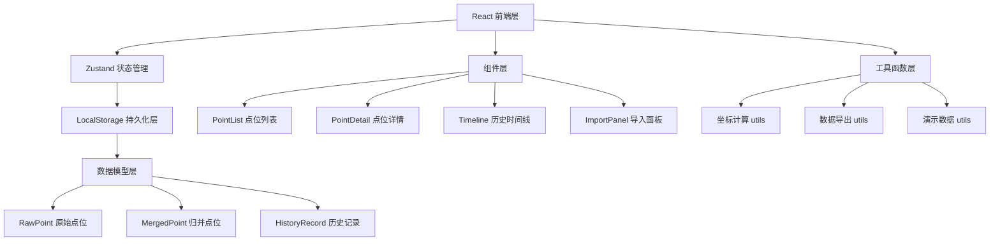
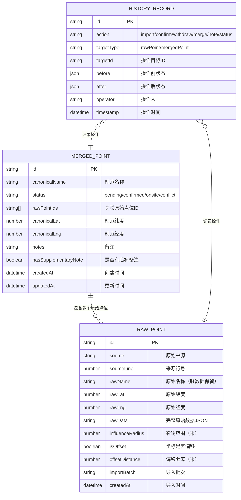
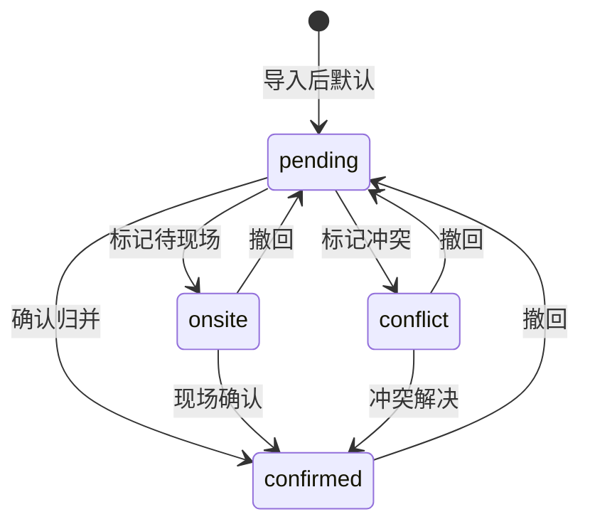

## 1. 架构设计



## 2. 技术描述

- **前端**：React@18 + TypeScript + Vite@5
- **状态管理**：Zustand@4
- **样式**：Tailwind CSS@3
- **图标**：lucide-react@0.344
- **本地存储**：LocalStorage（封装持久化中间件）
- **初始化工具**：vite-init

## 3. 路由定义

| Route | Purpose |
|-------|---------|
| / | 点位列表页（默认） |
| /point/:id | 点位详情页 |
| /timeline | 历史时间线页 |
| /import | 数据导入页 |

## 4. 数据模型

### 4.1 ER图



### 4.2 TypeScript 类型定义

```typescript
// 原始点位 - 保留完整脏数据痕迹
export interface RawPoint {
  id: string;
  source: string;
  sourceLine: number;
  rawName: string;
  rawLat: number;
  rawLng: number;
  rawData: Record<string, any>;
  influenceRadius: number;
  isOffset: boolean;
  offsetDistance: number;
  importBatch: string;
  createdAt: string;
}

// 归并后点位
export type PointStatus = 'pending' | 'confirmed' | 'onsite' | 'conflict';

export interface MergedPoint {
  id: string;
  canonicalName: string;
  status: PointStatus;
  rawPointIds: string[];
  canonicalLat: number;
  canonicalLng: number;
  notes: Note[];
  hasSupplementaryNote: boolean;
  createdAt: string;
  updatedAt: string;
}

export interface Note {
  id: string;
  content: string;
  isSupplementary: boolean;
  createdAt: string;
}

// 历史记录
export type HistoryAction = 'import' | 'confirm' | 'withdraw' | 'merge' | 'note' | 'status';

export interface HistoryRecord {
  id: string;
  action: HistoryAction;
  targetType: 'rawPoint' | 'mergedPoint';
  targetId: string;
  before: any;
  after: any;
  operator: string;
  timestamp: string;
}

// 应用状态
export interface AppState {
  rawPoints: RawPoint[];
  mergedPoints: MergedPoint[];
  history: HistoryRecord[];
  currentBatch: string;
}
```

## 5. 核心数据结构设计原则

### 5.1 原始数据不可修改原则
- `RawPoint` 一旦创建，永不修改
- 所有修改操作作用于 `MergedPoint`
- 历史记录同时保存 `before` 和 `after` 状态

### 5.2 脏数据保留策略
- `rawName` 存储原始名称，包含所有不规范写法
- `rawData` 存储完整原始JSON，保留所有字段
- `isOffset` 和 `offsetDistance` 仅做标记，不修改原始坐标

### 5.3 状态流转

