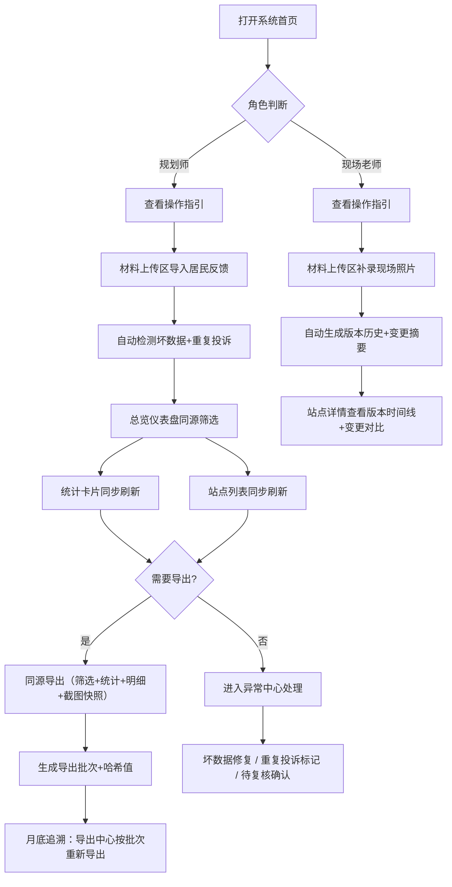

## 1. 产品概述

公交港湾容量复核系统是一套面向城市交通规划部门的内部协作工具，解决居民反馈手工核对效率低、历史版本被覆盖、重复投诉难识别、补录变更无追踪的核心痛点。

- 主要用途：统一数据源管理公交港湾站点的容量复核全流程，支持居民反馈导入、现场照片补录、版本历史追溯、异常数据检测、同源导出报表
- 目标用户：规划师（小赵）、现场勘测老师、数据复核人员
- 核心价值：月底不再被"旧版意见被新表盖掉"拖住，所有操作留痕可追溯，重复投诉和坏数据自动标记

---

## 2. 核心功能

### 2.1 用户角色

| 角色 | 核心场景 | 主要权限 |
|------|----------|----------|
| 规划师 | 日常复核、导出报表、处理异常 | 全部功能，含批量操作和导出 |
| 现场老师 | 补录现场照片和数据 | 材料上传、补录修改、查看异常 |
| 数据复核员 | 核对居民反馈和重复投诉 | 标记重复、标记坏数据、查看历史 |

### 2.2 功能模块

1. **总览仪表盘**：同源筛选面板、统计卡片、异常快速入口
2. **站点列表**：明细表 + 重复投诉标记 + 坏数据标记 + 筛选导出同源
3. **站点详情**：地图点位 + 版本历史时间线 + 字段变更对比 + 截图说明
4. **材料上传区**：居民反馈批量导入 + 现场照片补录 + 原始行溯源
5. **异常中心**：坏数据列表 + 重复投诉组 + 待复核队列
6. **导出中心**：历史批次追溯 + 筛选条件快照 + 一键重新导出 + 操作指引

### 2.3 页面详情

| 页面名称 | 模块名称 | 功能描述 |
|----------|----------|----------|
| 总览仪表盘 | 同源筛选面板 | 行政区/道路/状态/时间范围筛选，筛选结果同时驱动统计、列表、导出 |
| 总览仪表盘 | 统计卡片组 | 总站点数/异常数/正常数/重复投诉数/待复核数，点击卡片跳转对应筛选 |
| 总览仪表盘 | 操作指引卡 | "哪里放材料""哪里看异常""哪里重新导出"三个快速入口+新手提示 |
| 总览仪表盘 | 最近变更时间线 | 展示近7天的补录和修改记录，含变更摘要 |
| 站点列表 | 明细表 | 站名/道路/行政区/设计容量/当前容量/状态/投诉数/操作列，行内标记重复投诉和坏数据 |
| 站点列表 | 重复投诉标记 | 重复行高亮+徽章+"第N次重复"文字提示，点击展开关联投诉组 |
| 站点列表 | 坏数据标记 | 对应单元格红边框+图标悬浮显示具体坏数据类型和原始行号 |
| 站点列表 | 同源导出按钮 | 使用当前筛选条件生成导出批次，含统计快照和数据哈希 |
| 站点详情 | 地图点位区 | 展示站点坐标+补录前后坐标对比（如有位移），附截图和说明文字 |
| 站点详情 | 版本历史时间线 | 按时间倒序展示所有变更，含字段、旧值/新值、操作人、截图附件 |
| 站点详情 | 变更对比面板 | 选中两个版本进行字段级对比，高亮差异 |
| 站点详情 | 关联居民反馈 | 列出该站点的所有反馈行，含原始行号和原始数据快照 |
| 材料上传区 | 居民反馈导入 | 拖拽上传Excel/CSV，预览数据+自动检测坏数据+确认导入 |
| 材料上传区 | 现场照片补录 | 选择站点→上传照片→填写变更说明→自动生成版本记录 |
| 材料上传区 | 导入批次记录 | 历史导入列表，含坏数据统计和重复投诉统计 |
| 异常中心 | 坏数据列表 | 按类型分组，每条展示站点+原始行号+问题描述+快速修复按钮 |
| 异常中心 | 重复投诉组 | 按站点+反馈内容相似度聚类，标记首条和重复条 |
| 异常中心 | 待复核队列 | 需要人工确认的变更清单，含操作人+时间+变更摘要 |
| 导出中心 | 导出批次列表 | 每次导出的时间/筛选条件快照/统计快照/哈希值/操作人 |
| 导出中心 | 批次详情 | 查看该批次的筛选条件、统计数字、明细表结构，一键重新导出 |
| 导出中心 | 操作指引面板 | 分步说明：如何筛选→如何确认统计→如何导出→如何追溯历史批次 |

---

## 3. 核心流程

### 3.1 日常复核主流程

规划师每天打开系统，首页操作指引提示"先去材料上传区导入新一批居民反馈"。导入时系统自动检测坏数据（缺失手机号、无效站名等）和重复投诉，生成导入批次报告。

随后规划师回到总览仪表盘，使用同源筛选面板选择"行政区=浦东新区+状态=异常"。此时：
- 统计卡片自动刷新为筛选后的数字
- 站点列表同步展示符合条件的行
- 点击"导出"时使用完全相同的筛选条件和数据快照

筛选结果中，重复投诉的行带有橙色"重复"徽章，坏数据单元格有红角标，悬浮可看"原始Excel第23行：站名格式不规范"。

### 3.2 现场老师补录流程

现场老师打开系统，首页操作指引直接指向"材料上传区→现场照片补录"。选择站点、上传照片、填写"现场实测容量从12辆调整为15辆，附现场照片3张"后提交。

系统自动生成一条版本历史：
- 字段：currentCapacity
- 旧值：12 → 新值：15
- 变更人：现场老师
- 变更摘要：现场实测调整
- 附件：3张照片
- 地图点位：如坐标有微调，同时记录旧坐标/新坐标

站点详情页的时间线新增一条记录，截图说明区域自动展示照片，并在说明中引用"本次补录改了容量值和坐标"。

### 3.3 月底追溯导出流程

月底领导要最新报表，规划师不再需要担心旧版被盖掉。进入导出中心，所有历史导出批次按时间排列，每个批次保存了当时的筛选条件、统计数字、数据哈希。

点击某月某日的批次"查看详情"，可以看到当时导出的完整上下文。点击"重新导出"，系统使用保存的筛选条件在当前最新数据上重新生成，或选择"按当时快照导出"恢复历史结果。

### 3.4 Mermaid 流程图

---

## 4. 用户界面设计

### 4.1 设计风格

考虑到这是交通规划部门的专业工具，采用 **"工业实用主义+精致数据感"** 风格：

- **主色调**：深普鲁士蓝 `#1E3A5F`（专业/稳重/交通行业蓝）
- **辅助色**：琥珀橙 `#F59E0B`（重复投诉标记/重点提醒）、警示红 `#DC2626`（坏数据/异常）、成功绿 `#059669`（正常/已复核）
- **中性色**：石板灰阶梯 `#0F172A / #334155 / #64748B / #CBD5E1 / #F8FAFC`
- **背景**：浅灰蓝渐变底 `#F1F5F9 → #E2E8F0`，卡片纯白 `#FFFFFF` + 细边框 `#E2E8F0`
- **按钮风格**：方中带圆（圆角6px），主按钮普鲁士蓝实色，次按钮白底蓝边，危险按钮红底白字
- **字体**：标题用 `Noto Serif SC`（宋体系，规划报告的专业感），正文和数据用 `JetBrains Mono` + `PingFang SC`（数字等宽对齐+中文清晰可读）
- **布局风格**：顶部导航栏 + 左侧筛选/操作面板 + 中央内容区，卡片式分组，数据表格密集但有呼吸感
- **图标风格**：纯线条线性图标（Lucide Icons），状态用彩色圆点徽章，不用复杂emoji保持专业感
- **特殊细节**：数据表格的"重复投诉行"使用琥珀橙对角条纹背景（类似工程图纸的标注区），坏数据单元格右下角有红色折角标记

### 4.2 页面设计概览

| 页面名称 | 模块名称 | UI 元素设计 |
|----------|----------|-------------|
| 总览仪表盘 | 操作指引卡 | 3张并列卡片（蓝/橙/绿三色区分功能），大号数字步骤+说明文字+箭头按钮，卡片悬浮轻微上浮 |
| 总览仪表盘 | 统计卡片组 | 5张横排卡片，左侧大号数据数字（JetBrains Mono），右侧图标圆框，底部小字同比，点击有按压动效 |
| 总览仪表盘 | 同源筛选面板 | 顶部横向排列的下拉+搜索+日期范围，右侧"重置/导出/保存筛选"按钮组，筛选标签以tag形式展示在下方 |
| 总览仪表盘 | 最近变更时间线 | 左侧垂直时间轴线+圆点节点，右侧每条含时间/站点/变更人/摘要，悬浮展开截图缩略图 |
| 站点列表 | 明细表 | 斑马纹行，表头固定，重复行琥珀条纹背景+橙色徽章，坏数据单元格红折角+悬浮Tooltip，操作列蓝色文字链接 |
| 站点详情 | 版本时间线 | 左侧时间轴（粗线+渐变节点），右侧每条版本卡片含变更前后对比标签+截图小图+查看详情按钮 |
| 材料上传区 | 拖拽区 | 虚线大框+云上传图标+文字，拖拽进入时边框变蓝+背景浅蓝高亮 |
| 异常中心 | 分类标签页 | 顶部分类Tab（坏数据/重复投诉/待复核），带角标数字，切换内容有淡入动效 |
| 导出中心 | 批次卡片 | 每张卡片顶部"导出成功"绿条+时间，内含筛选条件标签组+统计数字小方块+哈希值小字+操作按钮 |

### 4.3 响应式

- 桌面端优先设计（规划师和现场老师均在办公电脑使用）
- 最小支持宽度1280px，1440px为最优
- 筛选面板在<1440px时从顶部横排改为左侧竖排
- 表格在小屏幕下横向滚动，列宽自适应
- 操作指引卡片在窄屏时从3列改为1列竖排

### 4.4 动效细节

- 页面加载：统计卡片数字从0滚动到目标值（带缓动）
- 筛选变更：列表数据淡出→淡入，行高过度自然
- 版本时间线：滚动到视口时节点从灰色变为主题色
- 重复投诉徽章：脉冲呼吸效果（轻微缩放+透明度变化）提醒注意
- 拖拽上传：文件进入区域时边框加粗+背景色渐变
- 操作成功：右上角Toast通知，绿色勾选图标+滑入滑出
