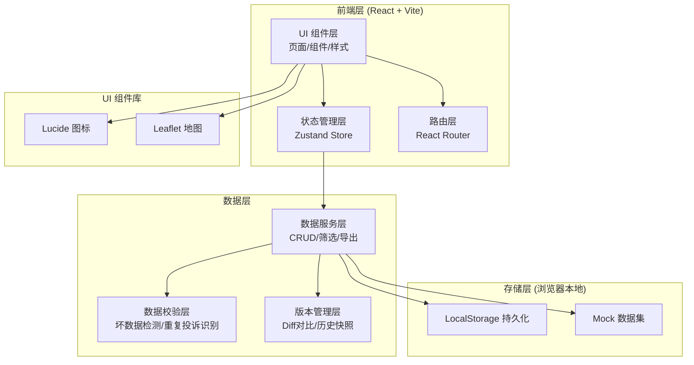

## 1. 架构设计



---

## 2. 技术选型说明

| 层 | 技术 | 版本 | 选型理由 |
|----|------|------|----------|
| 前端框架 | React | 18.x | 生态成熟，组件化开发适合复杂数据面板 |
| 构建工具 | Vite | 5.x | 启动快、HMR 体验好，开发效率高 |
| 语言 | TypeScript | 5.x | 数据模型复杂，类型安全减少bug |
| 样式 | Tailwind CSS | 3.x | 快速构建UI，统一设计系统 |
| 状态管理 | Zustand | 4.x | 轻量无模板代码，适合统一数据源的 Store |
| 路由 | React Router | 6.x | 标准路由方案，支持嵌套路由 |
| 地图 | Leaflet | 1.9.x | 轻量级开源地图，无需 API Key，适合内网环境 |
| 图标 | Lucide React | latest | 统一线性图标风格，专业简洁 |
| 数据校验 | 自定义 | - | 根据业务规则实现坏数据检测算法 |
| 持久化 | LocalStorage | - | 内网工具无需后端，浏览器本地存储演示 |

后端：无（纯前端演示，Mock 数据 + LocalStorage 持久化）
数据库：LocalStorage（键值对存储 JSON 序列化对象）

---

## 3. 路由定义

| 路由路径 | 页面组件 | 页面目的 |
|----------|----------|----------|
| `/` | `Dashboard` | 总览仪表盘：同源筛选+统计卡片+操作指引+最近变更 |
| `/bays` | `BayList` | 站点列表：明细表+重复投诉标记+坏数据标记+同源导出 |
| `/bays/:id` | `BayDetail` | 站点详情：地图+版本时间线+变更对比+关联反馈 |
| `/upload` | `MaterialUpload` | 材料上传区：居民反馈导入+现场补录+导入批次 |
| `/anomalies` | `AnomalyCenter` | 异常中心：坏数据+重复投诉+待复核队列 |
| `/export` | `ExportCenter` | 导出中心：批次列表+批次详情+重新导出+操作指引 |

---

## 4. 核心数据模型（TypeScript 定义）

```typescript
export type BayStatus = 'normal' | 'abnormal' | 'pending';
export type ChangedBy = 'resident' | 'field' | 'planner';

export interface BusBay {
  id: string;
  name: string;
  road: string;
  district: string;
  lng: number;
  lat: number;
  designCapacity: number;
  currentCapacity: number;
  status: BayStatus;
  feedbackCount: number;
  duplicateCount: number;
  badDataCount: number;
  createdAt: string;
  updatedAt: string;
}

export type BadDataFlag =
  | 'missing_name'
  | 'invalid_name'
  | 'missing_phone'
  | 'invalid_phone'
  | 'missing_content'
  | 'short_content'
  | 'no_matching_bay'
  | 'duplicate_content';

export interface ResidentFeedback {
  id: string;
  bayId: string | null;
  sourceRow: number;
  sourceFile: string;
  residentName: string;
  phone: string;
  content: string;
  reportedAt: string;
  isDuplicate: boolean;
  duplicateOfId?: string;
  duplicateOrder?: number;
  badDataFlags: BadDataFlag[];
  rawData: Record<string, any>;
  importBatchId: string;
  createdAt: string;
}

export interface VersionHistory {
  id: string;
  bayId: string;
  fieldName: string;
  oldValue: any;
  newValue: any;
  changedBy: ChangedBy;
  changedAt: string;
  remark: string;
  attachments: string[];
  sourceFeedbackId?: string;
  isFieldSupplement: boolean;
  changeSummary: string;
  oldLngLat?: [number, number];
  newLngLat?: [number, number];
}

export interface FilterCriteria {
  districts: string[];
  roads: string[];
  statuses: BayStatus[];
  hasDuplicate: boolean | null;
  hasBadData: boolean | null;
  dateFrom: string | null;
  dateTo: string | null;
  keyword: string;
}

export interface ExportStatistics {
  total: number;
  abnormal: number;
  normal: number;
  pending: number;
  duplicates: number;
  badData: number;
}

export interface ExportBatch {
  id: string;
  generatedAt: string;
  filterCriteria: FilterCriteria;
  statistics: ExportStatistics;
  snapshotHash: string;
  bayIdsSnapshot: string[];
  generatedBy: string;
  remark: string;
}

export interface ImportBatch {
  id: string;
  fileName: string;
  importedAt: string;
  totalRows: number;
  validRows: number;
  badDataRows: number;
  duplicateRows: number;
  importedBy: string;
}
```

---

## 5. 统一数据源设计（核心机制）

### 5.1 Zustand Store 架构（单一数据源）

```
useMainStore (单一全局 Store)
├── state
│   ├── bays: BusBay[]
│   ├── feedbacks: ResidentFeedback[]
│   ├── versions: VersionHistory[]
│   ├── exportBatches: ExportBatch[]
│   ├── importBatches: ImportBatch[]
│   ├── filters: FilterCriteria        ← 唯一筛选条件源
│   ├── selectedBayId: string | null
│   └── loading: boolean
├── getters (派生状态，从filters+bays计算)
│   ├── filteredBays: BusBay[]         ← 筛选后列表（列表页/统计/导出共用）
│   ├── statistics: ExportStatistics   ← 统计数字（卡片/导出共用）
│   └── snapshotHash: string           ← 数据哈希（同源校验）
└── actions
    ├── setFilters(partial)            ← 修改筛选条件（唯一入口）
    ├── applyFilterToExport()          ← 生成导出批次（保存当时的filters+stats+hash）
    ├── addFeedbackBatch(rows)         ← 导入居民反馈（触发检测+版本记录）
    ├── supplementFieldData(bayId, changes) ← 现场补录（自动生成版本历史）
    ├── markDuplicate(feedbackIds)     ← 标记重复投诉
    └── reExportFromBatch(batchId)     ← 按历史批次重新导出
```

**关键原则**：所有页面的筛选、统计、明细、导出 **只能通过 `filteredBays` 和 `statistics` 读取**，绝不允许自行筛选计算。

### 5.2 数据哈希计算

```typescript
function calculateSnapshotHash(bays: BusBay[], filters: FilterCriteria): string {
  const payload = JSON.stringify({ filters, bayIds: bays.map(b => b.id).sort() });
  return simpleHash(payload);
}
```

导出批次保存 `snapshotHash`，后续查看时可计算当前数据的哈希对比，判断是否已发生变更。

---

## 6. 版本历史与变更追踪机制

### 6.1 自动版本生成触发点

| 操作 | 自动生成的版本记录 |
|------|-------------------|
| 导入居民反馈包含容量建议 | `fieldName='currentCapacity'`, `changedBy='resident'` |
| 现场老师补录照片+修改 | `fieldName=实际修改的字段`, `changedBy='field'`, `isFieldSupplement=true` |
| 规划师手动调整容量/状态 | `fieldName=修改字段`, `changedBy='planner'` |
| 坐标修正 | `fieldName='lngLat'`, 同时记录 `oldLngLat` 和 `newLngLat` |

### 6.2 变更摘要自动生成

```typescript
function generateChangeSummary(field: string, oldV: any, newV: any): string {
  const templates: Record<string, (o, n) => string> = {
    currentCapacity: (o, n) => `容量从 ${o} 辆调整为 ${n} 辆（${n > o ? '增加' : '减少'} ${Math.abs(n-o)} 辆）`,
    status: (o, n) => `状态从「${statusLabel(o)}」变更为「${statusLabel(n)}」`,
    lngLat: (o, n) => `地图点位微调（经度 ${o[0].toFixed(5)}→${n[0].toFixed(5)}，纬度 ${o[1].toFixed(5)}→${n[1].toFixed(5)}）`,
    // ... 其他字段
  };
  return templates[field]?.(oldV, newV) ?? `字段「${field}」变更`;
}
```

---

## 7. 坏数据检测规则

| 规则标识 | 检测逻辑 | 严重级别 |
|----------|----------|----------|
| `missing_name` | 居民姓名字段为空 | 警告 |
| `invalid_name` | 姓名长度<2或含特殊字符 | 提示 |
| `missing_phone` | 手机号为空 | 严重 |
| `invalid_phone` | 手机号不是11位数字或格式不符 | 严重 |
| `missing_content` | 反馈内容为空 | 严重 |
| `short_content` | 反馈内容<5个字，可能无效 | 提示 |
| `no_matching_bay` | 站名/道路在站点库中匹配不到 | 严重 |
| `duplicate_content` | 与同站点7天内的反馈内容相似度>85% | 警告 |

---

## 8. 重复投诉识别算法

1. **分组键**：`bayId + 反馈内容前10字 + 手机号`
2. **同组内按时间排序**：最早的一条标记为 `首条`，后续标记为 `第N次重复`
3. **相似度补充**：内容 Levenshtein 距离<阈值时也判定重复
4. **人工标记优先级**：系统自动标记后允许人工调整，人工标记覆盖自动

---

## 9. 数据初始化（Mock Data）

初始加载时生成演示数据：
- 30 个公交港湾站点（分布在 3 个行政区、10 条道路）
- 120 条居民反馈记录（含 15 条坏数据、20 条重复投诉）
- 45 条版本历史记录（含 10 条现场补录带照片附件）
- 8 个导出批次（含不同筛选条件快照）
- 6 个导入批次
