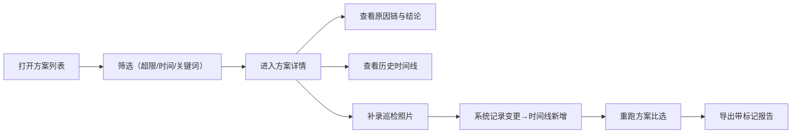

## 1. 产品概述

公交港湾方案比选系统，面向城市规划师，解决巡检材料分散、决策依据追溯难的问题。
- 核心用户：规划师（如小赵），需要在方案比选中关联照片、标注原因、追踪变更
- 产品价值：把"靠人记"变成"系统留痕"，让每条材料与结论的因果关系可追溯

## 2. 核心功能

### 2.1 用户角色

| 角色 | 注册方式 | 核心权限 |
|------|----------|----------|
| 规划师 | 无需登录，本地操作 | 全功能：查看、筛选、补录、导出、重跑比选 |

### 2.2 功能模块

1. **方案列表页**：方案卡片列表、筛选器（含容量超限标记）、快速统计
2. **方案详情页**：基本信息、地图点位、附件材料（含原始痕迹保留）、原因链说明、历史时间线
3. **分析面板**：比选结论可视化、晚到附件影响链路、容量超限高亮

### 2.3 页面详情

| 页面名称 | 模块名称 | 功能描述 |
|----------|----------|----------|
| 方案列表页 | 筛选栏 | 按方案名称、时间、容量超限标记、材料完整度筛选；支持关键词搜索 |
| 方案列表页 | 方案卡片 | 展示方案名、状态、材料数、超限标记、最后更新时间；点击进入详情 |
| 方案详情页 | 信息概览 | 方案基本信息、当前结论、核心指标 |
| 方案详情页 | 地图点位 | 显示公交港湾位置；补录后高亮变更点位 |
| 方案详情页 | 附件材料区 | 巡检照片列表，保留原始文件名/上传时间/来源标记；脏数据不修图；超限材料红色边框标记 |
| 方案详情页 | 原因链面板 | 可视化展示"某条材料→影响因素→比选结论"的因果链；重点突出晚到附件的影响 |
| 方案详情页 | 历史时间线 | 按时间倒序展示所有变更（材料补录、结论调整、标注修改）；每条记录含操作人、变更内容、前后对比 |
| 方案详情页 | 操作栏 | 放样例、重跑比选、导出报告（带超限标记）、补录材料 |

## 3. 核心流程

规划师日常工作流：打开系统查看方案列表 → 筛选容量超限/材料不齐的方案 → 进入详情检查原因链 → 补录现场照片（系统自动记录变更并进入时间线） → 重跑比选 → 导出带标记的报告

## 4. 用户界面设计

### 4.1 设计风格

- 主色调：工程蓝 `#1e40af` 搭配石板灰 `#334155`，强调专业、朴素不花哨
- 强调色：超限/异常用警示红 `#dc2626`，变更高亮用琥珀黄 `#d97706`
- 按钮风格：直角方角、细边框、弱阴影；操作按钮使用图标+文字
- 字体：标题用思源宋体（工程文档感），正文用思源黑体，数据等宽用 JetBrains Mono
- 布局风格：顶部导航 + 左侧筛选 + 主内容区，信息密度偏高但层级清晰
- 图标风格：线性图标（Lucide），避免装饰性 emoji

### 4.2 页面设计概览

| 页面名称 | 模块名称 | UI 元素 |
|----------|----------|---------|
| 方案列表页 | 筛选栏 | 紧凑表单布局，复选框筛选，超限筛选用红色开关 |
| 方案列表页 | 方案卡片 | 白底灰边，右上角超限红标，底部信息行用等宽字体 |
| 方案详情页 | 地图点位 | 简洁底图，点位用蓝色圆点，变更后点位外圈琥珀黄动画脉冲 |
| 方案详情页 | 附件材料区 | 网格布局，原始缩略图不裁剪，文件名保留原始字符串，超限卡片红色虚线边框 |
| 方案详情页 | 原因链面板 | 竖向流程图，节点用方框，箭头标"影响"，晚到附件节点用红色加粗边框 |
| 方案详情页 | 历史时间线 | 左侧竖线时间轴，节点圆点，每次补录显示"新增 X 张照片"并附缩略图 |

### 4.3 响应式

- 桌面端优先（规划师主要在办公电脑使用）
- 平板适配：筛选栏折叠为抽屉
- 移动端：仅保留核心查看功能，编辑操作建议桌面端

## 5. 非功能性需求

- **数据完整性**：原始附件文件名、上传时间、来源渠道永久保留，不做自动清洗
- **可追溯性**：每次变更（补录、修改、重跑）均写入时间线，不可删除
- **导出保真**：导出报告中保留超限标记、原始文件名、补录时间戳
