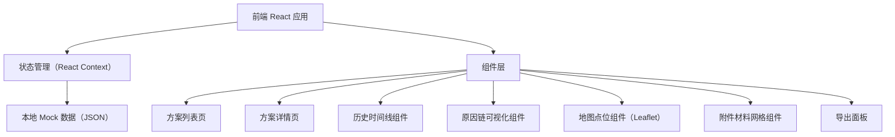
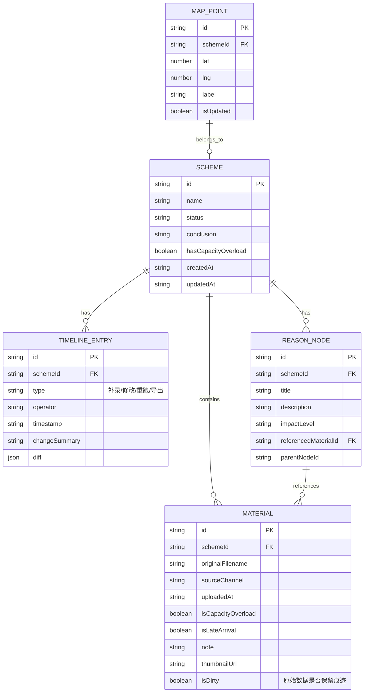

## 1. 架构设计



## 2. 技术描述

- **前端**：React@18 + TypeScript + tailwindcss@3 + Vite
- **初始化工具**：Vite create-vite
- **后端**：无后端，使用本地 Mock 数据 + localStorage 持久化
- **数据库**：浏览器 localStorage 存储方案数据与变更历史
- **关键库**：
  - `leaflet` + `react-leaflet`：地图点位展示
  - `lucide-react`：线性图标库
  - `jszip` + `file-saver`：导出带标记的报告包
  - `dayjs`：时间格式化与时间线

## 3. 路由定义

| 路由 | 用途 |
|------|------|
| `/` | 方案列表页，含筛选与卡片展示 |
| `/scheme/:id` | 方案详情页，含地图、材料、原因链、时间线 |

## 4. 数据模型

### 4.1 数据模型定义



### 4.2 数据结构（TypeScript）

```typescript
interface Scheme {
  id: string;
  name: string;
  status: 'draft' | 'reviewing' | 'finalized';
  conclusion: string;
  hasCapacityOverload: boolean;
  createdAt: string;
  updatedAt: string;
  mapPoint: { lat: number; lng: number; label: string; isUpdated: boolean };
}

interface Material {
  id: string;
  schemeId: string;
  originalFilename: string;
  sourceChannel: 'wechat' | 'onsite' | 'email' | 'other';
  uploadedAt: string;
  isCapacityOverload: boolean;
  isLateArrival: boolean;
  note: string;
  thumbnailUrl: string;
  isDirty: boolean;
}

interface TimelineEntry {
  id: string;
  schemeId: string;
  type: 'material_add' | 'conclusion_change' | 'note_edit' | 'rerun' | 'export';
  operator: string;
  timestamp: string;
  changeSummary: string;
  diff?: { before?: any; after?: any };
}

interface ReasonNode {
  id: string;
  schemeId: string;
  title: string;
  description: string;
  impactLevel: 'high' | 'medium' | 'low';
  referencedMaterialId?: string;
  parentNodeId?: string;
}
```

## 5. 组件结构

```
src/
├── pages/
│   ├── SchemeList.tsx      # 方案列表页
│   └── SchemeDetail.tsx    # 方案详情页
├── components/
│   ├── SchemeCard.tsx          # 方案卡片
│   ├── FilterBar.tsx           # 筛选栏
│   ├── MapView.tsx             # 地图点位
│   ├── MaterialGrid.tsx        # 附件材料网格
│   ├── ReasonChain.tsx         # 原因链可视化
│   ├── Timeline.tsx            # 历史时间线
│   ├── ActionBar.tsx           # 操作栏（放样例/重跑/导出/补录）
│   └── AddMaterialModal.tsx    # 补录材料弹窗
├── data/
│   └── mockData.ts         # Mock 数据
├── store/
│   └── SchemeContext.tsx   # 全局状态与 localStorage 持久化
├── types/
│   └── index.ts            # TypeScript 类型定义
├── utils/
│   ├── export.ts           # 导出工具
│   └── time.ts             # 时间工具
└── App.tsx
```
