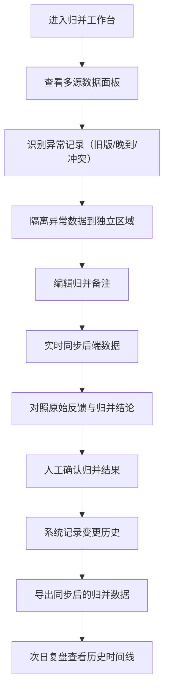

## 1. 产品概述

老街消防点位归并管理系统，服务于规划师、运营主管及社区工作人员协同完成消防点位归并工作。解决会议纪要零散、多源数据混淆、新旧意见覆盖、变更追溯困难等痛点，确保归并过程透明可查、结论可溯、交付顺畅。

- 核心价值：将分散在聊天、附件、口头沟通中的归并意见结构化管理，区分来源、防止覆盖、留痕变更
- 目标用户：运营主管（核心操作）、规划师（提供资料）、社区同事（点位核对）

## 2. 核心功能

### 2.1 用户角色

| 角色 | 注册方式 | 核心权限 |
|------|----------|----------|
| 运营主管 | 系统内置 | 编辑备注、归并点位、确认结果、导出数据、查看历史 |
| 规划师 | 系统内置 | 上传会议纪要/附件、提交口头备注、查看归并进度 |
| 社区同事 | 系统内置 | 核对点位信息、反馈原始意见 |

### 2.2 功能模块

1. **归并工作台**：点位列表、多源数据面板、归并操作区
2. **数据来源追踪**：会议纪要、附件、口头备注分类展示与影响标记
3. **异常记录隔离**：旧版纪要、晚到附件、新/旧意见冲突独立区域
4. **归并历史**：变更时间线、前后对比、操作人留痕
5. **数据导出**：同步前端备注、按格式导出归并结果

### 2.3 页面详情

| 页面名称 | 模块名称 | 功能描述 |
|----------|----------|----------|
| 归并工作台 | 点位列表 | 展示待归并/已归并点位，支持筛选、搜索、批量操作 |
| 归并工作台 | 多源数据面板 | 按来源分类展示会议纪要、附件、口头备注，标记是否影响归并结论 |
| 归并工作台 | 归并编辑区 | 运营主管编辑备注，实时同步后端数据 |
| 归并工作台 | 原始反馈对照 | 合并后的反馈与原始说法并排对照 |
| 异常记录区 | 旧版纪要隔离 | 单独展示过期/旧版会议纪要，防止误混入正常结果 |
| 异常记录区 | 晚到附件提醒 | 标记延迟上传的附件，高亮显示需关注 |
| 异常记录区 | 新旧意见冲突 | 旧方案与新意见并排对比，单独拎出不混入正常结果 |
| 归并历史 | 变更时间线 | 按时间倒序展示每次人工确认前后的变化 |
| 归并历史 | 前后对比视图 | 可视化展示修改前后差异 |
| 归并历史 | 操作人留痕 | 记录每次操作的人员、时间、操作类型 |
| 数据导出 | 格式选择 | 支持 Excel/CSV 导出，包含备注、来源、历史变更 |
| 数据导出 | 数据同步校验 | 导出前校验前端备注与后端数据一致性 |

## 3. 核心流程

运营主管进入归并工作台，查看按来源分类的数据（会议纪要、附件、口头备注），识别异常记录（旧版纪要、晚到附件、新旧冲突），在编辑区修改备注并实时同步，对比原始反馈与归并结论，确认后系统自动记录变更历史，最终导出与后端完全同步的归并结果。次日复盘时，运营主管可直接查看历史时间线解释每一步变化。

## 4. 用户界面设计

### 4.1 设计风格

- 主色调：深海军蓝 `#1e3a5f`（专业、稳重），辅助色：消防橙 `#e85d3c`（警示、强调），中性色：浅灰 `#f4f6f9` 背景 + 深灰 `#2d3748` 文字
- 按钮风格：圆角矩形（8px），主按钮实心蓝底白字，危险按钮橙底白字，次要按钮描边蓝边蓝字
- 字体：标题使用 Noto Serif SC（衬线、正式感），正文使用 Noto Sans SC（无衬线、易读），数字/标签使用 JetBrains Mono（等宽、清晰）
- 布局风格：三栏卡片式布局（左：点位列表，中：归并编辑+原始对照，右：多源数据+异常隔离），顶部导航面包屑
- 图标风格：线性图标（stroke 1.5px），异常/警示使用填充图标增强视觉冲击

### 4.2 页面设计概述

| 页面名称 | 模块名称 | UI 元素 |
|----------|----------|---------|
| 归并工作台 | 点位列表 | 卡片式列表、状态标签（待归并/已归并/有异常）、搜索框、筛选下拉、悬停阴影 |
| 归并工作台 | 多源数据面板 | 三标签页切换（纪要/附件/口头）、来源徽章、"影响结论"勾选框、时间戳 |
| 归并工作台 | 归并编辑区 | 大文本域（支持 Markdown）、自动保存提示、实时同步状态指示灯 |
| 归并工作台 | 原始反馈对照 | 左右双栏对比视图、差异高亮（新增绿/删除红/修改橙）、展开/收起 |
| 异常记录区 | 旧版纪要隔离 | 橙红色边框卡片、斜线底纹背景、"已过期"徽章、手动排除按钮 |
| 异常记录区 | 晚到附件提醒 | 橙色闪烁指示点、"延迟上传"标签、上传时间与截止时间对比 |
| 异常记录区 | 新旧意见冲突 | 分屏对比、左侧旧方案灰底、右侧新意见蓝底、"使用新意见"快捷操作 |
| 归并历史 | 变更时间线 | 垂直时间轴、节点图标（编辑/确认/导出）、操作人头像缩略图、展开详情 |
| 归并历史 | 前后对比视图 | diff 样式展示、行级高亮、上一条/下一条切换 |
| 数据导出 | 格式选择 | 卡片式选项（Excel/CSV）、包含字段复选框、数据量预览 |
| 数据导出 | 数据同步校验 | 进度条动画、校验结果（一致/不一致）、自动修复按钮 |

### 4.3 响应式

桌面优先设计（1440px 起步），主操作区居中 1200px 容器；平板端左右面板折叠为抽屉，移动端列表与编辑区垂直堆叠，异常记录折叠为可展开面板。

### 4.4 动效设计

- 页面加载：各模块从上至下渐入（staggered 100ms 延迟）
- 备注同步：编辑 1 秒无操作后触发保存，状态灯从黄闪变绿勾
- 异常标记：异常卡片入场时轻微晃动（shake 动画）吸引注意
- 时间线：滚动触发节点渐入展开
- 导出：进度条平滑填充，完成后出现对勾粒子动画
