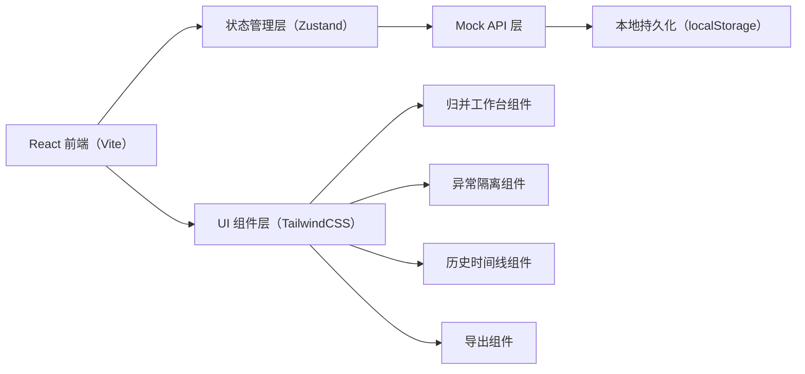
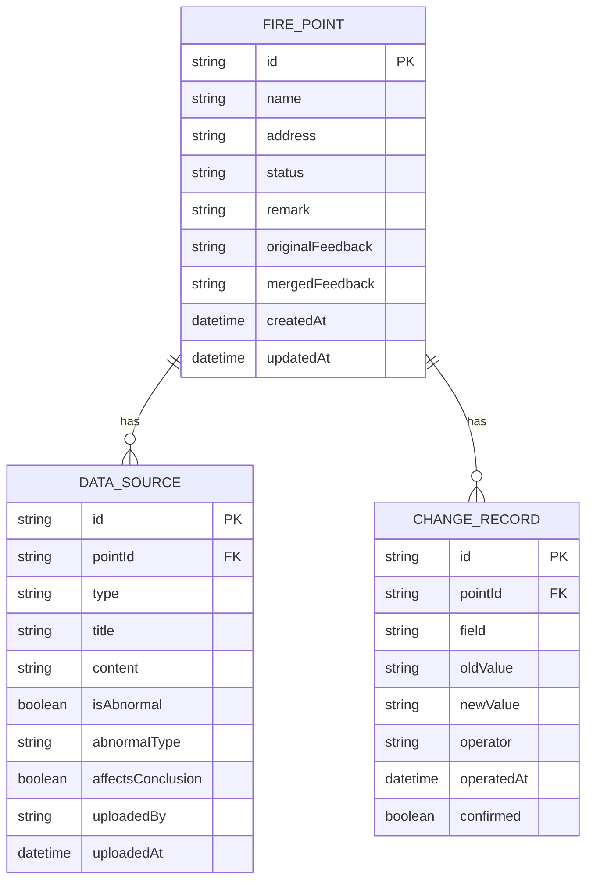

## 1. 架构设计



## 2. 技术说明

- 前端：React@18 + TypeScript + Vite@5
- 状态管理：Zustand（轻量、支持持久化中间件）
- 样式：TailwindCSS@3 + CSS 变量主题系统
- 图标：Lucide React
- 导出：SheetJS (xlsx) + 文件下载 API
- 后端：无，使用 Mock 数据 + localStorage 持久化模拟后端行为
- 数据库：无，localStorage 存储归并状态与历史

## 3. 路由定义

| 路由 | 用途 |
|------|------|
| / | 归并工作台（首页，含点位列表、多源数据、编辑区、异常隔离） |
| /history | 归并历史（变更时间线 + 前后对比视图） |
| /export | 数据导出（格式选择 + 同步校验 + 下载） |

## 4. API 定义（Mock）

```typescript
// 消防点位
interface FirePoint {
  id: string;
  name: string;
  address: string;
  status: 'pending' | 'merged' | 'abnormal';
  remark: string;
  originalFeedback: string;
  mergedFeedback: string;
  createdAt: string;
  updatedAt: string;
}

// 数据来源
interface DataSource {
  id: string;
  pointId: string;
  type: 'meeting_minutes' | 'attachment' | 'verbal_note';
  title: string;
  content: string;
  isAbnormal: boolean;
  abnormalType?: 'old_version' | 'late_arrival' | 'conflict';
  affectsConclusion: boolean;
  uploadedBy: string;
  uploadedAt: string;
}

// 变更记录
interface ChangeRecord {
  id: string;
  pointId: string;
  field: 'remark' | 'status' | 'mergedFeedback';
  oldValue: string;
  newValue: string;
  operator: string;
  operatedAt: string;
  confirmed: boolean;
}

// API 接口
interface Api {
  getPoints: () => Promise<FirePoint[]>;
  getPoint: (id: string) => Promise<FirePoint>;
  updatePoint: (id: string, data: Partial<FirePoint>) => Promise<FirePoint>;
  getDataSources: (pointId: string) => Promise<DataSource[]>;
  getChangeHistory: (pointId: string) => Promise<ChangeRecord[]>;
  confirmChange: (recordId: string) => Promise<ChangeRecord>;
  exportData: (format: 'xlsx' | 'csv', pointIds?: string[]) => Promise<Blob>;
}
```

## 5. 数据模型（Mock）

### 5.1 数据模型定义



### 5.2 Mock 数据初始化

```typescript
const mockPoints: FirePoint[] = [
  {
    id: 'FP001',
    name: '老街东入口消防栓',
    address: '老街东路12号',
    status: 'abnormal',
    remark: '与社区核对后确认归并至 FP002',
    originalFeedback: '社区反馈东入口有两处消防栓，建议合并',
    mergedFeedback: '东入口两处消防栓归并为一处（FP002），保留水压较大点位',
    createdAt: '2026-06-10T09:00:00Z',
    updatedAt: '2026-06-15T14:30:00Z',
  },
  {
    id: 'FP002',
    name: '老街中心广场消防栓',
    address: '老街中心广场西侧',
    status: 'pending',
    remark: '',
    originalFeedback: '广场西侧现有一处消防栓，水压充足',
    mergedFeedback: '',
    createdAt: '2026-06-10T09:05:00Z',
    updatedAt: '2026-06-10T09:05:00Z',
  },
];

const mockDataSources: DataSource[] = [
  {
    id: 'DS001',
    pointId: 'FP001',
    type: 'meeting_minutes',
    title: '老街消防点位归并会议纪要（6月12日）',
    content: '会议讨论东入口两处消防栓距离过近，建议归并...',
    isAbnormal: false,
    affectsConclusion: true,
    uploadedBy: '规划师小赵',
    uploadedAt: '2026-06-12T16:00:00Z',
  },
  {
    id: 'DS002',
    pointId: 'FP001',
    type: 'meeting_minutes',
    title: '老街消防点位归并会议纪要（6月8日·旧版）',
    content: '旧方案：东入口两处消防栓均保留...',
    isAbnormal: true,
    abnormalType: 'old_version',
    affectsConclusion: false,
    uploadedBy: '规划师小赵',
    uploadedAt: '2026-06-08T17:00:00Z',
  },
  {
    id: 'DS003',
    pointId: 'FP001',
    type: 'attachment',
    title: '老街消防点位现场照片（晚到）',
    content: '现场实拍东入口消防栓实景，6月14日补充上传',
    isAbnormal: true,
    abnormalType: 'late_arrival',
    affectsConclusion: true,
    uploadedBy: '规划师小赵',
    uploadedAt: '2026-06-14T20:15:00Z',
  },
  {
    id: 'DS004',
    pointId: 'FP001',
    type: 'verbal_note',
    title: '社区李主任口头反馈',
    content: '建议保留靠近居民区的那处消防栓（FP002位置）',
    isAbnormal: false,
    affectsConclusion: true,
    uploadedBy: '运营主管',
    uploadedAt: '2026-06-13T10:00:00Z',
  },
];

const mockChangeHistory: ChangeRecord[] = [
  {
    id: 'CR001',
    pointId: 'FP001',
    field: 'remark',
    oldValue: '',
    newValue: '与社区核对后确认归并至 FP002',
    operator: '运营主管',
    operatedAt: '2026-06-15T14:30:00Z',
    confirmed: true,
  },
  {
    id: 'CR002',
    pointId: 'FP001',
    field: 'mergedFeedback',
    oldValue: '',
    newValue: '东入口两处消防栓归并为一处（FP002），保留水压较大点位',
    operator: '运营主管',
    operatedAt: '2026-06-15T14:35:00Z',
    confirmed: true,
  },
];
```
