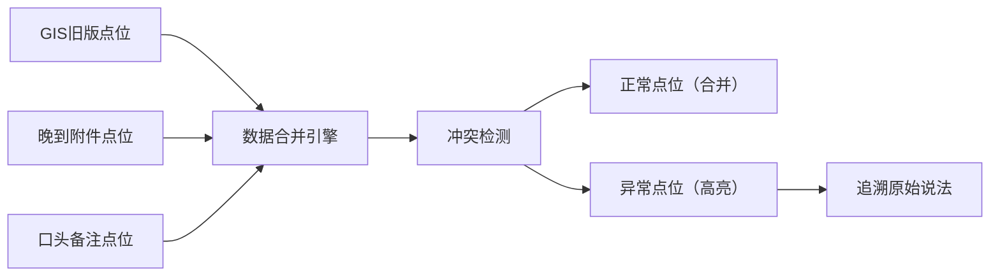

## 1. 产品概述

老街消防容量复核工具，用于街道社区消防点位数据的复核工作。解决多源数据（旧版GIS点位、晚到附件、口头备注）合并时的冲突问题，确保空间位置准确、异常高亮清晰、数据来源可追溯，让街道负责人能高效与社区同事核点位。

### 核心价值
- 空间位置与GIS点位来源一一对应，不混淆
- 多源数据合并后仍能追溯原始说法，不含糊
- 异常点位高亮警示，相邻路口合错一目了然
- CSV导出与页面状态一致，方便线下核对

## 2. 核心功能

### 2.1 用户角色
| 角色 | 使用方式 | 核心诉求 |
|------|----------|----------|
| 街道负责人（周姐） | 主操作人 | 快速复核、导出明细、追溯来源 |
| 社区同事 | 数据提供者 | 提供点位反馈、核对空间位置 |

### 2.2 功能模块
1. **点位总览页**：GIS点位地图、异常统计、来源分布
2. **点位详情面板**：单点位多源数据对比、原始说法追溯
3. **数据来源管理**：GIS旧版、晚到附件、口头备注三类来源
4. **CSV导出**：明细导出，状态与页面一致

### 2.3 页面详情
| 页面名称 | 模块名称 | 功能描述 |
|----------|----------|----------|
| 点位总览 | 顶部导航 | 项目标题、导出按钮、来源筛选 |
| 点位总览 | 统计卡片 | 总点位数、异常数、已复核数、来源分布 |
| 点位总览 | GIS地图区域 | 点位标记、异常高亮、hover详情、缩放平移 |
| 点位总览 | 点位列表 | 表格展示、状态标签、来源标识、点击查看详情 |
| 点位详情 | 点位基本信息 | 点位名称、位置、编号 |
| 点位详情 | 多源数据对比 | 各来源数据并排展示，差异高亮 |
| 点位详情 | 原始说法追溯 | 每条数据标注来源、原始描述、录入时间 |
| 点位详情 | 复核操作 | 标记状态、添加备注、确认无误 |

## 3. 核心流程

### 3.1 复核主流程
街道周姐打开工具 → 查看总览统计和异常点位 → 点击异常点位查看详情 → 对比多源数据追溯原始说法 → 标记复核状态 → 导出CSV明细 → 与社区同事核点位

### 3.2 数据合并流程

## 4. 用户界面设计

### 4.1 设计风格
- **主色调**：消防红（#E53935）作为警示色，配合深灰蓝（#2C3E50）作为主色
- **辅助色**：琥珀黄（#FFA726）标记待复核，森林绿（#43A047）标记已确认
- **视觉风格**：政务/工具类风格，清晰严谨，信息密度适中
- **字体**：标题用思源黑体 Bold，正文用思源黑体 Regular
- **按钮风格**：直角、细边框、悬停有底色变化
- **布局**：顶部导航 + 左侧地图 + 右侧列表面板的经典GIS工具布局

### 4.2 页面设计概述
| 页面名称 | 模块名称 | UI元素 |
|----------|----------|--------|
| 点位总览 | 统计卡片 | 4张卡片横向排列，数字+标签+趋势箭头，卡片有轻微阴影 |
| 点位总览 | GIS地图 | 浅灰色底图，红色异常点、黄色待复核点、绿色已确认点 |
| 点位总览 | 点位列表 | 斑马纹表格，状态标签带颜色圆点，来源用不同色块标识 |
| 点位详情 | 多源对比 | 三列并排卡片，差异行用红色背景高亮 |
| 点位详情 | 来源追溯 | 时间线样式，每条记录带来源图标和原始描述 |

### 4.3 响应式
- 桌面端优先（1280px及以上），采用左右分栏布局
- 平板端（768-1279px）上下布局，地图在上列表在下
- 移动端（768px以下）简化视图，列表优先

### 4.4 交互细节
- 地图点位hover显示浮层，包含点位名称和状态
- 异常点位有呼吸动画，吸引注意力
- 列表行点击展开详情，平滑过渡
- 来源标签点击可筛选同类来源
- 导出按钮有loading状态和完成提示
