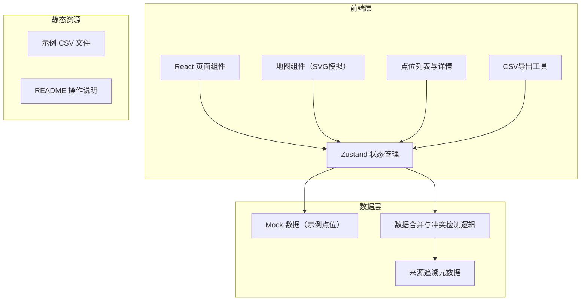
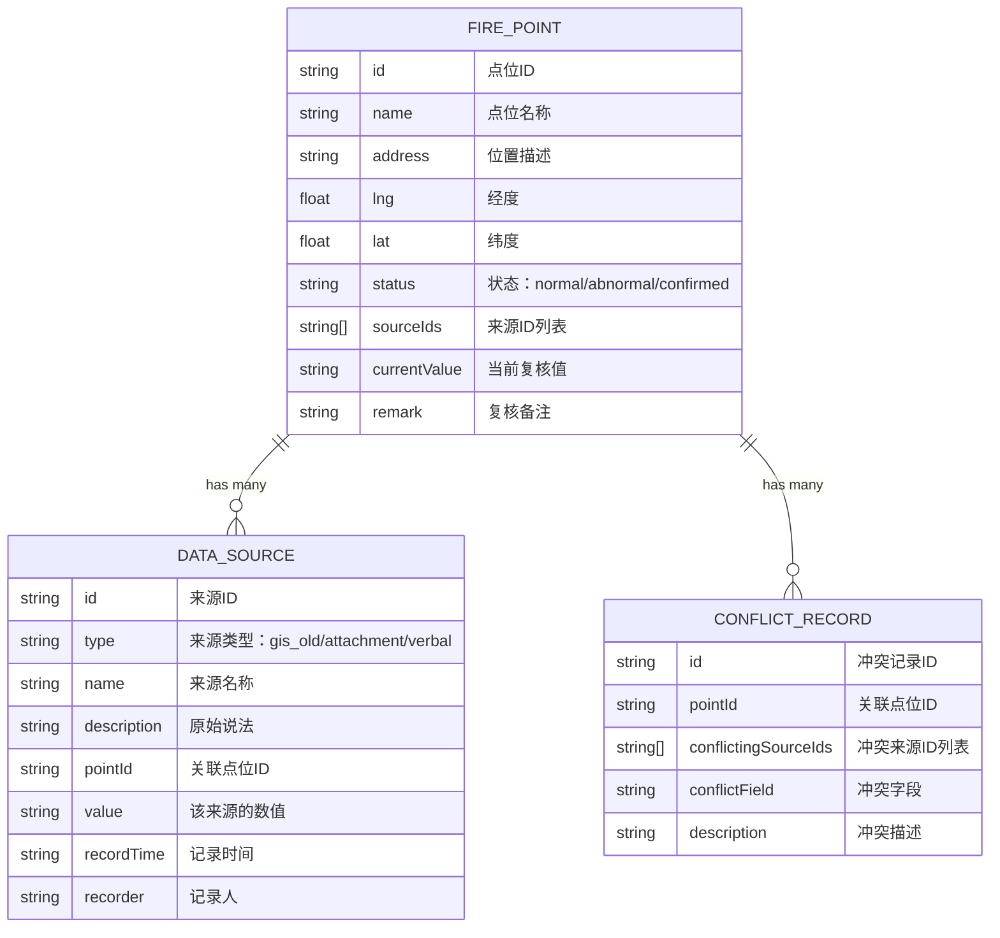

## 1. 架构设计



## 2. 技术描述

- **前端框架**：React 18 + TypeScript
- **构建工具**：Vite
- **样式方案**：Tailwind CSS 3
- **状态管理**：Zustand
- **地图展示**：SVG 自定义绘制（模拟GIS地图，无需依赖地图API）
- **图标库**：Lucide React
- **CSV处理**：原生 JS 实现 CSV 导出/导入
- **后端**：无后端，纯前端 + Mock 数据

## 3. 路由定义

| 路由 | 用途 |
|------|------|
| / | 点位总览页（主页面，包含地图和列表） |

## 4. 数据模型

### 4.1 数据模型定义



### 4.2 数据类型定义（TypeScript）

```typescript
// 点位状态
type PointStatus = 'normal' | 'abnormal' | 'confirmed' | 'pending';

// 数据来源类型
type SourceType = 'gis_old' | 'attachment' | 'verbal';

// 数据来源
interface DataSource {
  id: string;
  type: SourceType;
  name: string;
  description: string;
  pointId: string;
  value: string;
  recordTime: string;
  recorder: string;
}

// 冲突记录
interface ConflictRecord {
  id: string;
  pointId: string;
  conflictingSourceIds: string[];
  conflictField: string;
  description: string;
}

// 消防点位
interface FirePoint {
  id: string;
  name: string;
  address: string;
  lng: number;
  lat: number;
  status: PointStatus;
  sourceIds: string[];
  currentValue: string;
  remark: string;
}

// 统计数据
interface Statistics {
  total: number;
  abnormal: number;
  confirmed: number;
  pending: number;
  bySource: Record<SourceType, number>;
}
```

## 5. 目录结构

```
src/
├── components/
│   ├── Header/           # 顶部导航
│   ├── StatCards/        # 统计卡片
│   ├── MapView/          # 地图视图（SVG）
│   ├── PointList/        # 点位列表
│   ├── PointDetail/      # 点位详情面板
│   ├── SourceTimeline/   # 来源追溯时间线
│   └── ExportButton/     # 导出按钮
├── pages/
│   └── Overview/         # 总览页
├── store/
│   └── usePointStore.ts  # Zustand 状态管理
├── data/
│   └── mockPoints.ts     # Mock 数据
├── utils/
│   ├── csvExport.ts      # CSV 导出工具
│   ├── mergeData.ts      # 数据合并与冲突检测
│   └── geoTransform.ts   # 坐标转换工具
├── types/
│   └── index.ts          # 类型定义
├── App.tsx
├── main.tsx
└── index.css

data/
├── sample_gis_old.csv    # 示例：GIS旧版点位
├── sample_attachment.csv # 示例：晚到附件
└── sample_verbal.csv     # 示例：口头备注

README.md                 # 操作说明
```

## 6. 核心功能实现思路

### 6.1 地图展示
- 使用 SVG 绘制简化版街道地图，不需要真实地图服务
- 点位按经纬度映射到 SVG 坐标
- 不同状态用不同颜色标记，异常点位有呼吸动画

### 6.2 数据合并与冲突检测
- 按点位名称/位置匹配多源数据
- 对比各来源的关键字段（容量、位置等）
- 字段不一致时标记为异常点位
- 保留每个来源的原始数据用于追溯

### 6.3 CSV 导出
- 导出包含所有点位及状态的明细 CSV
- 确保页面状态与导出文件一致
- 包含来源信息和原始说法，方便线下核对

### 6.4 来源追溯
- 每个点位展示所有关联来源
- 时间线形式展示各来源的记录时间
- 点击来源可查看原始描述和记录人
