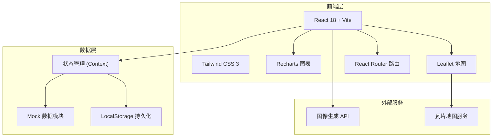
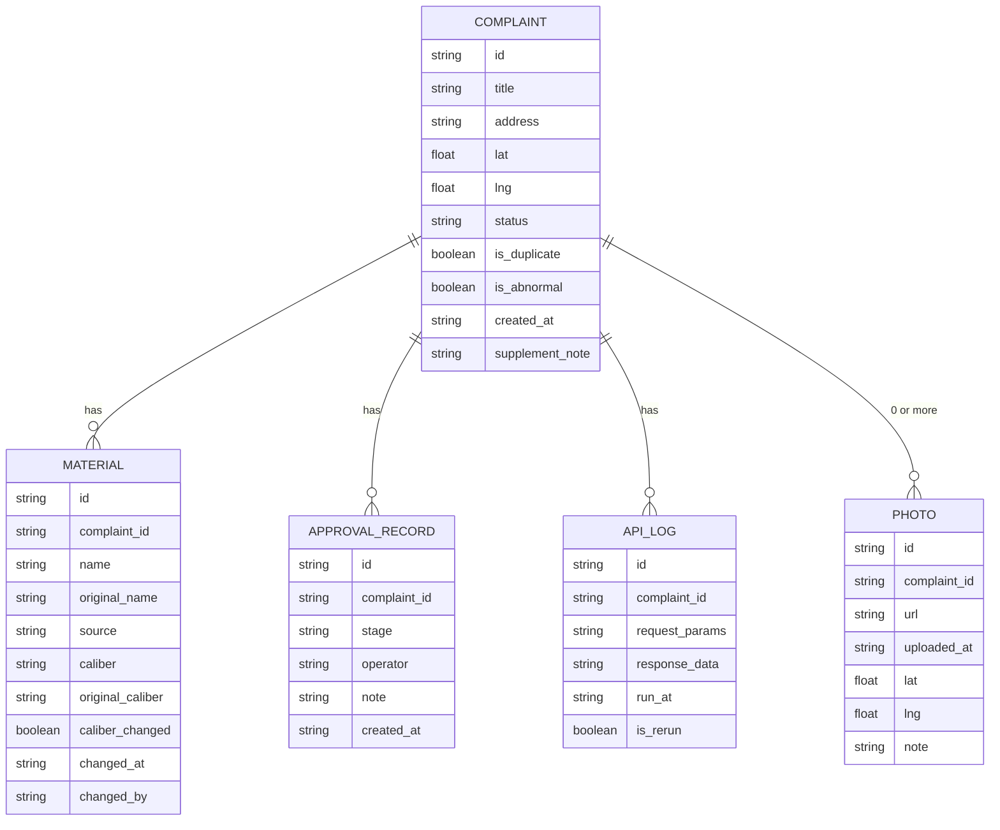

## 1. 架构设计



## 2. 技术说明

- 前端：React@18 + TypeScript + Tailwind CSS@3 + Vite@6
- 初始化工具：npm create vite@latest
- 图表：Recharts
- 地图：Leaflet + OpenStreetMap 瓦片
- 状态管理：React Context
- 后端：无后端，使用 Mock 数据模拟 API
- 数据存储：LocalStorage 持久化补录数据
- 图标：Lucide React

## 3. 路由定义

| 路由 | 用途 |
|------|------|
| / | 回放主页 - 趋势图 + 地图 + 小样例列表 |
| /trace/:id | 溯源详情页 - 审批台账 + 口径追踪 + 接口返回 |
| /supplement/:id | 补录操作页 - 照片上传 + 地图点位更新 + 变更说明 |

## 4. 数据模型

### 4.1 数据模型定义



### 4.2 TypeScript 类型定义

```typescript
interface Complaint {
  id: string;
  title: string;
  address: string;
  lat: number;
  lng: number;
  status: 'pending' | 'rejected' | 'reviewing' | 'supplemented';
  isDuplicate: boolean;
  isAbnormal: boolean;
  createdAt: string;
  supplementNote?: string;
  originalLat?: number;
  originalLng?: number;
}

interface Material {
  id: string;
  complaintId: string;
  name: string;
  originalName: string;
  source: string;
  caliber: string;
  originalCaliber: string;
  caliberChanged: boolean;
  changedAt: string;
  changedBy: string;
}

interface ApprovalRecord {
  id: string;
  complaintId: string;
  stage: string;
  operator: string;
  note: string;
  createdAt: string;
}

interface ApiLog {
  id: string;
  complaintId: string;
  requestParams: Record<string, any>;
  responseData: Record<string, any>;
  runAt: string;
  isRerun: boolean;
}

interface Photo {
  id: string;
  complaintId: string;
  url: string;
  uploadedAt: string;
  lat: number;
  lng: number;
  note: string;
}
```

## 5. 核心模块划分

| 模块 | 文件路径 | 职责 |
|------|----------|------|
| 布局组件 | src/components/Layout.tsx | 左侧导航 + 右侧内容区框架 |
| 趋势图表 | src/components/TrendChart.tsx | Recharts 折线图 + 异常点高亮 |
| 地图组件 | src/components/ComplaintMap.tsx | Leaflet 地图 + 点位渲染 + 变更动画 |
| 样例列表 | src/components/SampleList.tsx | 小样例卡片 + 重复投诉标记 |
| 审批台账 | src/components/ApprovalTimeline.tsx | 时间线展示审批记录 |
| 口径追踪 | src/components/CaliberTracker.tsx | 材料口径变更对比 |
| 接口返回 | src/components/ApiResponsePanel.tsx | JSON 展示 + 重跑功能 |
| 补录页面 | src/pages/Supplement.tsx | 照片上传 + 地图更新 + 变更说明 |
| Mock 数据 | src/mock/data.ts | 所有示例数据生成 |
| 状态管理 | src/context/AppContext.tsx | 全局状态 + 操作函数 |
| 操作指引 | src/components/GuideModal.tsx | 放样例/重跑/查看接口返回 三件事 |

## 6. 启动说明

1. 安装依赖：`npm install`
2. 启动开发：`npm run dev`
3. 查看接口返回：在溯源详情页点击"查看接口返回"
4. 重跑：在接口返回面板点击"重跑"按钮，对比新旧返回
5. 样例操作：在主页点击任意异常点，自动关联样例数据
