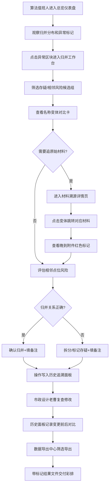

## 1. 产品概述
公园噪声点位归并系统，用于解决市政噪声监测数据中同一地点多名称录入导致的归并混乱问题。面向市政设计人员和算法值班人员，提供从图表总览→点位归并→材料溯源→历史追溯的完整工作流。
- 核心问题：居民反馈材料中同一噪声监测点位被录入为多种名称，相邻路口容易误合并
- 目标用户：市政设计老曹（点位判断决策人）、算法值班人（日常审核追明细）
- 产品价值：归并结果留证据、操作留历史、异常全链路可追溯，降低沟通成本

## 2. 核心功能

### 2.1 用户角色
| 角色 | 使用场景 | 核心权限 |
|------|----------|----------|
| 市政设计（老曹） | 对存疑点位做最终判断，修改归并结果 | 编辑归并关系、添加人工判断、导出带标记数据 |
| 算法值班人 | 先看归并总览图表，异常点一路点回原始材料 | 查看图表、筛选异常、钻取详情、查看历史 |
| 外部访客 | 彩排演示，验证材料入口和异常出口是否顺畅 | 只读浏览所有功能 |

### 2.2 功能模块
1. **总览仪表盘**：归并状态分布图、异常标记热力图、归并完成度统计
2. **点位归并工作台**：候选归并组列表、名称变体对比、相邻点位风险标记、人工判断操作
3. **材料溯源详情**：点位名称变体证据链、原始居民反馈附件、晚到数据标记、操作入口
4. **历史追溯面板**：老曹修改记录时间线、归并关系变更前后对比、操作人留痕
5. **数据导出中心**：全量导出、仅异常导出、带归并证据标记的自定义导出

### 2.3 页面详情
| 页面名称 | 模块名称 | 功能描述 |
|----------|----------|----------|
| 总览仪表盘 | 归并状态分布图 | 饼图展示已归并/待确认/存疑/相邻风险四类点位占比，可点击筛选 |
| 总览仪表盘 | 异常热力标记 | 地图区域标记晚到附件、相邻路口高风险区，悬停显示计数 |
| 总览仪表盘 | 归并完成度进度条 | 展示总进度，区分自动归并/人工判断占比 |
| 点位归并工作台 | 候选归并组列表 | 按归并置信度排序，每行显示主名称+变体数量+证据数+风险标签 |
| 点位归并工作台 | 名称变体对比卡 | 并列展示同组内所有名称写法，标记来源材料，支持拖拽合并/拆分 |
| 点位归并工作台 | 相邻点位风险提示 | 高亮显示距离<阈值的点位组，附坐标和距离数值，防误合并 |
| 点位归并工作台 | 人工判断操作栏 | 确认归并/拆分/标记存疑/退回算法，每条操作必填备注 |
| 材料溯源详情 | 证据链时间线 | 按材料提交顺序展示名称证据，晚到附件红色标记插入位置 |
| 材料溯源详情 | 原始材料卡片 | 居民反馈全文、附件缩略图、提交人信息、提交时间 |
| 材料溯源详情 | 一路点回入口 | 每个名称变体旁直接跳转对应原始材料行 |
| 历史追溯面板 | 修改时间线 | 按时间倒序展示所有人工判断操作，高亮老曹的修改记录 |
| 历史追溯面板 | 变更前后对比 | 左右对比归并关系修改前后的分组状态，颜色区分新增/移除 |
| 历史追溯面板 | 操作人留痕 | 显示操作人、时间、备注理由，不可删除 |
| 数据导出中心 | 筛选器组合 | 归并状态+风险等级+时间范围+操作人多条件筛选 |
| 数据导出中心 | 导出预览 | 预览前50行数据，标记列用颜色色块展示 |
| 数据导出中心 | 证据标记导出 | 选择是否附带名称变体证据链、历史操作记录 |

## 3. 核心流程
算法值班人登录系统后，先在总览仪表盘观察归并状态分布，点击异常区块进入归并工作台筛选存疑组。选中某组后查看名称变体与相邻点位风险，如需追明细则点击变体进入材料溯源详情，一路点回原始居民反馈材料（含晚到附件）。确认归并关系正确或发现相邻合错后，执行人工判断操作。所有修改进入历史追溯面板，下一班人员可查看变更前后对比。最终在数据导出中心按筛选条件导出带完整标记的结果文件。

## 4. 用户界面设计

### 4.1 设计风格
- 主色调：市政蓝 `#1E40AF` 为主，警示橙 `#EA580C` 标记异常，证据绿 `#059669` 标记已确认
- 辅助色：相邻风险紫 `#7C3AED`，晚到附件红 `#DC2626`
- 按钮风格：方角微圆（圆角4px），确认按钮实色填充，操作按钮描边+悬停填充
- 字体：标题用"思源宋体"体现专业市政感，正文用"思源黑体"保证可读性，数字等宽用 JetBrains Mono
- 布局风格：左侧固定导航+顶部筛选栏+主内容卡片式布局，证据链用竖线时间线
- 图标风格：线性图标（Lucide），异常标记用实色填充图标区别于普通功能
- 视觉细节：卡片加1px顶部色条标识状态，时间线节点用不同形状区分操作类型

### 4.2 页面设计概述
| 页面名称 | 模块名称 | UI 元素 |
|----------|----------|----------|
| 总览仪表盘 | 归并状态分布图 | 环形饼图，四色分区，中心显示总数，扇区点击触发筛选联动 |
| 总览仪表盘 | 异常热力标记 | 网格布局模拟区域地图，色块深浅表异常密度，悬停弹窗显示明细计数 |
| 总览仪表盘 | 归并完成度 | 分层进度条（自动归并绿/人工橙/待处理灰），右侧显示百分比数字 |
| 点位归并工作台 | 候选组列表 | 表格行左侧色条标识状态，名称变体用标签云展示，风险标记用徽章固定右侧 |
| 点位归并工作台 | 变体对比卡 | 三栏并列卡片，每张卡顶部来源标签，底部证据数，相邻线连接相似名称 |
| 点位归并工作台 | 风险提示条 | 紫色渐变背景条，左侧三角形警示图标，右侧展示坐标/距离数值 |
| 点位归并工作台 | 操作栏 | 固定底部浮层，四按钮横向排列，备注输入框展开式 |
| 材料溯源详情 | 证据链时间线 | 左侧竖线+节点，节点圆形=材料，方形=系统判定，菱形=人工判断，晚到节点红描边 |
| 材料溯源详情 | 原始材料卡 | 白色卡片+浅灰边框，附件缩略图圆角，重要字段加粗高亮 |
| 历史追溯面板 | 修改时间线 | 左右交替布局，老曹记录加蓝色头像边框，操作摘要用一句话描述 |
| 历史追溯面板 | 变更对比 | 左右双栏灰底，分组名称删除线=移除，下划线=新增，颜色与状态一致 |
| 数据导出中心 | 筛选器 | 横向排列下拉框+标签多选，已选条件显示为可移除标签 |
| 数据导出中心 | 导出预览表 | 斑马纹表格，标记列渲染彩色小圆点+文字 |

### 4.3 响应式
- 桌面端优先设计（最小支持1440px宽度），导航固定左侧240px
- 平板端（1024px）导航折叠为图标侧栏，主内容自适应
- 移动端仅提供只读浏览模式，卡片纵向堆叠，操作按钮改为底部浮动菜单

### 4.4 动效与交互细节
- 页面加载：卡片渐入+轻微上浮（stagger 50ms），导航背景从透明过渡到实色
- 筛选变化：表格行淡出→数据更新→淡入，平滑过渡300ms
- 变体拖拽合并：吸附效果+高亮目标区域边框闪烁，松手后播放合并动画
- 时间线滚动：节点进入视口时描边动画从0到100%
- 相邻风险提示：首次加载时脉冲闪烁3次吸引注意
- 导出进度：顶部进度条平滑填充，完成后显示绿色对勾+文件名掉落动画
