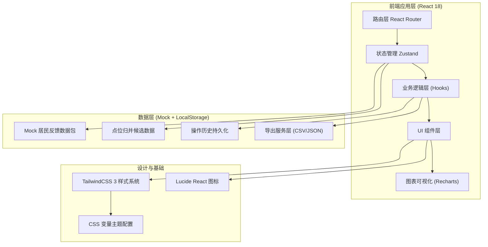
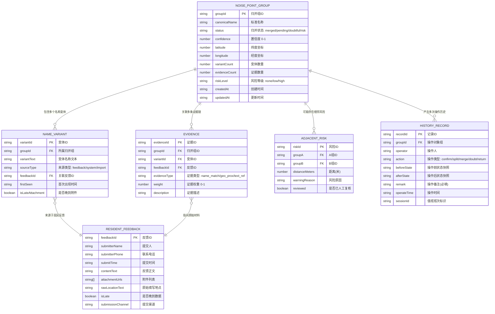

## 1. 架构设计



## 2. 技术描述
- **前端框架**: React@18 + TypeScript，函数组件 + Hooks 模式
- **构建工具**: Vite@5，快速冷启动和 HMR
- **样式方案**: TailwindCSS@3 + PostCSS，自定义市政主题调色板
- **状态管理**: Zustand@4，轻量 store 管理归并数据、筛选状态、历史记录
- **路由方案**: React Router@6，单页应用多视图切换
- **图表组件**: Recharts@2，饼图/进度条/热力图可视化
- **图标库**: Lucide React，一致的线性图标集
- **数据方案**: 内置 Mock 数据包（含正常记录+晚到附件+相邻合错场景），操作历史写入 LocalStorage 持久化
- **导出服务**: 纯前端 CSV/JSON 导出，带标记列格式化

## 3. 路由定义
| 路由路径 | 页面组件 | 用途说明 |
|----------|----------|----------|
| `/` | DashboardPage | 总览仪表盘，归并状态分布+异常标记+完成度 |
| `/merge` | MergeWorkbenchPage | 点位归并工作台，候选组列表+变体对比+人工判断 |
| `/merge/:groupId` | MergeDetailPage | 材料溯源详情，证据链时间线+原始材料+一路点回 |
| `/history` | HistoryPage | 历史追溯面板，修改时间线+变更前后对比 |
| `/export` | ExportCenterPage | 数据导出中心，多条件筛选+预览+带标记导出 |

## 4. 数据模型 (TypeScript 类型定义)



## 5. 核心模块文件结构

```
src/
├── assets/                 # 静态资源（晚到附件PDF占位图等）
├── components/
│   ├── layout/             # Sidebar / TopBar / PageContainer
│   ├── dashboard/          # StatusPieChart / HeatmapGrid / ProgressStack
│   ├── merge/              # GroupTableRow / VariantCompareCard / RiskAlertBar / ActionFooter
│   ├── detail/             # EvidenceTimeline / FeedbackCard / BackLinkButton
│   ├── history/            # HistoryTimeline / DiffCompare / OperatorBadge
│   ├── export/             # FilterBar / ExportPreviewTable / ExportOptionPanel
│   └── ui/                 # Button / Badge / Tag / Card / Modal 等基础组件
├── data/
│   └── mock/               # mockNoiseGroups.ts / mockFeedbacks.ts / mockHistory.ts
├── hooks/
│   ├── useMergeGroups.ts   # 归并组操作逻辑
│   ├── useFilter.ts        # 筛选条件管理
│   ├── useHistory.ts       # 历史记录读写
│   └── useExport.ts        # 导出服务
├── store/
│   └── useAppStore.ts      # Zustand 全局 store
├── styles/
│   ├── globals.css         # 全局样式 + CSS 变量
│   └── animations.css      # 自定义动画关键帧
├── types/
│   └── index.ts            # 全部 TypeScript 类型定义
├── utils/
│   ├── distance.ts         # 坐标距离计算
│   ├── exportFormatter.ts  # 导出数据格式化
│   └── diffSnapshot.ts     # 状态变更 diff 计算
├── pages/
│   ├── DashboardPage.tsx
│   ├── MergeWorkbenchPage.tsx
│   ├── MergeDetailPage.tsx
│   ├── HistoryPage.tsx
│   └── ExportCenterPage.tsx
├── App.tsx
└── main.tsx
```

## 6. Mock 数据包设计要点
- **主流程样本**: 12组居民反馈，覆盖"公园东门/公园正门口/公园东入口"等同地点多写法场景
- **晚到附件**: 第3组中插入一条 `isLate=true` 的反馈，提交时间晚于同组其他记录，红色标记
- **相邻合错陷阱**: 第7组和第8组坐标距离仅45米（低于50米阈值），触发相邻风险紫色标记，故意让变体名称相似造成混淆
- **老曹修改痕迹**: 预置5条历史记录，其中2条操作人="老曹"，1条从"已合并"状态改为"拆分为两组"
- **状态分布**: 已归并6组/待确认3组/存疑2组/相邻风险1组，使仪表盘饼图有数据展示
