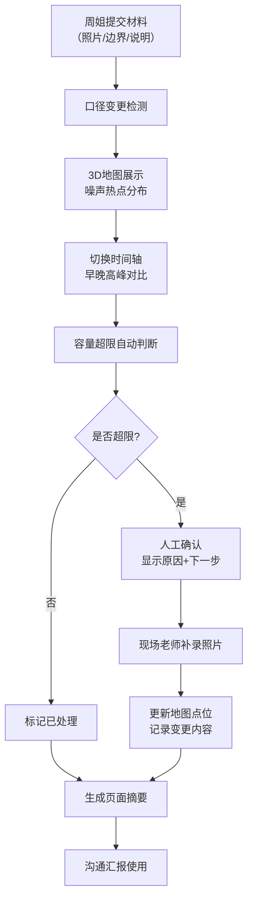

## 1. 产品概述

公园噪声容量复核工具，帮助街道工作人员直观判断公园噪声是否超标，追踪巡检材料口径变更，实现证据补录全流程可追溯。解决早晚高峰噪声口径不一致隐藏在巡检照片背后的问题，最终交付可直接用于沟通的页面摘要而非功能清单。

## 2. 核心功能

### 2.1 用户角色
| 角色 | 使用场景 | 核心需求 |
|------|----------|----------|
| 街道周姐 | 提交巡检材料、边界样本 | 材料上传、口径变更检测、证据追踪 |
| 现场老师 | 复核噪声容量、补充证据 | 3D地图浏览、状态概览、照片补录 |
| 复核人员 | 最终确认、沟通汇报 | 页面摘要导出、处理状态一览 |

### 2.2 功能模块
1. **3D地图主界面**：Web3D公园场景、噪声热点分布、时间轴控制
2. **材料管理面板**：巡检照片列表、边界样本、口径变更标记
3. **容量复核面板**：容量超限判断、人工确认原因、下一步建议
4. **照片补录模块**：现场照片上传、地图点位标记、变更记录
5. **页面摘要**：处理状态概览、证据缺口提示、沟通用摘要

### 2.3 页面详情
| 页面名称 | 模块名称 | 功能描述 |
|----------|----------|----------|
| 主工作台 | 3D地图场景 | 展示公园3D模型，支持点选噪声监测点，显示实时/历史噪声数据 |
| 主工作台 | 时间轴控制器 | 切换早晚高峰时段，联动地图数据和页面摘要 |
| 主工作台 | 筛选器 | 按状态（已处理/待补证）、按区域、按时段筛选 |
| 主工作台 | 页面摘要区 | 实时展示复核结论、已处理项、待补证项、变更记录 |
| 材料详情 | 材料列表 | 展示巡检照片、边界样本，标记口径变更 |
| 材料详情 | 变更检测 | 高亮显示修改过口径的材料，标注修改前后对比 |
| 容量复核 | 超限判断 | 自动判断容量是否超限，需人工确认时给出原因和下一步 |
| 照片补录 | 上传面板 | 上传现场照片，关联地图点位，记录补录说明 |
| 状态概览 | 处理列表 | 卡片式展示各监测点状态：已处理/待补证/需确认 |

## 3. 核心流程

街道周姐提交巡检照片、边界样本和口头说明 → 系统检测口径变更并标记 → 3D地图展示噪声分布，切换时间轴查看早晚高峰差异 → 自动容量超限判断 → 如需人工确认，显示原因和下一步 → 现场老师补录现场照片 → 地图点位和页面摘要同步更新变更记录 → 生成可直接沟通的页面摘要。

## 4. 用户界面设计

### 4.1 设计风格
- **主色调**：深空蓝 #1a365d（专业可信）+ 警示橙 #e53e3e（超限告警）+ 状态绿 #38a169（正常）
- **按钮风格**：扁平设计，2px圆角，悬停时轻微上浮+阴影变化
- **字体**：标题使用 Noto Serif SC（稳重专业），正文使用 Noto Sans SC（清晰易读）
- **布局风格**：三栏式布局（左侧材料列表 + 中间3D地图 + 右侧摘要面板），顶部时间轴工具栏
- **视觉细节**：微妙的网格纹理背景，卡片式面板带柔和阴影，数据高亮使用渐变边框

### 4.2 页面设计概述
| 页面名称 | 模块名称 | UI元素 |
|----------|----------|--------|
| 主工作台 | 3D地图场景 | 暗色3D场景，噪声热点用发光球体表示，点选后显示详情浮窗 |
| 主工作台 | 时间轴控制器 | 横向时间条，可拖拽滑块，早晚高峰时段用不同颜色标记 |
| 主工作台 | 筛选器 | 下拉选择+标签组合，选中项高亮显示 |
| 主工作台 | 页面摘要区 | 关键指标卡片，状态用颜色区分，变更记录用时间线展示 |
| 材料详情 | 变更标记 | 红色角标标注"口径已修改"，点击展开前后对比 |
| 容量复核 | 超限提示 | 醒目红色卡片，原因列表+建议操作按钮 |
| 状态概览 | 处理卡片 | 彩色状态条+关键数据，悬停显示详情 |

### 4.3 响应式
- Desktop-first设计，主工作台三栏布局
- 平板端自动调整为上下布局，地图在上、面板在下
- 移动端折叠面板，支持抽屉式切换

### 4.4 3D场景设计
- **环境**：城市公园场景，柔和的自然光，清晨/黄昏两种光照模式对应早晚高峰
- **光照**：主光用方向光模拟太阳光，环境光补充阴影细节，噪声热点自发光
- **相机**：默认俯视45度角，支持鼠标拖拽旋转、滚轮缩放、点击聚焦
- **交互**：点选监测点时相机平滑过渡聚焦，显示详情面板
- **动画**：时间轴切换时场景光照平滑过渡，噪声热点脉冲动画表示强度
- **后处理**：轻微Bloom效果增强发光感，柔和色调映射
